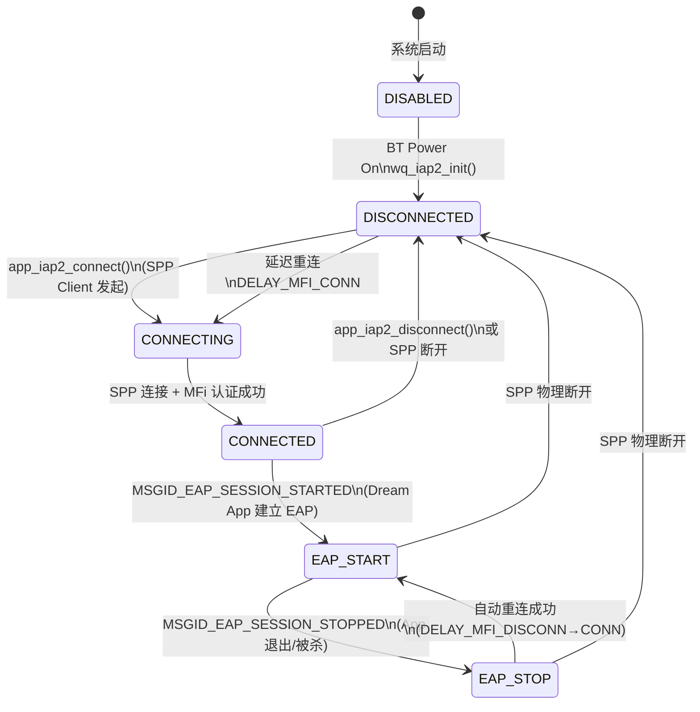
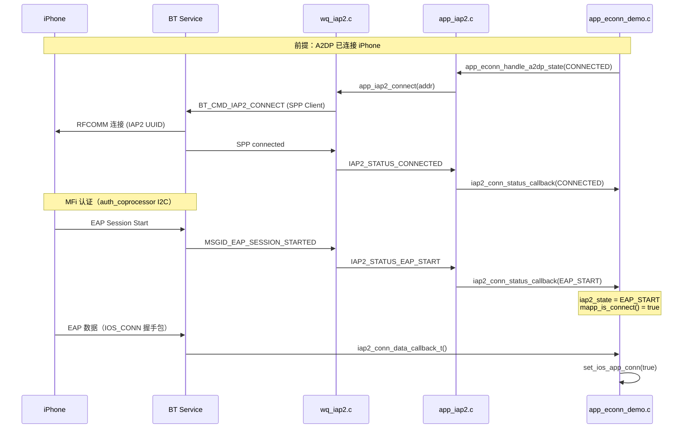

# IAP2 / MFI 逻辑与状态机说明

> 本文档面向 A2001 项目新人，梳理 iOS MFi（IAP2 over Bluetooth SPP）从底层到应用层的完整流程。  
> 主要代码位于 `wq-adk/components/apps/acore/bt/`、`wq-adk/components/bt_rpc/`、`wq-adk/project/a2001/acore/app/src/app_econn_demo.c`。

---

## 1. 概述

### 1.1 IAP2 在本项目中的角色

A2001 耳机与 iPhone 上的 **Dream App（MOVA TPEAK）** 通信，iOS 侧走 Apple MFi 认证的 **iAP2（iPod Accessory Protocol 2）** 通道，而非 Android 常用的普通 SPP。

| 通道 | 适用平台 | 协议栈 |
|------|----------|--------|
| 普通 SPP | Android App | `econn_spp_uuid128` |
| BLE GATT | 通用 / GoB | `gatt_service_uuid128` |
| **IAP2 (MFI)** | **iOS App** | `spp_IAP2_uuid128` + MFi 认证芯片 |

IAP2 承载的业务包括：

- 自定义 App 协议（`mcomm_*`，group `0xA1` AI 助手、group `0x23` 歌曲信息等）
- Hey Mova 唤醒上报
- IAP2 Launch App（后台拉起 Dream App）
- OTA（可选，`TEST_IAP2_OTA`）

### 1.2 功能开关

| 配置项 | 作用 |
|--------|------|
| `CONFIG_IAP2_ENABLE` | 启用 IAP2/MFI 全链路 |
| `CONFIG_MOBVOI_KWS` | Hey Mova 关键词唤醒（依赖 IAP2 通道上报） |
| `CONFIG_GATT_OVER_BREDR_ENABLE` | GoB 模式，与 IAP2 互斥优先级需关注 |

---

## 2. 软件架构（分层）

```
┌─────────────────────────────────────────────────────────────┐
│  业务层：app_ai_assistant / app_cmd / app_protocol          │
│  mcomm_rsp() → mcomm_if() → econn_send_data()               │
└───────────────────────────┬─────────────────────────────────┘
                            │
┌───────────────────────────▼─────────────────────────────────┐
│  应用连接层：app_econn_demo.c                                │
│  iap2_conn_status_callback / iap2_conn_data_callback_t       │
│  set_iap2_identification_info / launch_dream_app            │
│  DELAY_MFI_DISCONN / DELAY_MFI_CONN 重连状态机               │
└───────────────────────────┬─────────────────────────────────┘
                            │
┌───────────────────────────▼─────────────────────────────────┐
│  IAP2 适配层：app_iap2.c                                     │
│  app_iap2_connect/disconnect/register_callback              │
│  RFCOMM channel 发现、TWS 同步 id_cn[]                       │
└───────────────────────────┬─────────────────────────────────┘
                            │
┌───────────────────────────▼─────────────────────────────────┐
│  RPC 桥接层：wq_iap2.c                                       │
│  SPP Service/Client 注册、BT_EVT_IAP2_* 事件分发             │
└───────────────────────────┬─────────────────────────────────┘
                            │
┌───────────────────────────▼─────────────────────────────────┐
│  协议库：iap2_lib（闭源）                                     │
│  Identification、EAP Session、Launch App、MFi 认证交互        │
└───────────────────────────┬─────────────────────────────────┘
                            │
┌───────────────────────────▼─────────────────────────────────┐
│  硬件：auth_coprocessor（I2C MFi 认证芯片）                   │
│  auth_cp_read / auth_cp_write                               │
└─────────────────────────────────────────────────────────────┘
                            │
┌───────────────────────────▼─────────────────────────────────┐
│  BT Service（bcore）：BT_CMD_IAP2_CONNECT/DISCONNECT/SEND     │
└─────────────────────────────────────────────────────────────┘
```

### 2.1 关键源文件

| 文件 | 职责 |
|------|------|
| `wq_iap2.h` | IAP2 状态枚举、对外 API 定义 |
| `wq_iap2.c` | acore ↔ bcore RPC，SPP 回调转状态 |
| `app_iap2.c` | 模块初始化、连接管理、回调分发 |
| `iap2_lib.h` | Identification 配置、Launch App、ctl msg 处理 |
| `app_econn_demo.c` | **A2001 业务主逻辑**：状态维护、重连、数据路由 |
| `auth_coprocessor.c` | MFi I2C 芯片读写 |

---

## 3. IAP2 状态机

### 3.1 状态定义

定义于 `wq_iap2.h`：

```c
typedef enum {
    IAP2_STATUS_DISABLED,      // 0 - 未启用
    IAP2_STATUS_DISCONNECTED,  // 1 - SPP 链路已断
    IAP2_STATUS_CONNECTING,    // 2 - 正在建立 SPP（较少直接观测）
    IAP2_STATUS_CONNECTED,     // 3 - SPP 已连，MFi 认证完成，EAP 未启动
    IAP2_STATUS_EAP_START,     // 4 - EAP 会话已建立，App 可通信 ★
    IAP2_STATUS_EAP_STOP       // 5 - EAP 会话结束（App 被杀/退出）
} iAP2_STATUS_T;
```

### 3.2 状态转换图



### 3.3 各状态业务含义

| 状态 | `mapp_is_connect()` | 能否收发 App 协议 | 典型场景 |
|------|---------------------|-------------------|----------|
| `DISABLED` | false | 否 | BT 未上电 |
| `DISCONNECTED` | false | 否 | 蓝牙断开 / 主动断连 |
| `CONNECTED` | false | 否（仅链路层） | SPP 已连，Dream App 尚未建立 EAP |
| **`EAP_START`** | **true** | **是** | App 正常运行，Hey Mova 可用 |
| `EAP_STOP` | false | 否 | **iOS 杀 App**，EAP 结束但 BT 可能仍连着 |

> **新人必记**：业务层判断"App 是否在线"看 `mapp_is_connect()`，iOS 下实质是 `iap2_state == IAP2_STATUS_EAP_START`。

### 3.4 状态上报路径

BT Service 产生事件 → `wq_iap2_handle_bt_evt()` → 转换为状态回调：

| BT 事件 | 转换后状态 |
|---------|------------|
| SPP Server/Client `connected` | `IAP2_STATUS_CONNECTED` |
| SPP Server/Client `disconnected` | `IAP2_STATUS_DISCONNECTED` |
| `MSGID_EAP_SESSION_STARTED` | `IAP2_STATUS_EAP_START` |
| `MSGID_EAP_SESSION_STOPPED` | `IAP2_STATUS_EAP_STOP` |

回调链：

```
wq_iap2.c: iap2_cnt.status_cb()
  → app_iap2.c: iap2_conn_status_callback()  [按 protocol_id/session_id 分发]
    → app_econn_demo.c: iap2_conn_status_callback()  [A2001 业务处理]
```

---

## 4. 初始化流程

### 4.1 模块注册（系统启动）

```
app_iap2_init()                          // app_iap2.c
  ├── auth_cp_init()                     // MFi I2C 芯片初始化
  ├── iap2_lib_init(&adapt)              // 绑定 auth_cp_read/write、消息适配
  ├── app_sdp_client_register_rfcomm_found_handler()  // 发现 iPhone RFCOMM channel
  └── 注册 MSG_TYPE_IAP2 消息处理

app_econn_init()                         // app_econn_demo.c
  └── app_iap2_register_callback(IAP2_PROTOCOL_2,
                                 iap2_conn_data_callback_t,
                                 iap2_conn_status_callback)
```

### 4.2 蓝牙上电（EVTSYS_BT_POWER_ON）

```
app_iap2_handle_bt_power_on()            // 注册 SPP UUID、回调
  └── wq_iap2_init()
        ├── wq_spp_register_service_with_multi_conn(spp_IAP2_uuid128)  // Server
        ├── wq_spp_client_register()                                    // Client
        └── wq_bt_eir_add_uuid(spp_IAP2_uuid128)

app_econn_handle_sys_evt(EVTSYS_BT_POWER_ON)
  ├── iap2_conn_cnt = 0
  ├── set_iap2_identification_info()     // 下发 Identification Information
  └── iap2_identification_info_init_flag = 0  // 允许下次重设
```

### 4.3 Identification Information

`set_iap2_identification_info()` 向 iAP2 库注册配件身份信息，iPhone 据此识别 MFi 设备并匹配 App：

| 字段 | A2001 值 |
|------|----------|
| Name | `"MOVA TPEAK Clip Pro"` |
| ModelIdentifier | `"MA2001"` |
| EAP1_Name | `"com.dreame.iap2"` |
| EAP1_Identifier | `IAP2_PROTOCOL_2` |
| AppMatchTeamId | 中文 `"25AAL328GD"` / 英文 `"BVL93LPC80"` |
| ProductPlanUID | `"edbe60080e6943eb"` |

Identification 会在以下时机重新设置：

- BT 上电
- IAP2 断连/重连前（`iap2_conn_status_callback` 中 EAP_STOP/DISCONNECTED 分支）
- TWS 角色切换后（master 侧）

---

## 5. 连接建立流程（iOS）

### 5.1 典型连接时序



### 5.2 连接触发点

| 触发源 | 函数 | 说明 |
|--------|------|------|
| A2DP 连接 | `app_econn_handle_a2dp_state()` | iOS 设备 A2DP CONNECTED 时主动 `app_iap2_connect()` |
| 延迟重连消息 | `ECONN_REMOTE_MSG_ID_DELAY_MFI_CONN` | 断连后的自动重连 |
| TWS 切 Master | `econn_handle_tws_role_changed()` | 新 Master 补建 IAP2 |
| 手动/命令 | `app_iap2_connect()` | CLI 或内部补救 |

A2DP 连接触发逻辑（简化）：

```c
// app_econn_handle_a2dp_state(), state == A2DP_STATE_CONNECTED
if (phone_type == IOS && app_wws_is_master() && !iap2_conn_flag) {
    if (iap2_state == EAP_START && addr 匹配) return;  // 已连，跳过
    app_iap2_connect(addr);  // 或延迟发 DELAY_MFI_CONN
}
```

### 5.3 RFCOMM Channel 发现

iPhone 的 IAP2 RFCOMM channel 通过 SDP 发现：

```
app_sdp_client → iap2_rfcomm_found_handler()
  → 记录到 id_cn[i].channel
  → TWS Master 同步给 Slave（APP_IAP2_MSG_ID_REMOTE_SYNC_DATA）
```

`app_iap2_connect()` 使用 `id_cn[i].channel`（A2001 固定 channel=1）发起 SPP Client 连接。

---

## 6. 数据收发路径

### 6.1 发送（耳机 → App）

```
业务调用 mcomm_rsp(group, sub_id, ...)
  → mcomm_if() 组包（0x3B 0x5F 帧头 + CRC8）
  → econn_send_data()
       ├── [优先] iap2_state == EAP_START
       │     → wq_iap2_send_data(&iap2_send_remote_addr, iap2_session_id, data, len)
       ├── spps_connected → wq_spp_send_data()   (Android)
       └── gatts_connected → wq_gatts_send_notify() (BLE)
```

### 6.2 接收（App → 耳机）

```
iPhone EAP 数据
  → BT_EVT_IAP2_DATA
  → wq_iap2.c: iap2_cnt.data_cb()
  → app_iap2.c: iap2_conn_data_callback() [按 session 分发]
  → app_econn_demo.c: iap2_conn_data_callback_t()
       ├── 解析 IOS_CONN / IOS_DISCONN 握手包
       ├── set_ios_app_conn(true/false)
       └── mcomm_rx_anybyte(data, len, comtype=2)  → App 协议解析
```

### 6.3 iOS 握手包（私有协议）

定义于 `app_econn_demo.c`：

| 常量 | 含义 |
|------|------|
| `IOS_CONN[]` | App 逻辑连接通知 → `set_ios_app_conn(true)` |
| `IOS_DISCONN[]` | App 逻辑断开通知 → `set_ios_app_conn(false)` |
| `IOS2_RECONN[]` | 一拖二场景下拒绝第二台 iOS 的连接请求 |

### 6.4 `mapp_is_connect()` — App 在线判定

```c
bool mapp_is_connect(void) {
    return spps_connected || gatts_connected
        || (iap2_state == IAP2_STATUS_EAP_START);  // iOS 关键
}
```

额外还有 `ios_app_conn_flag`（`get_ios_app_conn()`），表示 App 层逻辑连接状态，与 IAP2 EAP 状态配合使用。

---

## 7. 断连与自动重连机制

### 7.1 断连触发场景

| 场景 | 状态变化 | 后续动作 |
|------|----------|----------|
| iOS 杀 App | `EAP_STOP` | **自动 MFI 断连/重连**（500ms + 1000ms） |
| SPP 物理断开 | `DISCONNECTED` | 自动重连（500ms 或 2000ms） |
| 入盒 BT 关闭 | 强制 disconnect | 清 `iap2_state`、清 session |
| OTA 进行中 | 跳过重连 | `ota_task_is_running()` 守卫 |

### 7.2 延迟消息驱动的重连状态机

两条核心消息（`app_econn_demo.h`）：

| 消息 ID | 值 | 处理 |
|---------|-----|------|
| `ECONN_REMOTE_MSG_ID_DELAY_MFI_DISCONN` | 145 | `app_iap2_disconnect(addr)` |
| `ECONN_REMOTE_MSG_ID_DELAY_MFI_CONN` | 138 | `app_iap2_connect(addr)` |

**断连成功后自动排队重连**（间隔 1000ms）：

```
DELAY_MFI_DISCONN (500ms)
  → app_iap2_disconnect()
  → 成功则 DELAY_MFI_CONN (1000ms)
       → app_iap2_connect()
       → 若仍为 EAP_STOP，再等 1000ms 重试
```

### 7.3 重连触发条件（`iap2_conn_status_callback` 末尾）

当 `state == EAP_STOP || DISCONNECTED` 且 Master 侧、非入盒关闭：

```c
if (iap2_stop_reconnect && (state == DISCONNECTED || state == EAP_STOP)) {
    // 快速路径：500ms（App 被杀等异常场景）bug#3170 #3453
    iap2_stop_reconnect = false;
    DELAY_MFI_DISCONN(500ms);
} else if (state == DISCONNECTED) {
    // 普通路径：2000ms
    DELAY_MFI_DISCONN(2000ms);
}
```

关键标志：

| 变量 | 设置时机 | 作用 |
|------|----------|------|
| `iap2_stop_reconnect` | `EAP_STOP` 时置 true | 标记需要快速重连 |
| `iap2_stop_role_delay` | 重连前置 true | TWS 角色切换 3s 内防误触 |
| `iap2_identification_info_init_flag` | Identification 设置后置 1 | 防止重复设置 |

> 详见 [iOS杀App后HeyMova唤醒修复说明.md](./iOS杀App后HeyMova唤醒修复说明.md)（bug#3453：`EAP_STOP` 也需触发快速重连）。

---

## 8. 一拖二（双 iOS / iOS + Android）

A2001 支持同时连接两台设备，IAP2 相关处理：

### 8.1 地址管理

| 变量 | 含义 |
|------|------|
| `iap2_remote_addr` | 当前主 IAP2 设备地址 |
| `iap2_ios2_remote_addr` | 第二台 iOS 设备地址 |
| `app_iap2_remote_addr` | 用于断连/重连的目标地址 |
| `app_iap2_remote_peer_addr` | TWS 同步的对端记录 |

### 8.2 互斥策略

- 已有 iOS App 连接（`get_ios_app_conn()`）时，第二台 iOS 的 IAP2 数据会被 **IOS2 REJECT** 拒绝
- SPP 连接与 IAP2 互斥：iOS MFI 已连时，普通 SPP 连入会被 `wq_spp_disconnect()` 断开
- 双 iOS 时第二台连接触发 `DELAY_MFI_CONN`（1000ms 延迟）

---

## 9. IAP2 Launch App

通过 iAP2 控制消息让 iPhone 拉起 Dream App：

```c
void launch_dream_app(bool is_cn) {
    if (iap2_state == IAP2_STATUS_EAP_START)
        bt_iap2_launch_app(is_cn, true);
}

// Bundle ID
// 中文：com.mova-tech.tpeak.cn
// 英文：com.mova-tech.tpeak.en
```

调用场景：

- `app_cmd.c`：App 协议 `cgroup0xa1_ai_assist_record_status_upload` 收到特定状态
- 内部补救：IAP2 已连但 App 未前台时

---

## 10. 与业务功能的关联

### 10.1 Hey Mova 唤醒

```
KWS 命中 → ai_assistant_awake_notify()
  → 检查 mapp_is_connect()（需 EAP_START）
  → mcomm_rsp(0xA1, ai_assist_awake_notify)
  → econn_send_data() → IAP2 发送
```

IAP2 未处于 `EAP_START` 时唤醒被忽略（log: `spp disconnect ignore notify`）。

### 10.2 AI 录音

- `EAP_STOP` 时调用 `ai_assistant_set_stop_record()` 停止录音
- 数据上传走 `ai_assistant_record_data_upload()` → IAP2

### 10.3 歌曲信息上报

- AVRCP 元数据 → `mcomm_rsp(0x23, ...)` → IAP2
- App 被杀检测：`ECONN_MSG_ID_DELAY_SEND_KILL_BLACKGROUND_PROCESSES`

### 10.4 OTA

- 入盒 BT 关闭时强制 `app_iap2_disconnect()`
- OTA 期间跳过重连（`ota_task_is_running()` / `fota_is_disconnect`）

---

## 11. TWS 双耳协同

| 事件 | Master 行为 | Slave 行为 |
|------|-------------|------------|
| IAP2 数据 | 处理 + `mcomm_rx_anybyte()` | 忽略（log: ignored for slave） |
| IAP2 状态 | 完整处理 + 重连 | 仅记录，不主动连 |
| EAP_START | 同步 `app_iap2_remote_addr` 给 Peer | 接收 `ECONN_REMOTE_MSG_SYNC_IAP2_ADDR` |
| 切为 Master | 补发 `DELAY_MFI_CONN(600ms)` | 停止录音等 |
| RFCOMM channel | 同步 `id_cn[]` 给 Slave | 使用同步的 channel |

---

## 12. 关键全局变量速查

| 变量 | 类型 | 说明 |
|------|------|------|
| `iap2_state` | `iAP2_STATUS_T` | **当前 IAP2 状态（业务层主状态）** |
| `iap2_session_id` | `uint16_t` | EAP 会话 ID，发送数据必需 |
| `iap2_send_remote_addr` | `BD_ADDR_T` | 发送目标地址 |
| `ios_app_conn_flag` | `bool` | App 逻辑连接（IOS_CONN 握手后） |
| `iap2_conn_flag` | `bool` | 防止 A2DP 重复触发 connect |
| `iap2_conn_cnt` | `uint8_t` | 一拖二连接计数 |
| `iap2_stop_reconnect` | `bool` | 快速重连标志 |
| `id_cn[]` | `app_iap2_content_t[]` | 每会话 addr/channel/state 记录 |

---

## 13. 调试指南

### 13.1 推荐 Log 关键字

| Log | 含义 |
|-----|------|
| `iap2_conn_status_callback state:` | 状态变更 |
| `ECONN_REMOTE_MSG_ID_DELAY_MFI_DISCONN` | 开始 MFI 断连 |
| `ECONN_REMOTE_MSG_ID_DELAY_MFI_CONN` | 开始 MFI 重连 |
| `iap2_set_identification_information OK` | Identification 成功 |
| `iap2 launch app ret:` | Launch App 结果 |
| `spp disconnect ignore notify` | Hey Mova 因 App 未连被忽略 |
| `IOS2 REJECT` | 一拖二拒绝第二台 iOS |
| `iap2_conn_data_callback_t ios_app_conn` | IOS_CONN 握手成功 |

### 13.2 常见问题排查

| 现象 | 可能原因 | 排查方向 |
|------|----------|----------|
| Hey Mova 无响应 | `iap2_state != EAP_START` | 查 MFI 重连 log |
| iOS 杀 App 后无法唤醒 | 未触发 EAP_STOP 重连 | 确认 bug#3453 修复已合入 |
| 有 A2DP 但无 IAP2 | `app_iap2_connect` 失败 | 查 RFCOMM channel、Master 角色 |
| 一拖二 IAP2 异常 | 第二台被拒绝 | 查 IOS2 REJECT 逻辑 |
| Identification 失败 | MFi 芯片 I2C | 查 `auth_cp_read` device id |

### 13.3 MFi 芯片检测

```c
get_iap2_cp_device_id()  // 读 ADDR_DEVICE_ID(0x04)，期望非全零
```

---

## 14. 相关 Bug 修复索引

| Bug | Commit 要点 | 说明 |
|-----|-------------|------|
| #2610 | 引入 DELAY_MFI_DISCONN/CONN | MFI 自动断连重连机制 |
| #3170 | `iap2_stop_reconnect` 标志 | 仅 DISCONNECTED 快速重连 |
| **#3453** | **`e5ff50c9`** | **EAP_STOP 也触发快速重连，修复杀 App 后 Hey Mova** |
| #3220 | OTA 与 IAP2 断开协调 | `fota_is_disconnect` 标志 |
| #3282 | CONN 时 cancel DISCONN | 避免断连/重连消息冲突 |

---

## 15. 阅读顺序建议（新人）

1. 本文 **§3 状态机** — 建立 IAP2 有哪些状态、何时可通信
2. **§5 连接流程** — 从 A2DP 连上到 EAP_START 的完整路径
3. **§6 数据路径** — `mcomm_rsp` 如何走到 IAP2
4. **§7 断连重连** — 杀 App、断连后的自动恢复机制
5. [iOS杀App后HeyMova唤醒修复说明.md](./iOS杀App后HeyMova唤醒修复说明.md) — 典型故障案例
6. [MULTIPOINT_一拖二逻辑.md](./MULTIPOINT_一拖二逻辑.md) — 双设备场景下的连接策略
