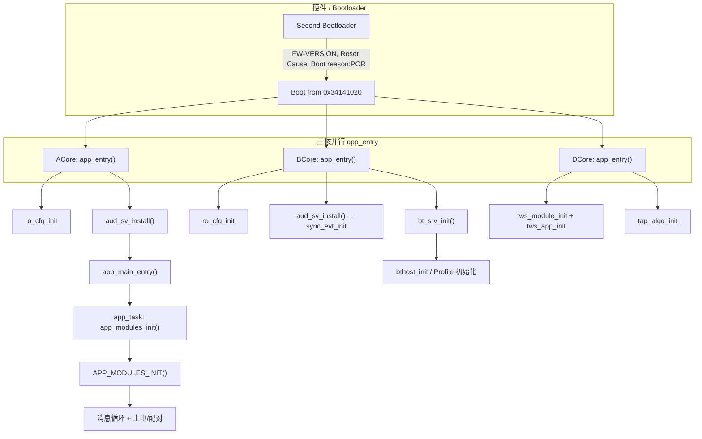
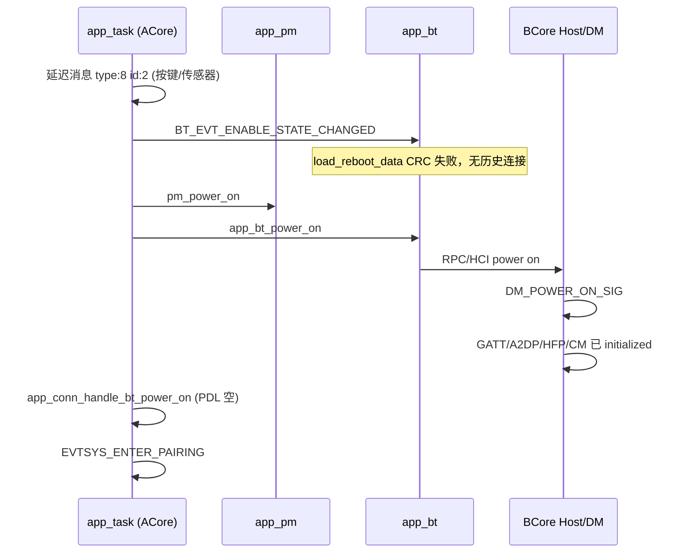

# A2007 固件初始化启动路径（基于 COM5 日志）

> **日志来源**: `2026-05-30-17-10-41-253-COM5.log`  
> **分析日期**: 2026-05-31  
> **芯片/配置**: 7035AX-B（左耳，`is_left_dev:1`）  
> **应用固件**: `FW-VERSION-v0.0.0.1--Tommy-2026-05-30 17:02:29-Debug-a2007-7035AX-B`  
> **ADK**: `ADK-VERSION-v1.3.12.4-Debug`

---

## 1. 总览

本日志记录了一次 **上电复位（POR）** 冷启动，从 Second Bootloader 到应用就绪、进入配对/广播的完整过程。系统为三核架构：

| 核心 | 代号 | 角色 | 入口函数 |
|------|------|------|----------|
| ACore | `[A-*]` | 应用、电源、按键、业务逻辑 | `app_entry()` → `app_main_entry()` |
| BCore | `[B-*]` | 蓝牙 Controller + Host 协议栈 | `app_entry()` → `bt_srv_init()` |
| DCore | `[D-*]` | DSP / 音频算法 | `app_entry()` → `tws_app` 的 `app_main_entry()` |

**关键时间锚点**（日志内 `tickMs` 字段，单位约 ms）：

| 阶段 | tickMs | 说明 |
|------|--------|------|
| `ro_cfg_init` | 2173 | 三核 RO 配置开始 |
| `aud_sv` ACore 安装完成 | 2237 | 音频服务底层就绪 |
| `app_main_entry` | 2238 | 应用主入口 |
| `APP_MODULES_INIT --` | 2458 | 应用模块注册表遍历完成 |
| `app_bt_power_on` | 2466 | 蓝牙协议栈上电 |
| `EVTSYS_ENTER_PAIRING` | 2677 | 进入配对态 |

从 `ro_cfg_init` 到 `APP_MODULES_INIT --` 约 **285 ms**（三核并行，非单线程顺序执行）。

---

## 2. 启动阶段总流程图



---

## 3. 阶段一：Bootloader（日志行 1–6）

| 日志 | 含义 |
|------|------|
| `WuQi - Second Bootloader` | 二级 Bootloader |
| `FW-VERSION-v0.0.0.0---2025-08-04...` | Bootloader 自带版本（非应用固件） |
| `Reset Cause:1` | 复位原因码 1 |
| `Boot reason:POR` | 上电复位 |
| `Boot from 0x34141020` | 应用镜像加载地址 |

此阶段尚无 `[A/B/D]` 核标签，由 Bootloader 通过 UART（COM5）直接打印。

---

## 4. 阶段二：三核 `app_entry` 底层初始化

各核在 RTOS 调度后进入各自的 `app_entry()`，**并行执行**，通过 `ro_cfg`、IPC、共享内存逐步对齐。

### 4.1 ACore — `wq-adk/components/apps/acore/entry/entry.c`

调用顺序（与日志对应）：

```
app_entry()
├── wq_share_task_init / wq_generic_transmission_init / wq_dbglog_init
├── key_value_init / storage_init
├── ro_cfg_init()                    ← [A-0][A-1] is_left_dev:1
├── app_set_log_level()              ← log level get 0
├── wq_timer/wdt/rtc/cpu_usage/cli/dma/adc/charger/gpio/debounce
├── rpc_srv_init / ipc_srv_init
├── app_enter_controller_mode()      ← [A-4] ret:0，未进入 Controller 测试模式
├── audsys_init()
├── aud_sv_install(NULL)             ← [A-5]~[A-55] 音频子系统
│   ├── aud_res dev/mic/spk/rxdfe
│   ├── param KV / sync_sv / tone / ANC / mixer / loop / ADEQ / DRC
│   └── [aud_sv] acore install done
├── wq_feat_res_init()
├── version + adk_version 打印       ← [A-55][A-56]
└── app_main_entry()                 ← [A-57]
    └── app_main_init()              创建 app_task
        └── app_modules_init()       ← APP_MODULES_INIT ++/--
```

**Controller 模式探测**（本次未进入）：

```c
// entry.c — app_enter_controller_mode() 仅在软复位 + 特定 boot_flag 时成功
LOG: [app_main] try entering controller_mode, boot_reason:1 boot_source:0 boot_flag:0 ret:0
```

### 4.2 BCore — `wq-adk/components/apps/bcore/entry/entry.c`

```
app_entry()
├── os_task_init(bt_task, hci_recv_task, ...)
├── wq_dma/timer/dbglog/wdt/rtc/generic_transmission/share_task
├── adapter_imp_init()
├── rpc_srv_init / ipc_srv_init / storage_init
├── ro_cfg_init()                    ← [B-0] bcore ro_cfg_get
├── show_lib_version()               ← adapter/host/controller/phy 版本
├── bt_srv_controller_mode_enter()     ← 未进入（同 ACore）
├── aud_sv_install(NULL)             ← [B-5] sync_evt_init, [B-6] dp task
│   └── [aud_sv] bcore install done  ← [B-8]
└── app_main_entry()                 ← project/a2007/bcore/app/app.c
    └── bt_srv_init()
        ├── wq_btc_init(MEM HCI)     ← [B-9]
        ├── bthost_init()            ← enter host_init. [B-24]
        └── bt_service 任务 + Profile 注册
```

### 4.3 DCore — `wq-adk/components/apps/dcore/entry/entry.c`

```
app_entry()
├── os_task_init / share_task / dbglog / wdt / rtc
├── rpc_srv_init / ipc_srv_init / wq_dma / wq_debug / wq_feat_res_init
└── app_main_entry()                 ← tws_app.c
    ├── tws_module_init()
    ├── print_version_info()         ← [D-0] TWS APP ver:0.99
    ├── tws_app_init()               ← param/aanc/SPA/ADEQ/DRC/sync/DSP
    └── tap_algo_init()              ← [D-74]
```

DCore 在 `[D-2]` 完成 `[param] dcore init done`，并与 ACore 通过 IPC 同步 EQ/ADEQ/DRC/aud_res 参数（日志 `[A-69]`~`[A-85]` 与 `[D-*]` 交错）。

---

## 5. 阶段三：`APP_MODULES_INIT` 应用模块初始化

### 5.1 机制

- 入口：`app_main.c` → `app_main_task_func()` → `app_modules_init()`
- 实现：`APP_MODULES_INIT()` 宏遍历链接段 `.app_module.*` 中注册的 `app_module_t`（见 `app_module.h`）
- 排序：**先按 `APP_MODULE_REGISTER` 的 priority 数值升序，同 priority 按链接顺序**

### 5.2 已知高优先级模块（源码注册）

| Priority | 模块 | init 函数 | 日志标签 |
|----------|------|-----------|----------|
| 1 | app_bt | `app_bt_init` | `[app_bt] app_bt_init` |
| 2 | app_charger | `app_charger_init` | `[app_charger]` → `[box] charger_box_init` |
| 3 | usr_cfg | `usr_cfg_init` | `[app_usr_cfg]`（本次 KV 空，加载默认） |
| 5 (default) | 其余模块 | 各 `*_init` | 见下表 |

### 5.3 日志中可见的 init 顺序（`APP_MODULES_INIT ++` ~ `--`）

| 序号 | tickMs | 模块/事件 | 源码位置（参考） |
|------|--------|-----------|------------------|
| 1 | 2240 | `app_bt_init` | `app_bt.c` |
| 2 | 2240 | `app_charger_init` + `charger_box_init` | `app_charger.c` / `charger_box_*.c` |
| 3 | 2247 | `usr_cfg` 加载失败→默认 | `usr_cfg.c` |
| 4 | 2248 | `app_bat_init` | `app_bat.c` |
| 5 | 2252 | `load_fuel_gauge_init` | 电量计 |
| — | 2251~2349 | **并行**：BCore `wq_btc_init` + `host_init` + Profile；DCore 算法 IPC | `bt_srv_api.c` / `tws_app.c` |
| 6 | 2308 | `app_btn_init` | `app_btn.c` |
| 7 | 2318 | `app_econn_init`（按键/颜色/业务） | `project/a2007/acore/app/src/app_econn_demo.c` |
| 8 | 2339 | `app_audio` 游戏/听力保护模式 | `app_audio.c` |
| 9 | 2351 | `app_cmd` version | CLI/命令 |
| 10 | 2449 | `app_evt_init` | `app_evt.c` |
| 11 | 2449 | OTA SPP/BLE trans init | `app_ota*.c` |
| 12 | 2451 | `app_pm_init` + `POWER_OFF→POWER_ON` | `app_pm.c` |
| 13 | 2452 | `factory_test_init` | `project/a2007/acore/app/src/factory_test.c` |
| 14 | 2452 | `app_audio_init` + 音量下发 DSP | `app_audio.c` |
| — | 2458 | **`APP_MODULES_INIT --`** | `app_main.c` |

同 priority 的模块（如 `app_wws`、`app_conn`、`app_tone`、`app_led` 等）若未打印 `*_init` 字样，仍会在链接段中执行，只是日志级别未输出。

---

## 6. 阶段四：初始化完成后的运行时路径

`APP_MODULES_INIT --` 之后，`app_task` 开始处理延迟/队列消息，完成 **业务上电** 与 **蓝牙协议栈启动**。



### 6.1 关键日志与代码

| 日志 | 函数/说明 |
|------|-----------|
| `[app_pm] set_state POWER_OFF -> POWER_ON` | `app_pm.c` 状态机 |
| `[app_bt] app_bt_power_on` | `app_bt.c` 触发协议栈上电 |
| `[DM]DM_POWER_ON_SIG` | BCore 设备管理器 |
| `[app_conn] app_conn_handle_bt_power_on pdl empty` | 无配对列表，不走自动回连 |
| `[app_econn] EVTSYS_ENTER_PAIRING` | `app_econn_demo.c` 进入配对 UI/广播策略 |
| `[bt] channel is left !` | BCore 确认左耳声道 |

### 6.2 本次启动的业务结论

- **左耳**（`is_left_dev:1`，`channel is left`）
- **冷启动 POR**，用户配置 KV  mostly 空（`usr_cfg_load error`，使用默认）
- **无已配对手机**（`pdl empty`，多次 `get_device error, addr is zero`）
- **自动进入配对模式**（约启动后 220 ms：`EVTSYS_ENTER_PAIRING`）
- TWS 对耳未连接（`app_wws` / `wws is not connected`，`get virtual clock failed` 属预期）

---

## 7. 蓝牙协议栈初始化（BCore 细节）

`bt_srv_init()`（`wq-adk/components/bt_service/api/bt_srv_api.c`）：

1. `wq_btc_init()` — Controller，HCI 内存接口 `[B-9]`
2. PHY 校准加载 `[B-12]`~`[B-18]`
3. `bthost_init()` — Host `[B-24] enter host_init.`
4. `bt_service_main` 任务
5. Profile 逐个 `*_initialized ++`：`GATT` → `SPP` → `AVRCP` → `A2DP` → `HF` → `TWS_SYNC` → `DM` → `LE` → `RM` → `CM` → `BTRPC`

A2007 BCore 应用入口仅调用 `bt_srv_init()`：

```c
// wq-adk/project/a2007/bcore/app/app.c
void app_main_entry(void *arg) {
    bt_srv_init();
    // ... optional record/vad
}
```

---

## 8. 音频 / DSP 路径摘要

| 层级 | ACore | BCore | DCore |
|------|-------|-------|-------|
| 安装入口 | `entry.c` → `aud_sv_install` | `entry.c` → `aud_sv_install` | `tws_app.c` → `tws_app_init` |
| 资源 | mic/spk/rxdfe/tone/ANC | sync_evt, datapath | SPA/ADEQ/DRC/sync/signal |
| 跨核同步 | `wq_sync_sv_start`, IPC param/EQ | `aud_sv` bcore install | `as_sh_info sync`, `[param] dcore init done` |
| 应用层 | `app_audio_init` 在 MODULES_INIT 末 | — | `tap_algo_init` |

---

## 9. 日志中的第二次启动（软复位）

约在 `17:11:43`（tickMs ~61355）出现 **第二轮** 完整 `ro_cfg_init` → `APP_MODULES_INIT` 序列：

| 对比项 | 冷启动 (17:10:44) | 软复位 (17:11:43) |
|--------|-------------------|-------------------|
| boot_reason | 1 (POR) | 4 |
| boot_source / flag | 0 / 0 | 3 / 6 |
| usr_cfg | 加载失败，默认 | `usr_cfg_init succeed`，含手机 `38:E1:3D:5C:E3:18` |
| app_pm power_on reason | UNKNOWN | USER |
| app_conn | pdl empty | start reconnect |
| load_reboot_data | CRC 失败 | succeed |

说明第一次在启动后约 **59 s** 发生了软复位（可能 OTA、测试或看门狗），第二次按用户/连接上下文恢复配置并尝试回连。

---

## 10. 核心源文件索引

| 路径 | 作用 |
|------|------|
| `wq-adk/components/apps/acore/entry/entry.c` | ACore 总入口、音频安装、`app_main_entry` |
| `wq-adk/components/apps/acore/main/src/app_main.c` | 应用任务、`APP_MODULES_INIT`、消息队列 |
| `wq-adk/components/apps/acore/main/inc/app_module.h` | 模块注册宏与遍历 |
| `wq-adk/components/apps/bcore/entry/entry.c` | BCore 总入口 |
| `wq-adk/project/a2007/bcore/app/app.c` | A2007 BCore `bt_srv_init` |
| `wq-adk/components/bt_service/api/bt_srv_api.c` | BTC + Host 初始化 |
| `wq-adk/components/apps/dcore/entry/entry.c` | DCore 总入口 |
| `wq-adk/components/apps/dcore/app/tws_app.c` | DSP 应用 `tws_app_init` |
| `wq-adk/components/ro_cfg/src/ro_cfg.c` | `ro_cfg_init` / 左右耳 |
| `wq-adk/components/audio_service/main/cores/acore/aud_sv_api.c` | ACore 音频服务安装 |
| `wq-adk/components/audio_service/main/cores/bcore/aud_sv_api.c` | BCore 音频服务 + sync_evt |
| `wq-adk/project/a2007/acore/app/src/app_econn_demo.c` | A2007 连接/按键/配对业务 |
| `wq-adk/project/a2007/acore/app/src/factory_test.c` | 产测模块 init |

---

## 11. 调试建议

1. **跟踪 MODULES 顺序**：在可疑 `APP_MODULE_REGISTER` 的 `*_init` 首行加 `LOGI`，或临时提高 `DBGLOG` 级别。
2. **对齐 tickMs**：用 `[A-xx] [tickMs]` 与 B/D 核同一 tick 窗口对照并行行为。
3. **区分冷/软启动**：务必看 `boot_reason` / `boot_source` / `boot_flag` 三元组（`app_pm_init`、`charger_box_init` 均会打印）。
4. **配对/连接问题**：从 `APP_MODULES_INIT --` 之后搜索 `app_bt_power_on` → `DM_POWER_ON` → `app_conn` → `EVTSYS_*`。

---

*文档由 `2026-05-30-17-10-41-253-COM5.log` 与 wq-adk / wqcore 源码交叉分析生成。*
