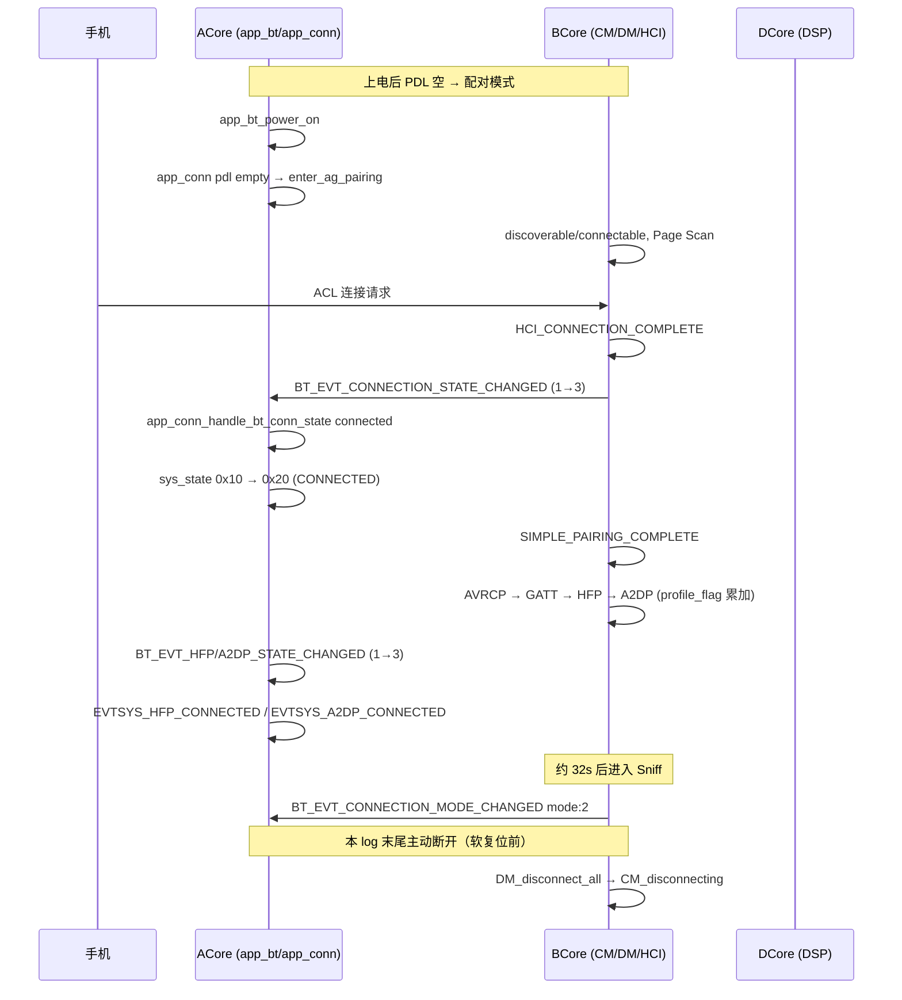

# A2007 蓝牙连接关键 Log 梳理

> **日志来源**: `2026-05-30-17-10-41-253-COM5.log`  
> **关联文档**: [boot-init-path-from-COM5-log.md](./boot-init-path-from-COM5-log.md)  
> **分析日期**: 2026-05-31  
> **样例手机地址**: `38:E1:3D:5C:E3:18`（ACL 连接成功后写入 PDL）

本文档按 **连接生命周期** 整理日志关键字、典型顺序、对应源码位置，并给出本份 log 中的真实时间线，便于抓 log 时快速定位问题。

---

## 1. 连接生命周期总览



---

## 2. 阶段说明与关键 Log

### 2.1 蓝牙上电与可发现（配对前）

| 关键 Log | 核心 | 源码（参考） | 含义 |
|----------|------|--------------|------|
| `[app_bt] app_bt_power_on` | A | `app_bt.c` | 应用层请求 BT 上电 |
| `[DM]DM_POWER_ON_SIG` | B | BCore DM 状态机 | 设备管理器上电 |
| `[DM]DM_opened ++` | B | DM | Host 栈就绪 |
| `[CM:x]CM_started ++` | B | CM | Connection Manager 启动 |
| `[A2DP/HF/...]_started ++` | B | 各 Profile | Profile 任务启动 |
| `[app_evt] EVTSYS_BT_INITED` | A | `app_evt.c` | 系统事件：BT 已初始化 |
| `[app_evt] EVTSYS_BT_POWER_ON` | A | `app_evt.c` | 系统事件：BT 上电完成 |
| `[app_conn] app_conn_handle_bt_power_on pdl empty` | A | `app_conn.c:982` | 配对列表空 → 走配对 |
| `[app_conn] app_conn_handle_bt_power_on start reconnect` | A | `app_conn.c:985` | PDL 非空 → 走上电回连 |
| `[app_bt] app_bt_enter_ag_pairing discoverable:0=>1 connectable:0=>1` | A | `app_bt.c:3692` | 进入 AG 配对（可见+可连接） |
| `[DM]discoverable is 1, connectable is 1` | B | DM | 扫描模式确认 |
| `[auto][HCI]hci_write_scan_enable scan_enable=3` | B | HCI | Inquiry + Page Scan |
| `[PAGE]__bt_pscan_update_param` | B | `bt_page_mgr.c` | Page Scan 参数更新 |
| `[app_econn] EVTSYS_ENTER_PAIRING` | A | `app_econn_demo.c` | 业务层进入配对 UI/策略 |
| `[app_bt] BT_EVT_VISIBILITY_CHANGED visible:1 connectable:1` | A | `app_bt.c:1300` | RPC 可见性事件 |

**本 log 冷启动**: `pdl empty` → `enter_ag_pairing` → `sys_state:0x10`（`STATE_AG_PAIRING`）。

**sys_state 位定义**（`app_bt.h`）：

| 值 | 宏 | 说明 |
|----|-----|------|
| `0x10` | `STATE_AG_PAIRING` | 可见 + 可连接，等待手机 |
| `0x20` | `STATE_CONNECTED` | ACL 已连接 |
| `0x40` | `STATE_A2DP_STREAMING` | A2DP 播放中（本段连接后未出现） |

---

### 2.2 ACL 链路建立（手机 ↔ 耳机）

| 关键 Log | 核心 | 源码 | 含义 |
|----------|------|------|------|
| `total connected device count(0)` | B | CM/DM | 发起连接前设备数为 0 |
| `Connection Received for CID 0x.. from` | B | L2CAP/HCI | 收到连接（多行地址） |
| `[auto]RX HCI_CONNECTION_COMPLETE_EVENT. Status: 0x00, Handle: 0x0080, ... BD_ADDR: xx:xx:...` | B | `T_appl_hci.c:557` | **ACL 连接成功**（Status=0） |
| `[auto][PAGE]bt_on_connect_result xx:xx:..., status = 0, paging = 0` | B | `bt_page_mgr.c:255` | Page 结束，连接成功 |
| `[CM:0, 0x0080] CM_connected,cod:7a020c ++` | B | `T_cm_top.c:1667` | CM 进入 connected，记录 COD |
| `[DM]DM_connected ++` | B | DM | DM 层连接完成 |
| `[app_bt] BT_EVT_CONNECTION_STATE_CHANGED 1=>3 index:0 ... reason:0x1` | A | `app_bt.c:1115` | **应用层 ACL 已连接** |
| `[app_conn] app_conn_handle_bt_conn_state master:1 connected:1 reason:0x1 ... profile_connected:0` | A | `app_conn.c:1065` | 连接管理：主耳、已连接、尚未 profile |
| `[app_bt] app_bt_set_discoverable_and_connectable discoverable:1=>0 connectable:1=>1` | A | `app_bt.c` | 连上后通常关 discoverable |
| `[app_econn] app_econn_handle_acl_state reason[0x1] state[0x3]` | A | `app_econn_demo.c` | 业务 ACL 回调 |
| `[app_evt] EVTSYS_STATE_CHANGED 0x10 -> 0x20` | A | `app_evt.c` | 系统状态：配对 → 已连接 |
| `[app_usr_cfg] usr_cfg_pdl_add_first first succeed` | A | `usr_cfg.c` | 手机地址写入 PDL 首位 |

**状态枚举**（`bt_rpc_api.h`）：

```c
// bt_connection_state_t — BT_EVT_CONNECTION_STATE_CHANGED 中的 1=>3
CONNECTION_STATE_DISCONNECTED = 1
CONNECTION_STATE_CONNECTING   = 2
CONNECTION_STATE_CONNECTED    = 3
```

**reason 字段**（ACL 建立时 `reason:0x1`）：

```c
// bt_connection_reason_t
CONNECTED_BY_LOCAL  = 0
CONNECTED_BY_REMOTE = 1   // 本 log：手机主动连耳机
```

---

### 2.3 配对与安全

| 关键 Log | 核心 | 含义 |
|----------|------|------|
| `RX HCI_SIMPLE_PAIRING_COMPLETE_EVENT. Status: 0x00, BD_ADDR: ...` | B | SSP 配对成功（ACL 后约 0.6s） |

失败时关注 `Status != 0x00`，以及 ACore `BT_HCI_ERR_AUTHENTICATION_FAIL` / `PIN_OR_KEY_MISSING` 触发的 `usr_cfg_pdl_remove`。

---

### 2.4 Profile 连接（AVRCP → GATT → HFP → A2DP）

BCore 通过 `CM_connected PROFILE_CONNECT_IND_SIG` 上报，并打印 `profile_flag`：

| 关键 Log | profile_flag | Profile |
|----------|--------------|---------|
| `PROFILE_CONNECT_IND_SIG 04 00` + `profile_flag=0x0004` | `0x0004` | AVRCP (`AVRCP_FLAG = 1<<2`) |
| `PROFILE_CONNECT_IND_SIG 20 04` + `profile_flag=0x0020` | `0x0020` | GATT (`GATT_FLAG = 1<<5`) |
| `PROFILE_CONNECT_IND_SIG 01 24` + `profile_flag=0x0001` | `0x0001` | HFP (`HF_FLAG = 1<<0`) |
| `PROFILE_CONNECT_IND_SIG 02 25` + `profile_flag=0x0002` | `0x0002` | A2DP (`A2DP_FLAG = 1<<1`) |

**Profile 连通确认 Log**（`T_*_top.c`）：

| 关键 Log | 源码文件 |
|----------|----------|
| `[auto]avrcp connected.BD_ADDR: ...` | `avrcp/T_avrcp_top.c:612` |
| `[auto]hfp connected.BD_ADDR: ...` | `hfp/T_hfp_top.c:823` |
| `[auto]a2dp connected.BD_ADDR: ...` | `a2dp/T_a2dp_top.c:1095` |

**ACore 状态事件**：

| 关键 Log | 状态变化 | 源码 | 系统事件 |
|----------|----------|------|----------|
| `[HF:1 0x0080]HFP_connecting ++` | B | HFP SM | 连接中 |
| `[app_bt] BT_EVT_HFP_STATE_CHANGED 1=>3` | DISCONNECTED→CONNECTED | `app_bt.c` | — |
| `[app_evt] EVTSYS_HFP_CONNECTED` | A | `app_evt.c` | 提示音/UI |
| `[app_bt] BT_EVT_A2DP_STATE_CHANGED 1=>3` | DISCONNECTED→CONNECTED | `app_bt.c` | — |
| `[app_evt] EVTSYS_A2DP_CONNECTED` | A | `app_evt.c` | 音乐通路就绪 |
| `[app_usr_cfg] usr_cfg_set_a2dp_codec 2` | A | `usr_cfg.c` | 保存协商 codec |
| `[app_econn] app_econn_handle_a2dp_state 3 3` | A | `app_econn_demo.c` | 业务 A2DP 处理 |

**A2DP/HFP 状态枚举**（`bt_rpc_api.h`）：

```c
// 本 log 均为 1=>3
HFP_STATE_DISCONNECTED = 1  →  HFP_STATE_CONNECTED = 3
A2DP_STATE_DISCONNECTED = 1 →  A2DP_STATE_CONNECTED = 3
// 开始播歌一般为 A2DP_STATE_STREAMING = 4（本段 log 未出现）
```

**本 log 时间间隔**（tickMs，相对启动）：

| 事件 | tickMs | 距 ACL |
|------|--------|--------|
| HCI_CONNECTION_COMPLETE | 12817 | 0 |
| BT_EVT_CONNECTION_STATE_CHANGED | 12825 | +8 ms |
| SIMPLE_PAIRING_COMPLETE | 13348 | +531 ms |
| HFP connected | 13685 | +868 ms |
| A2DP connected | 14642 | +1.8 s |

---

### 2.5 链路模式与质量（连接维持）

| 关键 Log | 含义 |
|----------|------|
| `[app_bt] BT_EVT_CONNECTION_MODE_CHANGED mode:2 index:0` | Sniff 模式（`mode:2`，见 HCI_MODE_CHANGE） |
| `RX HCI_MODE_CHANGE_EVENT. ... Mode: 2(0-Active, 2-Sniff.)` | BCore 确认 Sniff |
| `[SNIFF ENTER]link:0 sniff intv:384` | 进入 Sniff 省电 |
| `[auto] is_master = 1 traffic = x kb/s` | 周期链路统计 |
| `[auto]p_link:0,r_link:255` | `p_link:0` 表示手机 ACL 在 link0；`255` 无 TWS 对耳 |
| `phone/peer_rssi:x/y` | 手机/对耳 RSSI |
| `[auto] Current Audio Source Addr:38:E1:...` | 当前音频源地址 |
| `[winsize-sniff]link_id=0:...` | Sniff 窗口自适应 |

---

### 2.6 断开连接

| 关键 Log | 核心 | 含义 |
|----------|------|------|
| `[DM]DM_disconnect_all ++` | B | 主动断开所有链路 |
| `[DM]__start_disconnect_timer` | B | 断开定时器 |
| `[CM:0, 0x0080]CM_disconnecting ++` | B | CM 进入断开中 |
| `[CM:0, 0x0080]CM_connected --` / `CM_disconnected` | B | CM 连接结束（若打全） |
| `[auto]RX HCI_DISCONNECTION_COMPLETE_EVENT` | B | HCI ACL 断开完成 |
| `[DM]DM_connected --` | B | DM 连接态退出 |
| `[app_bt] BT_EVT_CONNECTION_STATE_CHANGED 3=>1` | A | 应用层已断开 |
| `[app_conn] app_conn_handle_bt_conn_state ... connected:0 reason:0xXX` | A | 连接管理断开处理 |
| `[app_evt] EVTSYS_DISCONNECTED` | A | `app_bt.c:1188` 发系统事件 |
| `[app_bt] app_bt_enter_ag_pairing` | A | 断开后可能重新配对 |

**本 log**：约 `17:11:41`（tickMs 59917）出现 `DM_disconnect_all`，随后 `17:11:43` 整机等价软复位；**完整 HCI 断开与 ACore `EVTSYS_DISCONNECTED` 未在同一冷启动段内打印全**，分析断开问题时建议延长抓 log 时间。

**常见 disconnect reason**（`bt_rpc_api.h` `BT_HCI_ERR_*`）：

| 值 | 宏 | 场景 |
|----|-----|------|
| `0x08` | `CONN_TIMEOUT` | 回连超时 |
| `0x13` | `REMOTE_USER_TERM_CONN` | 手机侧断开 |
| `0x15` | `REMOTE_POWER_OFF` | 手机关机 |
| `0x16` | `LOCALHOST_TERM_CONN` | 本机主动断开 |

---

### 2.7 上电回连（同 log 第二次启动）

软复位后 `boot_reason:4`，PDL 已存在：

| 关键 Log | 含义 |
|----------|------|
| `[app_usr_cfg] usr_cfg_init succeed, head:0 addr:38:E1:3D:5C:E3:18` | 加载已配对手机 |
| `[app_bt] load_reboot_data succeed` | 恢复断连前状态 |
| `[app_conn] app_conn_handle_bt_power_on start reconnect` | 上电回连 PDL 首地址 |
| `[app_pm] app_pm_power_on reason:1 USER` | 用户态上电（非冷启动 UNKNOWN） |

---

## 3. 本份 Log 完整连接时间线（冷启动段）

绝对时间 `2026-05-30 17:10:xx`，手机 `38:E1:3D:5C:E3:18`：

| 时间 | tickMs | 事件 |
|------|--------|------|
| 17:10:44.388 | 2466 | `app_bt_power_on` |
| 17:10:44.389 | 2468 | BCore `DM_POWER_ON` |
| 17:10:44.486 | 2633 | `app_conn` **pdl empty** → `enter_ag_pairing` |
| 17:10:44.585 | 2677 | `EVTSYS_ENTER_PAIRING` |
| 17:10:54.642 | 12817 | **HCI_CONNECTION_COMPLETE** |
| 17:10:54.684 | 12825 | **BT_EVT_CONNECTION_STATE_CHANGED 1=>3** |
| 17:10:54.688 | 12841 | `app_conn` connected, `sys_state 0x10→0x20` |
| 17:10:55.216 | 13348 | SIMPLE_PAIRING_COMPLETE |
| 17:10:55.511 | 13685 | **hfp connected** → `EVTSYS_HFP_CONNECTED` |
| 17:10:56.460 | 14642 | **a2dp connected** → `EVTSYS_A2DP_CONNECTED` |
| 17:11:26.157 | 44363 | Sniff 模式 `CONNECTION_MODE_CHANGED mode:2` |
| 17:11:41.891 | 59917 | `DM_disconnect_all`（断开/复位前） |

从进入配对到 ACL：**约 10.3 s**（含手机侧操作）；从 ACL 到 A2DP connected：**约 1.8 s**。

---

## 4. 按问题类型的 Log 检索表

### 4.1 连不上 / 一直配对

```
app_conn_handle_bt_power_on pdl empty
app_bt_enter_ag_pairing
EVTSYS_ENTER_PAIRING
discoverable is 1
HCI_CONNECTION_COMPLETE.*Status: 0x[^0]
bt_on_connect_result.*status = [^0]
PAGE_TIMEOUT / Authentication
```

### 4.2 ACL 有、Profile 无

```
CM_connected,cod
CM_connected PROFILE_CONNECT_IND_SIG
profile_flag=0x
avrcp connected / hfp connected / a2dp connected
BT_EVT_HFP_STATE_CHANGED
BT_EVT_A2DP_STATE_CHANGED
```

### 4.3 已连接无声音

```
BT_EVT_A2DP_STATE_CHANGED.*=>4        # STREAMING
music stream start / music stream created
[DSP].*music stream
a2dp_codec / usr_cfg_set_a2dp_codec
```

### 4.4 通话 / SCO

```
HFP_connecting / hfp connected
hfp_appl_event_cb
BT_EVT_HFP_SCO_STATE_CHANGED
scoTX|scoRX
AUD_SV_EVT_VOICE
```

### 4.5 断开 / 回连

```
HCI_DISCONNECTION
BT_EVT_CONNECTION_STATE_CHANGED.*=>1
EVTSYS_DISCONNECTED
app_conn_handle_bt_conn_state.*connected:0
DM_disconnect
start reconnect / CONN_MSG_ID_RECONNECT
link loss / PAGE_TIMEOUT
```

---

## 5. 代码路径速查

| 层级 | 功能 | 主要文件 |
|------|------|----------|
| HCI 事件 | ACL 完成/断开 | `wq-adk/components/bt_service/cm/T_appl_hci.c` |
| Page/回连 | 分页连接结果 | `wq-adk/components/bt_service/common/bt_page_mgr.c` |
| CM 状态机 | `CM_connected` / profile | `wq-adk/components/bt_service/cm/T_cm_top.c` |
| RPC 事件 | 上报 ACore | `wq-adk/components/bt_service/bt_rpc/app_user_event.c` |
| 应用 BT | 连接状态、配对 | `wq-adk/components/apps/acore/bt/src/app_bt.c` |
| 连接策略 | PDL/回连/配对 | `wq-adk/components/apps/acore/bt/src/app_conn.c` |
| 业务 | 配对 UI、ACL/A2DP | `wq-adk/project/a2007/acore/app/src/app_econn_demo.c` |
| 系统事件 | 提示音/UI | `wq-adk/components/apps/acore/event/src/app_evt.c` |
| Profile | a2dp/hfp/avrcp 连通 log | `wq-adk/components/bt_service/{a2dp,hfp,avrcp}/T_*_top.c` |
| Log 分类配置 | wq-log-analyzer | `tools/wq-log-analyzer/src/config/logCategories.ts` |

**事件上报链（ACL）**：

```
HCI_CONNECTION_COMPLETE (T_appl_hci.c)
  → handle_acl_connected → CM_connected
  → app_user_event.c → BT_EVT_CONNECTION_STATE_CHANGED
  → app_bt.c: bt_evt_connection_state_changed_handler
  → app_conn_handle_bt_conn_state / app_econn_handle_acl_state
```

---

## 6. 与 wq-log-analyzer 的对应关系

工具中已预置分类（`logCategories.ts`），可直接筛：

| 分类 ID | 覆盖本文字段 |
|---------|--------------|
| `bt_connect` | HCI_CONNECTION_COMPLETE, CM_connected, bt_on_connect_result, BT_EVT_CONNECTION_STATE_CHANGED |
| `bt_disconnect` | CM_disconnected, HCI_DISCONNECTION, disconnect_reason |
| `pairing` | ENTER_PAIRING, app_bt_enter_ag_pairing, discoverable, BT_EVT_VISIBILITY_CHANGED |
| `a2dp` | A2DP_*, a2dp connected, BT_EVT_A2DP, music stream |
| `hfp_sco` | HF*, hfp connected, hfp_appl_event, scoTX/scoRX |
| `tws_wws` | app_wws, wws connected, channel is left/right |
| `app_event` | app_bt, app_conn, app_econn, EVTSYS_* |

---

## 7. 备注

1. **TWS 对耳**：本 log 为左耳单耳使用，`wws is not connected`、`peer_addr 000000000000` 为常态，勿误判为手机连接失败。  
2. **噪声 Log**：`get_device error, addr is zero`、`get virtual clock failed` 多出现在未连手机或 WWS 未同步时，见 `logCategories.ts` 的 `NOISE_PATTERNS`。  
3. **A2DP STREAMING**：本次连接仅到 `A2DP_STATE_CONNECTED(3)`，若需分析播歌，请抓含 `A2DP_STATE_CHANGED.*=>4` 或 `[DSP] music stream start` 的 log。

---

*文档由 `2026-05-30-17-10-41-253-COM5.log` 与 wq-adk 蓝牙协议栈 / app 层源码交叉分析生成。*
