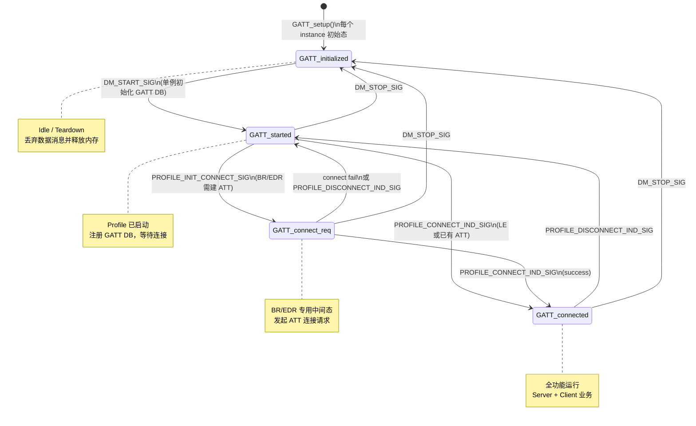

# GATT 模块状态机学习笔记（`SM_STATE_HANDLER`）

> **源码位置**: `wq-adk/components/bt_service/gatt/`  
> **核心文件**: `T_gatt_top.c` / `T_gatt.h`  
> **框架头文件**: `rt_module.h` / `T_module_defs.h`  
> **分析日期**: 2026-05-31

---

## 1. 这套状态机是什么

WuQi BT Service 使用 **RT Module（运行时任务 + 状态机）** 框架管理各 Profile（GATT、HFP、A2DP、CM 等）。

每个模块的典型写法：

1. 在 `.h` 里用 **X-Macro** 列出所有状态名
2. 在 `.c` 里为每个状态写一个 `SM_STATE_HANDLER(状态名)` 函数
3. 函数内部 `switch (msg_id)` 处理消息，必要时 `RT_STATE_TRANS_TO()` 跳转
4. 框架根据当前状态索引，从函数指针表 dispatch 消息

GATT 是理解这套模式的 **好入门样例**：只有 4 个状态，但覆盖了启动、连接、业务、断连、停止全链路。

---

## 2. 宏展开：从 `SM_STATE_HANDLER` 到函数指针表

### 2.1 `SM_STATE_HANDLER` — 定义状态处理函数

```c
// rt_module.h
#define SM_STATE_HANDLER(FN_) \
    int FN_(uint16_t const msg_id, uint16_t const dest_id, \
            uint16_t const src_id, void const *param)
```

写法：

```c
SM_STATE_HANDLER(GATT_initialized)
{
    switch (msg_id) { ... }
}
```

等价于：

```c
int GATT_initialized(uint16_t const msg_id, uint16_t const dest_id,
                     uint16_t const src_id, void const *param)
{
    switch (msg_id) { ... }
}
```

### 2.2 `GATT_TABLE` — X-Macro 声明状态列表

```c
// T_gatt.h
#define GATT_TABLE(DEF)        \
    DEF(GATT_initialized, _ID) \
    DEF(GATT_started, _ID)     \
    DEF(GATT_connect_req, _ID) \
    DEF(GATT_connected, _ID)
```

配合 `rt_module.h` 中的宏，一次定义、多处复用：

| 宏调用 | 展开结果 |
|--------|----------|
| `FUNC_INDEX_DEC(GATT)` | 枚举 `GATT_initialized_ID`, `GATT_started_ID`, `GATT_connect_req_ID`, `GATT_connected_ID`, `GATT_FUNC_MAX_ID` |
| `FUNC_TBL_DEF(GATT)` | `GATT_FUNC_TBL[] = { GATT_initialized, GATT_started, GATT_connect_req, GATT_connected }` |
| `SM_STATE_INFO_DEF(GATT, NULL)` | 把函数表注册给 RT 运行时 |

### 2.3 `T_gatt_top.c` 中的注册代码

```c
RT_MODULE_CONTEXT_DEF(GATT, GATT_APPL_CONTEXT, N_GATT);  // 实例上下文数组
RT_MODULE_STATE_DEF(GATT, N_GATT);                         // 每个实例的当前状态
RT_MODULE_DESC_DEF(GATT, N_GATT);                          // 模块描述符
FUNC_TBL_DEF(GATT);                                        // 状态函数指针表
SM_STATE_INFO_DEF(GATT, NULL);                             // 状态机元信息

void GATT_ctor(void) {
    rt_task_create(MODULE_GATT, &GATT_DESC);
    RT_MODULE_SET_USER_DATA(MODULE_GATT, &GATT_STATE_INFO);
    // 订阅全局消息 ...
}

void GATT_setup(void) {
    for (size_t i = 0; i < N_GATT; i++) {
        RT_MODULE_SET_INIT_STATE(MODULE_GATT, task_id, GATT_initialized_ID);
    }
}
```

**要点**：GATT 支持 **多实例**（`N_GATT` 个 task），每个实例独立维护当前状态，共享同一套状态处理函数。

---

## 3. 运行时 API 速查

| 宏 / API | 作用 |
|----------|------|
| `RT_INDEX_GET(dest_id)` | 从 task ID 取出实例 index（0 ~ N_GATT-1） |
| `RT_MODULE_CONTEXT(GATT, index)` | 取 `g_GATT_app[index]` 实例上下文 |
| `RT_STATE_GET(id)` | 读当前状态 ID |
| `RT_STATE_TRANS_TO(dest_id, state_ID)` | 状态迁移（框架会发 ENTER/EXIT） |
| `SM_STATE_DELEGATE(GATT_initialized)` | 把当前消息转交给另一状态函数处理 |
| `SM_MSG_HANDLED` | 本状态已处理，不再向下传递 |
| `SM_MSG_DELEGATE` | 同上 delegate 的返回值 |
| `MODULE_MSG_STATE_ENTER` | 进入新状态时自动注入 |
| `MODULE_MSG_STATE_EXIT` | 离开旧状态时自动注入 |

### 返回值语义（`T_SM_MSG_STATUS`）

```c
enum T_SM_MSG_STATUS {
    SM_MSG_HANDLED,    // 已处理
    SM_MSG_DELEGATE,   // 已委托给其他状态
    SM_MSG_DEFER,      // 延迟处理
    SM_MSG_UNHANDLED,  // 未处理
};
```

---

## 4. GATT 四状态总览

### 4.1 状态迁移图



### 4.2 状态职责一句话

| 状态 | 含义 | 能否处理 GATT 业务 |
|------|------|-------------------|
| `GATT_initialized` | Profile 未运行 / 已 stop | 否（只 cleanup） |
| `GATT_started` | Profile 已启动，无连接 | 否（只注册 DB + 等连接） |
| `GATT_connect_req` | BR/EDR 正在建 ATT 通道 | 否 |
| `GATT_connected` | 已连接 | **是** |

### 4.3 辅助宏（判断当前状态）

```c
// T_gatt.h
#define GATT_IS_CONNECTED(index_)    (GATT_STATE_IDX_CURRENT(index_) == GATT_connected_ID)
#define GATT_IS_DISCONNECTED(index_) (GATT_STATE_IDX_CURRENT(index_) == GATT_started_ID)
#define GATT_IS_OVER_LE(index_)      (GATT_IS_CONNECTED(index_) && link_type == DQ_LE_LINK)
#define GATT_IS_OVER_BREDR(index_)   (GATT_IS_CONNECTED(index_) && link_type == DQ_BR_LINK)
```

---

## 5. 各状态详细梳理

### 5.1 `GATT_initialized` — 初始 / 停止态

**日志关键字**: `[GATT:x]GATT_initialized ++`

#### 进入时 (`MODULE_MSG_STATE_ENTER`)

- 若实例 `allocated == T_USED`：上报状态变化 → `_gatt_reset_instance()` 清空实例
- 若全局 `gatt_is_start == true`（最后一个 instance 进入 initialized）：
  - 清 `GATT_FLAG`、MTU 交换标志
  - BR/EDR 下恢复 `gatt_set_conn_req_acceptable_flag(true)`

#### 消息处理

| 消息 | 行为 | 下一状态 |
|------|------|----------|
| `DM_START_SIG` | 单例启动：`gatt_db_init` → `gatt_appl_init` → 初始化 send token | → `GATT_started` |
| `GATTS_RECV_WRITE_REQ_SIG` | 释放 `pe->data` | 保持 |
| `GATTS_SEND_READ_RSP_SIG` / `GATTC_SEND_WRITE_SIG` | 释放 data 缓冲 | 保持 |
| `GATTS_SEND_NOTIFY_SIG` / `GATTS_SEND_INDICATE_SIG` | 释放 data + `bt_srv_release_token` | 保持 |
| `GATTS_SEND_READ_BY_TYPE_RSP_SIG` | 释放多条 data | 保持 |
| `GATTS_READ_MULTI_REQ_SIG` | 释放 val | 保持 |

**设计意图**：未连接时收到的数据消息不能泄漏内存，统一在此丢弃。

---

### 5.2 `GATT_started` — Profile 就绪，等待连接

**日志关键字**: `[GATT:x]GATT_started ++`

#### 进入时

- 若非 `DM_START_SIG` 触发（即从 connected/connect_req 退回）：上报状态 + 通知 CM profile 断开
- 始终 `_gatt_reset_instance()`

#### 消息处理

| 消息 | 行为 | 下一状态 |
|------|------|----------|
| `GATTS_REG_SERVICE_SIG` | 注册 Primary Service | 保持 |
| `GATTS_REG_INC_SERVICE_SIG` | 注册 Include Service | 保持 |
| `GATTS_REG_CHARA_SIG` | 注册 Characteristic | 保持 |
| `GATTS_REGISTER_DONE` | 注册 GATT DB、GA 服务、计算 datahash | 保持 |
| `GATTS_GET_DATAHASH_VALUE` | 触发 datahash 计算 | 保持 |
| `PROFILE_CONNECT_IND_SIG` | 保存连接信息（LE 或已有 ATT） | → `GATT_connected` |
| `PROFILE_INIT_CONNECT_SIG` | BR/EDR：查 device queue，准备建 ATT | → `GATT_connect_req` |
| `DM_STOP_SIG` | Profile 停止 | → `GATT_initialized` |
| `TDS_APP_SETUP_SIG` | TDS 恢复，跳到保存的状态 | → `pe->value.pt_gatt` |
| 数据类消息 | `SM_STATE_DELEGATE(GATT_initialized)` | 委托丢弃 |

---

### 5.3 `GATT_connect_req` — BR/EDR ATT 连接中

**日志关键字**: `[GATT:x]GATT_connect_req ++`

#### 进入时

- 调用 `gatt_connect_request(&me->att_handle)` 发起 ATT 连接
- 失败则自行 post `PROFILE_CONNECT_IND_SIG`（reason = API_FAILURE）
- 上报 `GATT_connect_req` 状态

#### 消息处理

| 消息 | 行为 | 下一状态 |
|------|------|----------|
| `PROFILE_CONNECT_IND_SIG` (success) | 保存连接参数 | → `GATT_connected` |
| `PROFILE_CONNECT_IND_SIG` (fail) | 连接失败 | → `GATT_started` |
| `PROFILE_DISCONNECT_IND_SIG` | ACL 断开 | → `GATT_started` |
| `DM_STOP_SIG` | Profile 停止 | → `GATT_initialized` |
| `TDS_APP_SETUP_SIG` | 委托给 `GATT_started` | — |
| 数据类消息 | 委托给 `GATT_initialized` | — |

**为何单独一个状态**：LE 连接时 ATT 随链路建立；BR/EDR 需先有 ACL，再额外发起 ATT 连接，中间需要等待异步结果。

---

### 5.4 `GATT_connected` — 已连接，全功能

**日志关键字**: `[GATT:x]GATT_connected,conn_hld:0x.... ++`

#### 进入时

- BR 链路：绑定 CM ID，更新 profile 连接状态
- 注册 observer：`notify_recv` / `write_recv` 回调
- LE + MTU 交换使能：延迟 100ms 发 `GATTS_SEND_EXCHANGE_MTU_SIG`
- 上报 MTU

#### 退出时 (`MODULE_MSG_STATE_EXIT`)

- 通知 ANCS 断连（若启用）
- 关闭 audio session
- 停止 indicate 超时定时器

#### 消息处理（按类别）

**连接管理**

| 消息 | 行为 | 下一状态 |
|------|------|----------|
| `PROFILE_INIT_DISCONNECT_SIG` | 主动断连（LE 发 disconnect / BR 发 ATT disconnect req） | 保持 |
| `PROFILE_DISCONNECT_IND_SIG` | 断连完成 | → `GATT_started` |
| `DM_STOP_SIG` | BR 先发 ATT disconnect，再 stop | → `GATT_initialized` |
| `SMP_AUTH_COMPLETE_SIG` | LE 配对完成，设 `auth_complete = true` | 保持 |

**GATT Server**

| 消息 | 行为 |
|------|------|
| `GATTS_RECV_WRITE_REQ_SIG` | 分发给 observers，释放 data |
| `GATTS_RECV_READ_REQ_SIG` | 上报 read 事件给应用 |
| `GATTS_SEND_NOTIFY_SIG` | `gatts_send_notify` + release token |
| `GATTS_SEND_INDICATE_SIG` | `gatts_send_indicate` + indicate 超时管理 |
| `GATTS_RECV_INDICATE_CFM_SIG` | indicate 确认回调 |
| `GATTS_SEND_READ_RSP_SIG` | 发送 read response |
| `GATTS_RECV_READ_BY_TYPE_REQ_SIG` | 上报 read-by-type 请求 |
| `GATTS_SEND_READ_BY_TYPE_RSP_SIG` | 发送 read-by-type response |
| `GATTS_SEND_WRITE_RSP_SIG` | 发送 write response |
| `GATTS_READ_MULTI_REQ_SIG` | 多条 read 聚合响应 |
| `GATTS_MTU_CHANGED_SIG` | 上报 MTU 变化 |
| `GATTS_SEND_EXCHANGE_MTU_SIG` | 执行 MTU 交换 |

**GATT Client**

| 消息 | 行为 |
|------|------|
| `GATTC_DISCOVER_SERVICE_SIG` | 发现 Primary Service |
| `GATTC_DISCOVER_CHARACTER_SIG` | 发现 Characteristic |
| `GATTC_DISCOVER_DESCRIPTORS_SIG` | 发现 Descriptor |
| `GATTC_*_COMPLETE_SIG` / `GATTC_DISCOVER_DONE_SIG` | 上报发现结果 |
| `GATTC_SEND_READ_SIG` | Client read |
| `GATTC_SEND_WRITE_SIG` | Client write |
| `GATTC_SEND_READ_BY_TYPE_SIG` | Client read by type |

**音频（上游 session）**

| 消息 | 行为 |
|------|------|
| `AM_OPEN_UPSTREAM_SEESION_SIG` | 打开 VAD/Record session |
| `AM_CLOSE_UPSTREAM_SEESION_SIG` | 关闭 session |
| `AM_AUDIO_FOCUS_CHANGED_SIG` | 处理 focus gain/loss |

---

## 6. 关键设计模式

### 6.1 消息委托（Delegate）

未连接状态收到数据消息时，不各自写 discard 逻辑，而是统一 delegate：

```c
// GATT_started 中
case GATTS_SEND_NOTIFY_SIG:
    return SM_STATE_DELEGATE(GATT_initialized);
```

`GATT_initialized` 集中负责 **释放内存 + release token**，避免泄漏、减少重复代码。

### 6.2 单例启动 + 多实例状态

- `gatt_is_start` 保证 `gatt_db_init` / `gatt_appl_init` **全局只执行一次**
- 但 `DM_START_SIG` 会让 **每个 instance** 都 `RT_STATE_TRANS_TO(GATT_started)`
- `DM_STOP_SIG` 时每个 instance 回到 `initialized`；最后一个 instance 进入时会 teardown 全局资源

### 6.3 LE vs BR/EDR 连接路径差异

```
LE 连接:
  GATT_started ──PROFILE_CONNECT_IND_SIG──▶ GATT_connected

BR/EDR 连接:
  GATT_started ──PROFILE_INIT_CONNECT_SIG──▶ GATT_connect_req
       ──PROFILE_CONNECT_IND_SIG(success)──▶ GATT_connected
```

### 6.4 断连 vs 停止

| 事件 | 目标状态 | Profile 是否仍运行 |
|------|----------|-------------------|
| `PROFILE_DISCONNECT_IND_SIG` | `GATT_started` | 是（可重连） |
| `DM_STOP_SIG` | `GATT_initialized` | 否（完全 teardown） |

---

## 7. 典型生命周期（对照 log）

```
[上电] GATT_setup()
  └─ 所有 instance → GATT_initialized

[DM 启动蓝牙] DM_START_SIG
  └─ gatt_db_init / gatt_appl_init（仅首次）
  └─ 所有 instance → GATT_started
  └─ log: [GATT:x]GATT_started ++

[应用注册 GATT 服务] GATTS_REG_* / GATTS_REGISTER_DONE
  └─ 仍在 GATT_started

[LE 设备连接] PROFILE_CONNECT_IND_SIG
  └─ instance → GATT_connected
  └─ log: [GATT:x]GATT_connected,conn_hld:0x.... ++

[断连] PROFILE_DISCONNECT_IND_SIG
  └─ instance → GATT_started（profile 仍可用）

[蓝牙关闭] DM_STOP_SIG
  └─ instance → GATT_initialized
  └─ log: [GATT:x]GATT_initialized ++
```

---

## 8. 同类模块参考

bt_service 中以下模块使用 **相同框架**，可作为进阶阅读：

| 模块 | 文件 | 状态数 | 特点 |
|------|------|--------|------|
| GATT | `gatt/T_gatt_top.c` | 4 | 本文，入门推荐 |
| HFP | `hfp/T_hfp_top.c` | 多 | 通话状态更复杂 |
| A2DP | `a2dp/T_a2dp_top.c` | 多 | 媒体流状态 |
| CM | `cm/T_cm_top.c` | 多 | 连接管理中枢 |
| LE/GA | `le/le_audio/T_ga_top.c` | 多 | LE Audio |
| AVRCP | `avrcp/T_avrcp_top.c` | 多 | 媒体控制 |
| AM | `am/T_am_top.c` | 多 | 音频焦点管理 |

通用阅读步骤：

1. 找 `XXX_TABLE(DEF)` → 列出所有状态名
2. 找 `FUNC_TBL_DEF(XXX)` → 确认函数表注册
3. 逐个读 `SM_STATE_HANDLER(XXX_xxx)` → 看 `switch(msg_id)` 和 `RT_STATE_TRANS_TO`
4. 找 `XXX_ctor` / `XXX_setup` → 看初始状态和订阅消息

---

## 9. 学习检查清单

- [ ] 能说出 `SM_STATE_HANDLER` 宏展开后的函数签名
- [ ] 能解释 `GATT_TABLE` + `FUNC_TBL_DEF` 如何生成状态 ID 和函数表
- [ ] 能画出 4 状态迁移图，并说明 LE / BR 路径差异
- [ ] 能解释 `SM_STATE_DELEGATE` 的作用和为何 delegate 到 `GATT_initialized`
- [ ] 能区分 `PROFILE_DISCONNECT_IND_SIG` 与 `DM_STOP_SIG` 的状态结果
- [ ] 能在 log 中通过 `GATT_xxx ++` 定位当前状态
- [ ] 能指出 `GATT_connected` 中哪些消息属于 Server、哪些属于 Client

---

## 10. 源码索引

| 内容 | 路径 |
|------|------|
| 状态列表 & 消息枚举 | `wq-adk/components/bt_service/gatt/T_gatt.h` |
| 四个状态处理函数 | `wq-adk/components/bt_service/gatt/T_gatt_top.c` |
| RT 框架宏定义 | `wq-adk/components/bt_service/internal/lib/*/inc/rt_module.h` |
| 模块 ID 定义 | `wq-adk/components/bt_service/common/T_module_defs.h` |
| 实例上下文结构 | `GATT_APPL_CONTEXT` in `T_gatt.h` |
