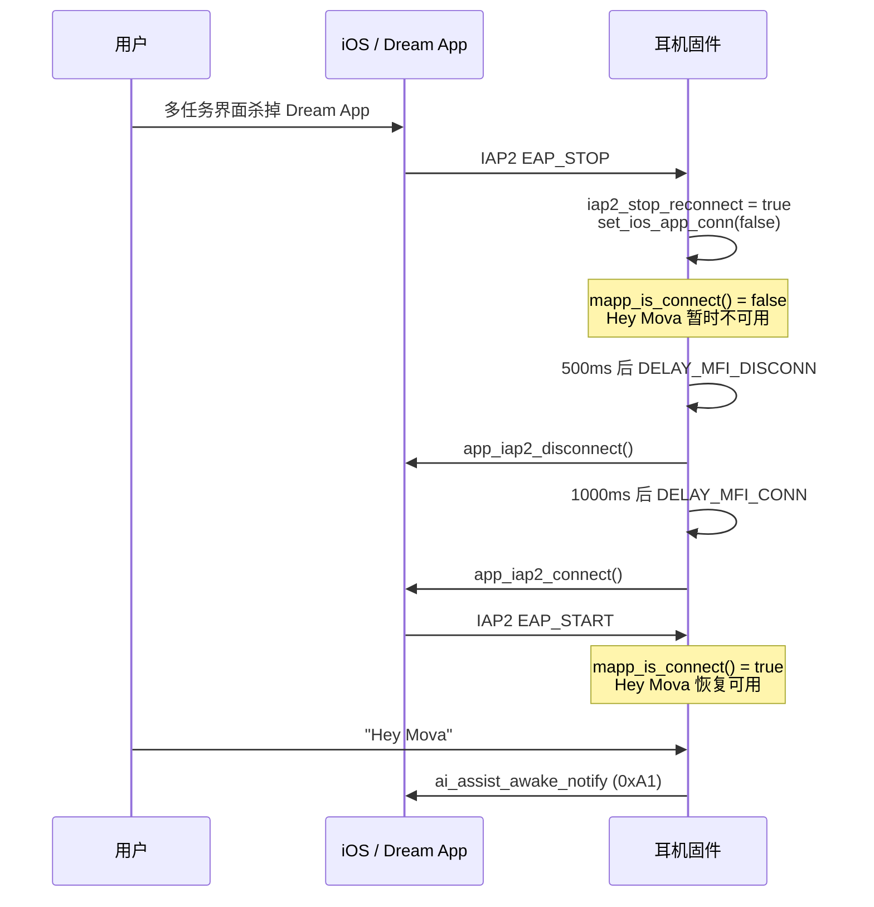

# iOS 杀掉 App 后 Hey Mova 无法唤醒 — 问题修复梳理

> 对应 Commit：`e5ff50c9b5276e8a6b42b20bb64a77a11a49a3a4`  
> 提交信息：`[feat][app] bug 3453`  
> 固件版本：`CONFIG_CUSTOM_VERSION` 156 → 157  
> 工程师结论：**杀掉 APP 后没有在后台重新发起 MFI 断开和连接**

---

## 1. 问题现象

| 场景 | 期望 | 实际（修复前） |
|------|------|----------------|
| iPhone 已连耳机，Dream App 正常运行 | 说 "Hey Mova" 可唤醒 AI 助手 | ✅ 正常 |
| 用户在 iOS 多任务界面 **强制杀掉 Dream App** | 耳机应自动恢复 MFI 通道，Hey Mova 仍可唤醒 | ❌ 无法唤醒 |
| 蓝牙 HFP/A2DP 仍保持连接 | MFI/IAP2 会话应重建 | MFI 会话停在 `EAP_STOP`，未触发重连 |

---

## 2. 根因分析

### 2.1 Hey Mova 唤醒依赖 App 通道

Hey Mova 由耳机端 KWS（Mobvoi）识别，识别后调用 `ai_assistant_awake_notify()` 向手机 App 上报唤醒事件：

```
KWS 命中 "Hey Mova"
  → app_vad_mobvoi_kws_hit_inform()
  → ai_assistant_awake_notify(AI_ASSIST_AWAKE_TYPE_KWS)
  → mcomm_rsp(0xA1, cgroup0xa1_ai_assist_awake_notify, ...)
```

**关键门禁**：`ai_assistant_awake_notify()` 会先检查 `mapp_is_connect()`，App 未连接则直接 `return`，不上报唤醒：

```364:392:wq-adk/project/a2001/acore/app/src/app_ai_assistant.c
void ai_assistant_awake_notify(uint8_t awake_type)
{
    ...
	if(!mapp_is_connect()){
		LOGI("spp disconnect ignore notify\n", awake_type);
		return ;
	}
    ...
    mcomm_rsp(0xA1, cgroup0xa1_ai_assist_awake_notify, APP_RESULT_REPORT, buffer, offset);
}
```

### 2.2 `mapp_is_connect()` 判定逻辑

App 是否"已连接"由 SPP / GATT / **IAP2 EAP 会话** 三者之一决定：

```1123:1128:wq-adk/project/a2001/acore/app/src/app_econn_demo.c
bool mapp_is_connect(void){
    return (spps_connected || gatts_connected
		 #if is_defined(CONFIG_IAP2_ENABLE)
    		 || (iap2_state == IAP2_STATUS_EAP_START) 
		 #endif		
		)?1:0;
}
```

iOS 场景下主要走 **MFI/IAP2** 通道，因此 `iap2_state` 必须为 `IAP2_STATUS_EAP_START`，Hey Mova 才能正常工作。

### 2.3 杀 App 后 IAP2 状态变化

用户在 iOS 上杀掉 Dream App 时：

1. 蓝牙 ACL / A2DP / HFP **通常仍保持连接**
2. IAP2 会话收到 **`IAP2_STATUS_EAP_STOP`**（EAP 层会话结束）
3. 状态 **不一定** 会立即变为 `IAP2_STATUS_DISCONNECTED`（物理 SPP 链路可能仍在）

`iap2_conn_status_callback()` 在收到 `EAP_STOP` 时会：

- 设置 `iap2_stop_reconnect = true`（标记需要重连）
- 调用 `set_ios_app_conn(false)`（App 逻辑上已断开）
- 停止 AI 录音、重新开启 BLE 广播等

```6028:6037:wq-adk/project/a2001/acore/app/src/app_econn_demo.c
    }else if(state == IAP2_STATUS_EAP_STOP){
        iap2_stop_reconnect = true;
        set_ios_app_conn(false);
        ...
		if(!get_spp_status())
            ai_assistant_set_stop_record();
```

此时 `iap2_state = EAP_STOP`，`mapp_is_connect()` 返回 **false**，Hey Mova 唤醒被拦截。

### 2.4 修复前的缺陷：重连条件遗漏 `EAP_STOP`

固件已有 **MFI 断连 → 延迟重连** 机制（bug#2610 引入），由两条延迟消息驱动：

| 消息 ID | 作用 | 延迟 |
|---------|------|------|
| `ECONN_REMOTE_MSG_ID_DELAY_MFI_DISCONN` (145) | 调用 `app_iap2_disconnect()` | 500ms / 2000ms |
| `ECONN_REMOTE_MSG_ID_DELAY_MFI_CONN` (138) | 调用 `app_iap2_connect()` | 1000ms |

断连成功后自动排队重连：

```4535:4547:wq-adk/project/a2001/acore/app/src/app_econn_demo.c
    case ECONN_REMOTE_MSG_ID_DELAY_MFI_DISCONN:
        ...
        iap2_dis_ret=app_iap2_disconnect((BD_ADDR_T *)param);
        if(iap2_dis_ret==WQ_RET_OK){
        app_cancel_msg(MSG_TYPE_ECONN, ECONN_REMOTE_MSG_ID_DELAY_MFI_CONN);
        app_send_msg_delay(MSG_TYPE_ECONN, ECONN_REMOTE_MSG_ID_DELAY_MFI_CONN, (const uint8_t *)param,sizeof(BD_ADDR_T),1000);
        }
```

触发入口在 `iap2_conn_status_callback()` 末尾，当状态为 `EAP_STOP` 或 `DISCONNECTED` 时进入：

```6094:6113:wq-adk/project/a2001/acore/app/src/app_econn_demo.c
    else if((state == IAP2_STATUS_EAP_STOP||state == IAP2_STATUS_DISCONNECTED) 
   && !get_cmc_box_close_flag()
    ){
        ...
        if (!bdaddr_is_zero(&app_iap2_remote_addr)&&app_wws_is_master()) { 
        ...
        app_cancel_msg(MSG_TYPE_ECONN, ECONN_REMOTE_MSG_ID_DELAY_MFI_DISCONN);
	 if(iap2_stop_reconnect && (state == IAP2_STATUS_DISCONNECTED || state == IAP2_STATUS_EAP_STOP)){  // bug 3170 3453
	     iap2_stop_reconnect = false;
            app_send_msg_delay(... DELAY_MFI_DISCONN ..., 500);
	 }else if(state == IAP2_STATUS_DISCONNECTED){
            app_send_msg_delay(... DELAY_MFI_DISCONN ..., 2000);
	 }
```

**修复前**（bug 3170 逻辑）快速重连条件为：

```c
if (iap2_stop_reconnect && state == IAP2_STATUS_DISCONNECTED)
```

杀 App 时状态是 **`EAP_STOP`** 而非 `DISCONNECTED`：

- 第一个 `if`：不满足（state ≠ DISCONNECTED）→ **不发起 500ms 快速重连**
- 第二个 `else if`：也不满足（state ≠ DISCONNECTED）→ **不发起 2000ms 重连**
- **结果：MFI 断连/重连链路完全未触发**，`iap2_state` 长期停留在 `EAP_STOP`

这与工程师描述完全一致：**杀掉 APP 后没有在后台重新发起 MFI 断开和连接**。

---

## 3. 修复方案（Commit e5ff50c9）

### 3.1 代码改动

唯一逻辑变更：将快速 MFI 重连的触发条件从「仅 DISCONNECTED」扩展为「DISCONNECTED **或** EAP_STOP」：

```diff
- if(iap2_stop_reconnect && state == IAP2_STATUS_DISCONNECTED){  // bug 3170
+ if(iap2_stop_reconnect && (state == IAP2_STATUS_DISCONNECTED || state == IAP2_STATUS_EAP_STOP)){  // bug 3170 3453
      iap2_stop_reconnect = false;
      app_send_msg_delay(MSG_TYPE_ECONN, ECONN_REMOTE_MSG_ID_DELAY_MFI_DISCONN,
                         (const uint8_t *)&app_iap2_remote_addr, sizeof(BD_ADDR_T), 500);
```

版本号同步 bump：`CONFIG_CUSTOM_VERSION` 156 → 157。

### 3.2 修复后时序



---

## 4. 相关机制与历史 Commit

| Commit | Bug | 内容 |
|--------|-----|------|
| `c75d7819` | #2610 | 首次引入 `DELAY_MFI_DISCONN` / `DELAY_MFI_CONN` 延迟断连重连机制 |
| `683b1cc9` | #3170 / #3220 | 新增 `iap2_stop_reconnect` 标志；仅在 `DISCONNECTED` 时走 500ms 快速重连 |
| **`e5ff50c9`** | **#3453** | **将快速重连条件扩展至 `EAP_STOP`，修复杀 App 场景** |

### 4.1 `iap2_stop_reconnect` 标志作用

- 在 `IAP2_STATUS_EAP_STOP` 时置 `true`（表示 App 侧会话异常结束，需要重建）
- 触发一次快速重连后置 `false`，避免重复断连
- 配合 `ECONN_MSG_ID_MFICONN_ROLE_DELAY`（3s 超时）防止 TWS 角色切换期间误触发

### 4.2 重连延迟策略

| 条件 | 断连延迟 | 说明 |
|------|----------|------|
| `iap2_stop_reconnect && (DISCONNECTED \|\| EAP_STOP)` | **500ms** | App 被杀 / 会话异常，快速重建 |
| 仅 `DISCONNECTED`（非 stop_reconnect 路径） | 2000ms | 普通过路断开，较慢重连 |
| 断连成功后 | **+1000ms** 再连 | `DELAY_MFI_CONN` |
| 重连时若仍为 `EAP_STOP` | 再等 1000ms 重试 | 防止状态未就绪 |

### 4.3 与 `launch_dream_app()` 的关系

App 被杀后，若 MFI 重连成功且 IAP2 回到 `EAP_START`，可通过 IAP2 Launch App 拉起 Dream App：

```5746:5771:wq-adk/project/a2001/acore/app/src/app_econn_demo.c
static void bt_iap2_launch_app(bool is_cn, bool alert)
{
    ...
    ret=app_iap2_launch_app(&iap2_remote_addr, appboudid, alert);
}

void launch_dream_app(bool is_cn)
{
	if(iap2_state == IAP2_STATUS_EAP_START)
		bt_iap2_launch_app(is_cn,true);
	else
		LOGD("launch_dream_app iap2 disconnect");
}
```

本次修复侧重 **耳机端自动 MFI 断连/重连**；App 拉起属于 MFI 重连成功后的附加能力，由 App 协议命令（`app_cmd.c`）或 IAP2 Launch 触发。

---

## 5. 涉及文件

| 文件 | 变更 |
|------|------|
| `wq-adk/project/a2001/acore/app/src/app_econn_demo.c` | 核心修复：`iap2_conn_status_callback()` 重连条件 |
| `wq-adk/project/a2001/config/7036AC/defconfig.pro` | 版本号 157 |
| `wq-adk/project/a2001/sdkconfig` | 版本号 157 |

### 关联只读文件（未在本 Commit 修改，但构成完整链路）

| 文件 | 职责 |
|------|------|
| `app_ai_assistant.c` | Hey Mova KWS 识别与 `mapp_is_connect()` 门禁 |
| `app_iap2.c` / `wq_iap2.c` | IAP2 底层连接/断连/状态回调 |
| `app_econn_demo.h` | 消息 ID 定义（138/145 等） |

---

## 6. 验证建议

1. iPhone 连接耳机，打开 Dream App，确认 Hey Mova 可唤醒
2. 从 iOS 多任务界面 **上滑杀掉 Dream App**（保持蓝牙连接）
3. 等待约 **1.5s**（500ms 断连 + 1000ms 重连）
4. 再次说 "Hey Mova"，应能正常唤醒
5. 抓 log 关键字：
   - `ECONN_REMOTE_MSG_ID_DELAY_MFI_DISCONN`
   - `ECONN_REMOTE_MSG_ID_DELAY_MFI_CONN`
   - `iap2_conn_status_callback ... state:EAP_STOP`
   - `iap2_conn_status_callback ... state:EAP_START`（重连成功）

---

## 7. 总结

| 项目 | 说明 |
|------|------|
| **问题** | iOS 杀 App 后 IAP2 进入 `EAP_STOP`，Hey Mova 因 `mapp_is_connect()==false` 无法上报唤醒 |
| **根因** | MFI 自动断连/重连仅在 `DISCONNECTED` 时触发，杀 App 场景只产生 `EAP_STOP`，重连链路未启动 |
| **修复** | Commit `e5ff50c9`：快速重连条件增加 `IAP2_STATUS_EAP_STOP` |
| **效果** | 杀 App 后耳机在后台自动执行 MFI 断开（500ms）→ 重连（1000ms），恢复 `EAP_START`，Hey Mova 重新可用 |
