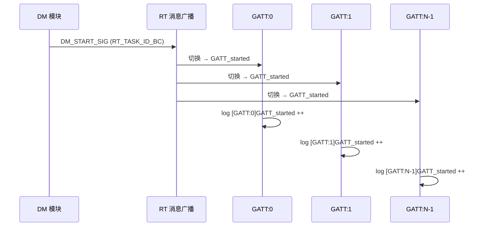

# Profile Instance 个数学习笔记

> **问题来源**: 分析 COM5 日志中 `GATT_started ++`、`SPP_started ++` 等同名 log 为何出现多行  
> **核心结论**: 方括号里的数字是 **instance index**，不是重复打印；个数由 **编译期宏** 决定  
> **分析日期**: 2026-05-31

---

## 1. 问题现象

蓝牙上电后，log 中会出现多行类似输出：

```
[A2DP:5, 0xFFFF]A2DP_started ++
[AVRCP:0, 0xFFFF]AVRCP_started ++
[AVRCP:1, 0xFFFF]AVRCP_started ++
[SPP:0]SPP_started ++
...
[SPP:6]SPP_started ++
[GATT:0]GATT_started ++
...
[GATT:3]GATT_started ++
```

**这不是同一条 log 重复打印**，而是同一 Profile 模块的 **多个 instance** 各自进入 `started` 状态后各打一行。

触发原因：DM 上电时广播 `DM_START_SIG`，每个 instance 从 `*_initialized` 切到 `*_started`：

```c
// dm/T_dm_top.c
rt_common_evt_t *pe = RT_MSG_NEW(DM_START_SIG, RT_TASK_ID_BC, 0, rt_common_evt_t);
RT_MSG_PUT(pe);
```

`RT_TASK_ID_BC` 表示广播；各 Profile 的每个 instance 独立响应并打印 log。

---

## 2. Instance 个数由什么决定

**不是运行时决定，而是编译期宏写死。**

### 2.1 配置链路（三层）

```
sdkconfig / defconfig.pro     ← Kconfig 选项（menuconfig 可改）
        ↓
bt_srv_common_cfg.h           ← Kconfig → MULTI_DEVICE_CONNECTION 等中间宏
        ↓
appl_limits.h / bt_stack_cfg.h ← 各 Profile 的具体数字
        ↓
T_xxx.h 里的 N_XXX            ← 状态机实际 instance 数
        ↓
g_XXX_app[N_XXX]              ← 编译期分配的上下文数组
```

每个 Profile 在 `T_xxx.h` 中声明 instance 数，例如：

```c
// T_gatt.h
#define N_GATT   GATT_MAX_INSTANCE

// T_spp.h
#define N_SPP    CFG_SPP_MAX_ENTITY

// T_a2dp.h
#define N_A2DP   CFG_A2DP_MAX_CODECS

// T_avrcp.h
#define N_AVRCP  CFG_AVRCP_MAX_PROFILES

// T_hfp.h
#define N_HFP    CFG_HFP_UNIT_MAX_CONNECTIONS

// T_cm.h
#define N_CM     CM_MAX_INSTANCE

// T_le.h
#define N_LE     LE_MAX_INSTANCE
```

`XXX_setup()` 中循环创建 instance：

```c
for (size_t i = 0; i < N_GATT; i++) {
    RT_MODULE_SET_INIT_STATE(MODULE_GATT, task_id, GATT_initialized_ID);
}
```

---

## 3. 分类说明

### 3.1 与「多设备连接」相关

#### 顶层开关：`CONFIG_APP_BT_MAX_CONNECTION`

Kconfig 定义（`components/apps/Kconfig.in`）：

```
config APP_BT_MAX_CONNECTION
    int "BT max connection num"
    range 1 2
    default 2
```

转换为中间宏（`common/bt_srv_common_cfg.h`）：

```c
#if (CONFIG_APP_BT_MAX_CONNECTION > 1)
#ifndef MULTI_DEVICE_CONNECTION
#define MULTI_DEVICE_CONNECTION
#endif
#endif
```

#### CM instance 数

```c
// common/appl_limits.h
#ifdef MULTI_DEVICE_CONNECTION
#define CM_MAX_INSTANCE (4)
#else
#define CM_MAX_INSTANCE (2)
#endif
```

| `CONFIG_APP_BT_MAX_CONNECTION` | `MULTI_DEVICE_CONNECTION` | `N_CM` |
|----------------------------------|---------------------------|--------|
| 1 | 未定义 | 2 |
| 2（默认） | 已定义 | **4** |

#### 与最大 BR 连接设备数对齐的 Profile

| Profile | 宏 | 典型值 | 配置宏 | 配置文件 |
|---------|-----|--------|--------|----------|
| HFP | `N_HFP` | 2 | `CFG_HFP_UNIT_MAX_CONNECTIONS` | `adapter/*/bt_stack_cfg.h` |
| AVRCP | `N_AVRCP` | 2 | `CFG_AVRCP_MAX_PROFILES` | 同上 |
| GA (LE Audio) | `N_GA` | 2 | `APPL_GA_MAX_DEVICES` | `le/le_audio/appl/appl_ga.h` |

含义：最多 2 部手机时，每部各有一套 HFP / AVRCP / GA 状态机槽位。

---

### 3.2 A2DP — 由 codec 种类数量决定

A2DP 的 instance 数 **不等于连接数**，而是 **codec 通道资源池**大小。

```c
// adapter/hornet/bt_stack_cfg.h
#define BASE_A2DP_CODECS_NUM  (6)

#if defined(CONFIG_CODEC_LHDC_ENABLE)
#define LHDC_CODECS_NUM (4)
#else
#define LHDC_CODECS_NUM (0)
#endif

#if defined(CONFIG_CODEC_L2HC_ENABLE)
#define L2HC_CODECS_NUM (2)
#else
#define L2HC_CODECS_NUM (0)
#endif

#define CFG_A2DP_MAX_CODECS  (BASE_A2DP_CODECS_NUM + LHDC_CODECS_NUM + L2HC_CODECS_NUM)
```

| Kconfig | 增量 | 说明 |
|---------|------|------|
| （基础） | 6 | SBC / AAC 等基础 codec 槽 |
| `CONFIG_CODEC_LHDC_ENABLE` | +4 | LHDC 相关 codec 槽 |
| `CONFIG_CODEC_L2HC_ENABLE` | +2 | L2HC 相关 codec 槽 |

A2007 `defconfig.pro` 未开 LHDC/L2HC → **N_A2DP = 6**，对应 log 中 `A2DP:0` ~ `A2DP:5`。

---

### 3.3 SPP — 由 RFCOMM 通道池决定

```c
// adapter/hornet/bt_stack_cfg.h
#define CFG_SPP_MAX_ENTITY (7)   // hornet 平台

// adapter/bbb/bt_stack_cfg.h
#define CFG_SPP_MAX_ENTITY (6)   // bbb 平台
```

与 CM 连接数无关，表示最多同时开几个 SPP 通道（多 UUID、多应用通道）。

A2007 使用 hornet → **N_SPP = 7**，对应 log 中 `SPP:0` ~ `SPP:6`。

---

### 3.4 GATT / LE — 应用层固定上限

```c
// common/appl_limits.h
#define LE_MAX_INSTANCE   (3)
#define GATT_MAX_INSTANCE (4)
```

| Profile | 宏 | 值 | 说明 |
|---------|-----|-----|------|
| GATT | `N_GATT` | **4** | bt_service 状态机 instance 数 |
| LE | `N_LE` | **3** | LE 连接管理 instance 数 |

**注意**：`N_GATT = 4` 是 **应用层状态机** 的 instance 数；协议栈侧还有独立的 `CFG_ATT_MAX_CONNECTION_INSTANCES`（随 `CONFIG_BLE_AUDIO_ENABLED`、`MULTI_DEVICE_CONNECTION` 变化），两者用途不同，数值也可能不一致。

```c
// adapter/hornet/bt_stack_cfg.h（协议栈 ATT 连接实例，非 N_GATT）
#if is_defined(CONFIG_BLE_AUDIO_ENABLED)
#ifdef MULTI_DEVICE_CONNECTION
#define CFG_ATT_MAX_CONNECTION_INSTANCES (14)
#else
#define CFG_ATT_MAX_CONNECTION_INSTANCES (7)
#endif
#else
#define CFG_ATT_MAX_CONNECTION_INSTANCES (4)
#endif
```

---

### 3.5 固定为 1 的单例模块

| Profile | 宏 | 值 | 说明 |
|---------|-----|-----|------|
| DM | `N_DM` | 1 | 设备管理，全局唯一 |
| RM | `N_RM` | 1 | 角色管理（TWS 等） |
| AM | `N_AM` | 1 | 音频焦点管理 |
| HID | `N_HID` | 1 | HID over BR/EDR |
| ANCS | `N_ANCS` | 1 | Apple 通知中心 |
| PAN | `N_PAN` | 1 | 网络接入 |
| FIFO | `N_FIFO` | 1 | FIFO 模块 |
| BTRPC | `N_BTRPC` | 1 | BT RPC |
| TWS_SYNC | `N_TWS_SYNC` | 1 | TWS 同步 |

这些模块不需要多连接槽位，只有 1 个状态机 instance。

---

### 3.6 其他受 Kconfig 影响的相关参数

以下参数 **不直接等于** `N_XXX`，但与 Profile 能力/内存相关：

| Kconfig | 影响宏 | 值（典型） | 说明 |
|---------|--------|-----------|------|
| `CONFIG_AVRCP_LYRIC_ENABLE` | `BT_STACK_N_AVRCP_CONTEXT` | 7 或 3 | AVRCP **栈上下文**数，≠ `N_AVRCP(2)` |
| `CONFIG_BLE_AUDIO_ENABLED` | `CFG_ATT_MAX_CONNECTION_INSTANCES` | 4/7/14 | 协议栈 ATT 连接实例 |
| `CONFIG_CUS_L2CAP_PSM_ENABLE` | `BT_STACK_N_CBFC_L2CAP_CHANNELS` | 5~16 | L2CAP CBFC 通道数 |
| `BT_STACK_TRIMMED` | `CFG_BT_MAX_REMOTE_DEVICES` | 3 或 4 | 裁剪栈内存时的最大远端设备数 |

---

## 4. A2007（7035AX-B / hornet）当前数值

结合 `config/7035AX-B/defconfig.pro` + `sdkconfig`：

| Profile | Instance 数 | 决定因素 |
|---------|-------------|----------|
| CM | **4** | `APP_BT_MAX_CONNECTION=2` → `MULTI_DEVICE_CONNECTION` |
| A2DP | **6** | `BASE_A2DP_CODECS_NUM=6`，未开 LHDC/L2HC |
| AVRCP | **2** | `CFG_AVRCP_MAX_PROFILES=2` |
| HFP | **2** | `CFG_HFP_UNIT_MAX_CONNECTIONS=2` |
| SPP | **7** | hornet 平台 `CFG_SPP_MAX_ENTITY=7` |
| GATT | **4** | `GATT_MAX_INSTANCE=4` |
| LE | **3** | `LE_MAX_INSTANCE=3` |
| DM / RM / AM | **1** | 单例模块 |

与 COM5 log（`2026-05-30-17-10-41-253-COM5.log`）中上电时的 `*_started ++` 条数完全一致。

完整 log 中 A2DP 也是 0~5 共 6 条（用户截取片段可能只显示最后一条 `A2DP:5`）。

---

## 5. Log 字段解读

### 5.1 Instance index

```
[GATT:2]GATT_started ++
        ↑
    instance 编号，范围 0 ~ N_GATT-1
```

### 5.2 conn_handle `0xFFFF`

A2DP/AVRCP 日志格式：`[A2DP:5, 0xFFFF]A2DP_started ++`

`0xFFFF` = `HCI_INVALID_HANDLE`，表示 instance 已进入 `started` 但 **尚无 ACL 连接**。

### 5.3 全局 init vs 每 instance 状态切换

以 GATT 为例，`DM_START_SIG` 处理中：

```c
// gatt/T_gatt_top.c
case DM_START_SIG: {
    if (!gatt_is_start) {
        gatt_db_init(...);      // 全局 init，仅首次
        gatt_appl_init();
        gatt_is_start = true;
    }
    RT_STATE_TRANS_TO(dest_id, GATT_started_ID);  // 每个 instance 都执行
    return SM_MSG_HANDLED;
}
```

- **全局资源**（GATT DB、token 等）：单例，只 init 一次
- **状态切换 + log**：每个 instance 独立执行 → 打 N 行 log

---

## 6. 上电启动流程



SPP、A2DP、AVRCP 等 Profile 同理，只是 `N_XXX` 不同。

---

## 7. 如何修改 Instance 个数

| 目标 | 修改位置 | 说明 |
|------|----------|------|
| 最大手机连接数 | Kconfig `CONFIG_APP_BT_MAX_CONNECTION` | 影响 CM 及 MULTI_DEVICE 相关逻辑 |
| A2DP instance | `CONFIG_CODEC_LHDC_ENABLE` / `CONFIG_CODEC_L2HC_ENABLE` | 或改 `BASE_A2DP_CODECS_NUM` |
| SPP 通道数 | `adapter/hornet/bt_stack_cfg.h` → `CFG_SPP_MAX_ENTITY` | 平台相关 |
| GATT / LE 槽位 | `common/appl_limits.h` → `GATT_MAX_INSTANCE` / `LE_MAX_INSTANCE` | 应用层上限 |
| HFP / AVRCP 连接槽 | `bt_stack_cfg.h` → `CFG_HFP_UNIT_MAX_CONNECTIONS` / `CFG_AVRCP_MAX_PROFILES` | 通常与最大设备数对齐 |

**注意**：修改宏后必须 **全量重新编译**。`g_XXX_app[N_XXX]` 等数组在编译期分配，无法在运行时动态增减。

---

## 8. 与状态机文档的关系

Instance 个数决定 `[GATT:x]` 中 `x` 的范围；每个 instance 独立运行同一套状态机（`initialized → started → connected → ...`）。

状态机行为详见：[gatt-state-machine-study.md](./gatt-state-machine-study.md)

---

## 9. 学习检查清单

- [ ] 能解释 log 中多行 `*_started ++` 不是重复，而是不同 instance index
- [ ] 能说出 `N_XXX` 的三层配置链路（Kconfig → cfg 头文件 → T_xxx.h）
- [ ] 能区分 A2DP instance（codec 池）与 AVRCP instance（连接槽）的设计目的
- [ ] 能区分 `N_GATT`（应用状态机）与 `CFG_ATT_MAX_CONNECTION_INSTANCES`（协议栈）
- [ ] 能根据 A2007 defconfig 推算当前各 Profile 的 instance 数
- [ ] 知道修改 instance 数需要改哪些文件并重新编译

---

## 10. 源码索引

| 内容 | 路径 |
|------|------|
| Kconfig 最大连接数 | `wq-adk/components/apps/Kconfig.in` |
| MULTI_DEVICE 转换 | `wq-adk/components/bt_service/common/bt_srv_common_cfg.h` |
| CM / GATT / LE 上限 | `wq-adk/components/bt_service/common/appl_limits.h` |
| HFP / A2DP / SPP / AVRCP 等 | `wq-adk/components/bt_service/adapter/hornet/bt_stack_cfg.h` |
| 各 Profile N_XXX 定义 | `wq-adk/components/bt_service/*/T_xxx.h` |
| DM 广播 DM_START_SIG | `wq-adk/components/bt_service/dm/T_dm_top.c` |
| A2007 项目配置 | `wq-adk/project/a2007/config/7035AX-B/defconfig.pro` |
| 参考 log | `2026-05-30-17-10-41-253-COM5.log` |
