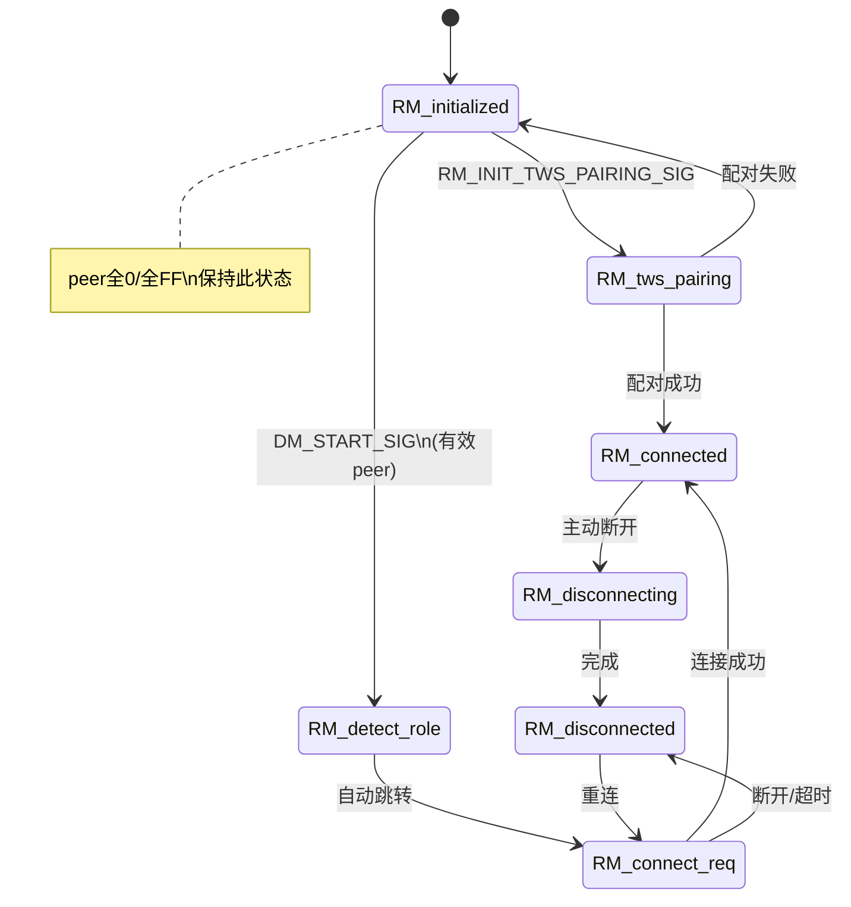

# 物奇 BT Service 前缀与命名速查（以 RM_initialized 为入口）

本文档梳理 `wq-adk/components/bt_service` 中 **1～2 个大写字母前缀** 的模块、状态、宏变量含义，便于阅读 `RM_initialized` 等状态机代码。

> 代码入口：`rm/T_rm_top.c` → `SM_STATE_HANDLER(RM_initialized)`  
> RT/RM 逻辑详解：[RT_RM_LOGIC.md](./RT_RM_LOGIC.md)  
> RM_detect_role 与主从判定：[RM_DETECT_ROLE_QA.md](./RM_DETECT_ROLE_QA.md)  
> `T_` 文件分层说明：[T_PREFIX_GUIDE.md](./T_PREFIX_GUIDE.md)  
> `SM_` 状态机写法：[SM_MODULE_GUIDE.md](./SM_MODULE_GUIDE.md)

---

## 目录

0. [RT 前缀是什么？](#0-rt-前缀是什么)
1. [命名规则](#1-命名规则)
2. [RM_initialized 代码解读](#2-rm_initialized-代码解读)
3. [RM 模块全状态](#3-rm-模块全状态-role-manager)
4. [MODULE 模块 ID 一览](#4-module-模块-id-一览)
5. [核心模块状态机](#5-核心模块状态机)
6. [Profile 协议模块](#6-profile-协议模块)
7. [角色与地址宏](#7-角色与地址宏)
8. [BTS 系统状态位](#8-bts-系统状态位)
9. [应用层前缀（acore）](#9-应用层前缀acore)
10. [链路 / 同步相关术语](#10-链路--同步相关术语)
11. [消息与信号后缀](#11-消息与信号后缀)

---

## 0. RT 前缀是什么？

**RT = Runtime（运行时框架）**，是物奇 BT Service 内部的 **任务 + 消息 + 状态机引擎**，与业务模块前缀（RM/DM/CM）处于不同层次。

头文件目录：`bt_service/internal/lib/<chip>/inc/rt_*.h`

| 头文件 | 作用 |
|--------|------|
| `rt_engine.h` | 引擎入口：`rt_init()` / `rt_run()` |
| `rt_task.h` | 任务（Task）创建、状态读写 |
| `rt_msg.h` | 消息分配、投递、定时投递 |
| `rt_module.h` | 模块状态机：`SM_STATE_HANDLER`、`RT_MODULE_*` |
| `rt_timer.h` | 定时器 |
| `rt_queue.h` | 消息队列 |
| `rt_buffer.h` | 消息内存池 |
| `rt_event.h` | 事件分发 |
| `rt_common.h` | 汇总包含上述所有头文件 |

### RT 与 RM/DM 的关系

```
┌─────────────────────────────────────┐
│  RT Runtime 框架（基础设施层）         │
│  任务调度、消息队列、状态机调度        │
└─────────────────────────────────────┘
          ↑ 所有模块跑在 RT 之上
┌─────────┴───────────────────────────┐
│ RM / DM / CM / HFP / A2DP ...     │  ← 业务模块（MODULE_XX）
│ 每个模块 = 一个 RT Task             │
│ 每个状态 = SM_STATE_HANDLER(XX_yyy) │
└───────────────────────────────────┘
```

### 常用 RT 宏

| 宏 | 含义 | 示例 |
|----|------|------|
| `RT_BUILD_ID(module, index)` | 构造 **任务 ID**（高 8 位=实例，低 8 位=模块类型） | `RT_BUILD_ID(MODULE_RM, 0)` |
| `RM_TASK_ID()` | 等价于 `RT_BUILD_ID(MODULE_RM, 0)` | RM 模块任务 ID |
| `RT_MSG_NEW(sig, dest, src, Type)` | 分配带参数的消息 | `RT_MSG_NEW(DM_START_SIG, ...)` |
| `RT_MSG_PUT(p)` | 投递消息到 **普通优先级** 队列 | 异步发给目标 Task |
| `RT_MSG_PUT_URGENT(p)` | 投递到 **高优先级** 队列 | 紧急消息 |
| `RT_MSG_PUT_DELAY(p, ms, timer)` | **延迟**投递消息 | `RM_RECONNECT_PRI_SIG` 定时 paging |
| `RT_STATE_GET(id)` | 读取某 Task 当前状态索引 | 等价 `RM_STATE_IDX_CURRENT()` |
| `RT_STATE_TRANS_TO(id, state)` | **状态转移** | `RT_STATE_TRANS_TO(dest_id, RM_connected_ID)` |
| `RT_INDEX_GET(dest_id)` | 从任务 ID 取实例下标 | 多实例 Profile 用 |
| `RT_TYPE_GET(task_id)` | 从任务 ID 取模块类型 | 得到 `MODULE_RM` 等 |

### RT 核心类型

| 类型 | 含义 |
|------|------|
| `RT_TASK_ID` | 任务标识（16 bit：实例 + 模块类型） |
| `RT_MSG_ID` | 消息标识（16 bit：高 8 位模块，低 8 位信号序号） |
| `RT_STATE` | 状态索引（`uint8_t`，如 `RM_initialized_ID`） |
| `rt_msg_t` | 消息体（含 dest/src/param） |
| `rt_task_desc_t` | 任务描述（handler + 状态表） |

### SM_ 前缀（State Machine，状态机语法糖）

> 完整用法（返回值、父子状态、DEFER、模板与示例）：[SM_MODULE_GUIDE.md](./SM_MODULE_GUIDE.md)

`SM_` 宏定义在 `rt_module.h`，是 RT 框架上写状态机的 **语法封装**：

| 宏 | 含义 |
|----|------|
| `SM_STATE_HANDLER(RM_initialized)` | 定义名为 `RM_initialized` 的状态处理函数 |
| `SM_MSG_HANDLED` | 消息已处理，返回给框架 |
| `SM_MSG_DELEGATE` | 委托给子状态处理 |
| `SM_MSG_DEFER` | 延迟处理（放入 defer 队列） |
| `SM_STATE_DELEGATE(FN_)` | 转调另一个状态 handler |
| `MODULE_MSG_STATE_ENTER` | 进入状态时框架自动发的消息 |
| `MODULE_MSG_STATE_EXIT` | 退出状态时框架自动发的消息 |

因此代码里常见组合：

```c
SM_STATE_HANDLER(RM_initialized)   // 用 SM_ 定义状态函数
{
    case DM_START_SIG:              // 收到 DM 模块发来的信号
        RT_STATE_TRANS_TO(dest_id, RM_detect_role_ID);  // 用 RT_ 做状态跳转
        return SM_MSG_HANDLED;      // 用 SM_ 告诉框架已处理
}
```

### RT 消息投递示例（串联 RM_initialized）

```
app_user_cmd.c
  RT_MSG_NEW(DM_START_SIG, RT_BUILD_ID(MODULE_RM, 0), ...)
  RT_MSG_PUT(pe)
       ↓ RT 消息队列
T_rm_top.c  RM_initialized 收到 DM_START_SIG
  RT_STATE_TRANS_TO(dest_id, RM_detect_role_ID)
       ↓ RT 框架触发 MODULE_MSG_STATE_ENTER
RM_detect_role → 立即跳转 RM_connect_req
```

### RT 与 MODULE 的 ID 编码

```
RT_TASK_ID = RT_BUILD_ID(MODULE_RM, 0)
  低 8 bit (0x00~0xFF) = 模块类型 → MODULE_RM / MODULE_DM ...
  高 8 bit             = 实例下标 → 0, 1, 2（多路 HFP/A2DP）

RT_MSG_ID = RT_MODULE_MSG_ID_BUILD(MODULE_RM, signal_index)
  高 8 bit = 模块类型
  低 8 bit = 信号序号 → DM_START_SIG, RM_CONNECT_IND_SIG ...
```

---

## 1. 命名规则

物奇 BT Service 基于 **RT 状态机框架**（`rt_module.h`），命名惯例如下：

| 模式 | 示例 | 含义 |
|------|------|------|
| `XX_initialized` | `RM_initialized` | 模块 **初始/空闲** 状态，等待启动信号 |
| `XX_connected` | `RM_connected` | 模块 **已连接** 工作状态 |
| `XX_connect_req` | `RM_connect_req` | 正在 **发起连接** |
| `XX_disconnecting` | `RM_disconnecting` | 正在 **断开** |
| `MODULE_XX` | `MODULE_RM` | 模块 ID（`T_module_defs.h`） |
| `XX_TABLE(DEF)` | `RM_TABLE` | 模块全部状态列表，用于生成状态 ID |
| `XX_MSG_INDEX` | `RM_RECONNECT_PRI_SIG` | 模块内部 **信号/消息** 枚举 |
| `XX_TASK_ID()` | `RM_TASK_ID()` | 模块任务 ID = `RT_BUILD_ID(MODULE_RM, 0)` |
| `XX_CONTEXT` | `RM_CONTEXT` | 模块运行时上下文结构体 |
| `IS_XX_*()` / `XX_IS_*()` | `IS_PRI_ROLE()` | 布尔判断宏 |

**记忆技巧：** 看到 `RM_xxx`，先想 **Role Manager（TWS 角色/对耳链路）**；`DM_xxx` = Device Manager；`CM_xxx` = Connection Manager。

---

## 2. RM_initialized 代码解读

文件：`bt_service/rm/T_rm_top.c`

`RM_initialized` 是 RM 模块的 **待命状态**，不主动连对耳，只响应信号：

```c
SM_STATE_HANDLER(RM_initialized)
{
    switch (msg_id) {
    case MODULE_MSG_STATE_ENTER:
        __rm_reset_instance(me);      // 重置 RM 上下文
        __tws_clear_exchange_data();
        __rm_reset_role(me);          // 按 Flash 校正主从角色
        __rm_set_connectable(false);
        break;

    case RM_INIT_TWS_PAIRING_SIG:
        // 收到配对命令 → 转入 RM_tws_pairing
        RT_STATE_TRANS_TO(dest_id, RM_tws_pairing_ID);
        break;

    case DM_START_SIG:
        // BT 栈启动完成，DM 通知 RM 开始工作
        bt_service_evt_tws_role_changed(..., TWS_ROLE_CHANGED_REASON_POWER_ON);

        if (peer 全0 或 全FF) {
            // 无对耳 / Single Mode → 保持 initialized
            bt_storage_write_tws_single_mode(SINGLE);
            if (全FF) 设置 TWS_FACTORY 产线标志;
            return;
        } else {
            // 有有效 peer MAC → 开始重连
            if (IS_PRI_ROLE()) 延迟发送 RM_RECONNECT_PRI_SIG;
            RT_STATE_TRANS_TO(dest_id, RM_detect_role_ID);
        }
        break;
    }
}
```

**关键信号：**

| 信号 | 来源 | 作用 |
|------|------|------|
| `MODULE_MSG_STATE_ENTER` | RT 框架 | 进入状态时自动触发 |
| `RM_INIT_TWS_PAIRING_SIG` | DM / RPC | 启动 TWS 配对 → `RM_tws_pairing` |
| `DM_START_SIG` | DM 上电流程 | 根据 peer 地址决定 **停留** 或 **重连** |

---

## 3. RM 模块全状态（Role Manager）

头文件：`rm/T_rm.h`（`_ROLE_MGR_H`）

| 状态 | 含义 |
|------|------|
| `RM_initialized` | 初始待命；无对耳或等待 `DM_START_SIG` |
| `RM_tws_pairing` | TWS **配对中**（inquiry/page，vid/pid/magic 匹配） |
| `RM_detect_role` | 重连 **标记过渡态**（立即跳转到 `RM_connect_req`，主从见 [RM_DETECT_ROLE_QA.md](./RM_DETECT_ROLE_QA.md)） |
| `RM_connect_req` | TWS **连接请求中**（PRI page / SEC 主动连） |
| `RM_disconnected` | TWS 链路 **已断开**，可重新发起连接 |
| `RM_connected` | TWS 链路 **已连接**，正常工作 |
| `RM_disconnecting` | TWS 链路 **断开中** |

**常用判断宏：**

| 宏 | 含义 |
|----|------|
| `RM_IS_CONNECTED()` | 当前在 `RM_connected` |
| `RM_IS_DISCONNECTED()` | 状态 ≤ `RM_disconnected` |
| `RM_IS_TWS_PAIRING()` | 当前在 `RM_tws_pairing` |
| `RM_IS_FACTORY_MODE()` | Single Mode 产线标志置位 |
| `RM_IS_VALID_PEER_ADDR()` | peer 为有效 MAC（非 0 非 FF） |
| `RM_IS_SINGLE_MODE_PEER_ADDR()` | peer 为全 FF |

**常用 RM 信号（节选）：**

| 信号 | 含义 |
|------|------|
| `RM_RECONNECT_PRI_SIG` | 主耳重连定时器到，发起 paging |
| `RM_CONNECT_IND_SIG` | TWS ACL 连接结果 |
| `RM_INIT_TWS_PAIRING_SIG` | 进入 TWS 配对 |
| `RM_TWS_PAIRING_RESULT_SIG` | 配对超时 / 发现对耳 |
| `RM_SWAP_IND_SIG` | 主从角色切换 |
| `RM_DETECT_ENABLE_SIG` | 双主检测开关 |
| `DM_START_SIG` / `DM_STOP_SIG` | DM 启停 RM |

---

## 4. MODULE 模块 ID 一览

定义：`common/T_module_defs.h` → `enum T_APP_MODULE_ID`

| 前缀 | MODULE 常量 | 全称 / 含义 | 头文件 |
|------|-------------|-------------|--------|
| **DM** | `MODULE_DM` | **Device Manager** 设备管理（BT 总开关、可见性、工厂复位） | `dm/T_dm.h` |
| **CM** | `MODULE_CM` | **Connection Manager** ACL 连接管理（连手机） | `cm/T_cm.h` |
| **RM** | `MODULE_RM` | **Role Manager** TWS 角色与对耳链路 | `rm/T_rm.h` |
| **AM** | `MODULE_AM` | **Audio Manager** 音频会话/焦点管理 | `am/T_am.h` |
| **LM** | `MODULE_LM` | **Link Manager** 手机主链路切换 / TDS 触发 | `lm/lm_top.h` |
| **HFP** | `MODULE_HFP` | **Hands-Free Profile** 通话协议 | `hfp/T_hfp.h` |
| **A2DP** | `MODULE_A2DP` | **Advanced Audio Distribution** 音乐传输 | `a2dp/T_a2dp.h` |
| **AVRCP** | `MODULE_AVRCP` | **Audio/Video Remote Control** 播控 | `avrcp/T_avrcp.h` |
| **SPP** | `MODULE_SPP` | **Serial Port Profile** 串口透传 | `spp/T_spp.h` |
| **LE** | `MODULE_LE` | **Low Energy** BLE 连接 | `le/T_le.h` |
| **GATT** | `MODULE_GATT` | **GATT** BLE 属性服务 | `gatt/T_gatt.h` |
| **GA** | `MODULE_GA` | **Generic Audio** LE Audio（BLE Audio） | `le/le_audio/T_ga.h` |
| **HID** | `MODULE_HID` | **Human Interface Device** | `hid/T_hid.h` |
| **ANCS** | `MODULE_ANCS` | **Apple Notification Center** iOS 通知 | `ancs/T_ancs.h` |
| **L2CAP** | `MODULE_L2CAP` | **L2CAP** 自定义通道 | `l2cap/T_l2cap.h` |
| **PAN** | `MODULE_PAN` | **Personal Area Network** | `pan/T_pan.h` |
| **FIFO** | `MODULE_FIFO` | 跨核 FIFO 消息 | `fifo/T_fifo.h` |
| **BTRPC** | `MODULE_BTRPC` | BT RPC 桥接 | `bt_rpc/T_btrpc.h` |
| **TWS_SYNC** | `MODULE_TWS_SYNC` | TWS 同步（提示音/LED/时钟） | `tws_sync/T_tws_sync.h` |
| **TDS** | `MODULE_TDS` | **TWS Data Switch** 双耳数据切换引擎 | `tds/T_tds.h` |
| **STACK** | `MODULE_STACK` | 协议栈层 | — |
| **USER** | `MODULE_USER` | 应用 RPC 用户任务 | — |

---

## 5. 核心模块状态机

### 5.1 DM — Device Manager

文件：`dm/T_dm.h`、`dm/T_dm_top.c`

| 状态 | 含义 |
|------|------|
| `DM_initialized` | BT 未开启 / 复位后初始 |
| `DM_opened` | BT 已开启，可连接，无手机连接 |
| `DM_connected` | 至少一部手机已连接 |
| `DM_role_switch` | 主从角色切换进行中 |
| `DM_tws_pairing` | DM 层 TWS 配对（断开手机后进入） |
| `DM_bt_power_off_req` | 关机请求处理中 |
| `DM_bt_factory_reset_req` | 恢复出厂请求 |
| `DM_factoryresetting` | 正在恢复出厂 |
| `DM_dut_mode` | DUT 测试模式 |
| `DM_disconnect_all` | 断开所有连接 |
| `DM_closing` | BT 关闭中 |

**常用 DM 信号：**

| 信号 | 含义 |
|------|------|
| `DM_POWER_ON_SIG` / `DM_POWER_OFF_SIG` | BT 开/关 |
| `DM_START_SIG` / `DM_STOP_SIG` | 通知 RM 启停 |
| `DM_SET_VISIBILITY_SIG` | 设置可发现/可连接 |
| `DM_SET_PEER_ADDR_SIG` | 设置对耳地址 |
| `DM_START_TWS_PAIR` | 启动 TWS 配对 |
| `DM_ENTER_SINGLE_MODE_SIG` | 进入 Single Mode |
| `DM_ROLE_SWITCH_SIG` | 触发主从切换 |

**DM 标志（节选）：**

| 标志 | 含义 |
|------|------|
| `DM_CONNECTING_AG_FLAG` | 正在连手机（AG） |
| `DM_DISCONNECTING_FLAG` | 正在断开 |
| `DM_DIS_SCAN_REASON_TWS_PAIRING` | TWS 配对期间禁 scan |

---

### 5.2 CM — Connection Manager

文件：`cm/T_cm.h`

| 状态 | 含义 |
|------|------|
| `CM_initialized` | 初始 |
| `CM_started` | 已启动，可接受连接 |
| `CM_assist_connect_req` | 辅助连接（链路协助） |
| `CM_connect_req` | 正在连接手机 ACL |
| `CM_connected` | 手机 ACL 已连接 |
| `CM_disconnecting` | 正在断开手机 |

---

### 5.3 AM — Audio Manager

文件：`am/T_am.h`

| 状态 | 含义 |
|------|------|
| `AM_idle` | 空闲，无音频流 |
| `AM_audio_base` | 音频基础态 |
| `AM_media` | 媒体播放 |
| `AM_up_stream` | 上行流（录音/VAD 等） |
| `AM_media_mixed` | 混合媒体 |
| `AM_call` | 通话 |
| `AM_call_speech` | 通话语音（SCO） |

---

### 5.4 LM — Link Manager

文件：`lm/lm_top.h`

| 状态 | 含义 |
|------|------|
| `LM_idle` | 空闲 |
| `LM_switch_start` | 开始切换手机主链路 |
| `LM_set_plink` | 设置 Primary Link（手机主连接） |
| `LM_tds_doing` | TDS 数据切换进行中 |

**LM 动作：**

| 枚举 | 含义 |
|------|------|
| `LM_ACTION_SWITCH` | 切换活跃手机链路 |
| `LM_ACTION_SET_PLINK` | 设定主链路 |
| `LM_ACTION_DO_TDS` | 执行 TDS |

---

## 6. Profile 协议模块

### HFP（通话）

| 状态 | 含义 |
|------|------|
| `HFP_initialized` | 初始 |
| `HFP_started` | 已启动 |
| `HFP_connecting` | 连接中 |
| `HFP_connected` | 已连接 |
| `HFP_incoming_call` | 来电 |
| `HFP_outgoing_call` | 去电 |
| `HFP_call` | 通话中 |
| `HFP_call_waiting` | 呼叫等待 |
| `HFP_callheld_eq1/eq2` | 呼叫保持 |
| `HFP_disconnecting` | 断开中 |

消息前缀 `HF_` = Hands-Free 子层（如 `HF_CALL_ANSWER_SIG`）。

---

### A2DP（音乐）

| 状态 | 含义 |
|------|------|
| `A2DP_initialized` | 初始 |
| `A2DP_started` | 已启动 |
| `A2DP_avdtp_connecting` | AVDTP 连接中 |
| `A2DP_connect_req` | 连接请求 |
| `A2DP_connected` | 已连接 |
| `A2DP_streaming` | 正在推流 |
| `A2DP_suspended` | 已暂停 |
| `A2DP_disconnecting` | 断开中 |

---

### AVRCP（播控）

| 状态 | 含义 |
|------|------|
| `AVRCP_initialized` | 初始 |
| `AVRCP_started` | 已启动 |
| `AVRCP_connect_req` | 连接请求 |
| `AVRCP_connected` | 已连接 |
| `AVRCP_playing` | 播放中 |
| `AVRCP_suspend` | 暂停 |
| `AVRCP_disconnecting` | 断开中 |

---

### LE / GA（BLE / LE Audio）

**LE 状态：**

| 状态 | 含义 |
|------|------|
| `LE_initialized` | 初始 |
| `LE_started` | BLE 已启动 |
| `LE_connect_req` | BLE 连接中 |
| `LE_connected` | BLE 已连接 |

**GA 状态（LE Audio，节选）：**

| 状态 | 含义 |
|------|------|
| `GA_initialized` / `GA_started` | 初始 / 启动 |
| `GA_connected` | LE Audio 已连接 |
| `GA_media_playing` | 媒体播放 |
| `GA_call_*` | 各类通话子状态 |
| `GA_bc_*` | Broadcast（BIS）相关 |

---

### 其他 Profile

| 前缀 | 含义 |
|------|------|
| **SPP** | 串口透传（`SPP_initialized` 等） |
| **GATT** | BLE GATT 服务 |
| **HID** | HID over BREDR |
| **ANCS** | Apple 通知服务 |
| **L2CAP** | 自定义 L2CAP |
| **PAN** | 网络接入 |
| **TWS_SYNC** | 双耳同步（tone/LED/RTC） |
| **FIFO** | 核间 FIFO |
| **BTRPC** | RPC 通信 |

---

## 7. 角色与地址宏

文件：`dm/T_dm.h`

### 角色

| 宏 / 枚举 | 含义 |
|-----------|------|
| `HEADSET_PRI` | 主耳（Primary） |
| `HEADSET_SEC` | 从耳（Secondary） |
| `IS_PRI_ROLE()` | 本机是主耳 |
| `IS_SEC_ROLE()` | 本机是从耳 |
| `LOCAL_ROLE()` | 本机当前角色 |
| `PEER_ROLE()` | 对耳角色 |

### 地址

| 宏 | 含义 |
|----|------|
| `LOCAL_BDADDR()` | 本机蓝牙地址 |
| `PEER_BDADDR()` | 对耳蓝牙地址 |
| `PRI_BDADDR()` | 主耳侧地址（本机 PRI 则=本机，否则=对耳） |
| `SEC_BDADDR()` | 从耳侧地址 |
| `IS_PEER_ADDR(bd)` | 判断地址是否为对耳 |
| `IS_LOCAL_ADDR(bd)` | 判断是否为本机 |

### 手机（AG）

| 宏 | 含义 |
|----|------|
| **AG** | Audio Gateway，指 **手机** 等远端设备 |
| `MAX_AG_NUM_CONNECTED` | 最大同时连接手机数（1 或 2） |
| `DM_CONNECTING_AG_FLAG` | 正在连接手机 |
| `REMOTE_DEVICE` | 当前活跃手机设备上下文 |

---

## 8. BTS 系统状态位

文件：`common/bt_srv_system_state.h` → `enum BTS_SYSTEM_STATE`

全局位标志，`bts_sys_state_set/clear/is_set` 操作。

### 手机连接

| 状态位 | 含义 |
|--------|------|
| `BTS_SYSTEM_STATE_DISCONNECTED` | 无手机连接 |
| `BTS_SYSTEM_STATE_CONNECTED` | 有手机连接 |

### TWS

| 状态位 | 含义 |
|--------|------|
| `BTS_SYSTEM_STATE_TWS_FACTORY` | 产线 Single Mode |
| `BTS_SYSTEM_STATE_TWS_PAIRING` | TWS 配对中 |
| `BTS_SYSTEM_STATE_TWS_CONNECTING` | TWS 连接中 |
| `BTS_SYSTEM_STATE_TWS_FAST_CONN` | TWS 快速连接窗口 |
| `BTS_SYSTEM_STATE_TWS_LC_START` | 手机连接开始（Link Creation） |
| `BTS_SYSTEM_STATE_TWS_CONNECTED` | TWS 已连接 |
| `BTS_SYSTEM_STATE_TWS_L2CAP_CONNECTED` | TWS L2CAP 已连接 |

### 音频

| 状态位 | 含义 |
|--------|------|
| `BTS_SYSTEM_STATE_AUDIO_IDLE` | 音频空闲 |
| `BTS_SYSTEM_STATE_AUDIO_MEDIA_ON` | 媒体播放中 |
| `BTS_SYSTEM_STATE_AUDIO_SPEECH_ON` | 语音通话中 |
| `BTS_SYSTEM_STATE_AUDIO_HIGH_SPEED` | 高速音频模式 |

### 工作场景（DTOP）

| 状态位 | 含义 |
|--------|------|
| `BTS_SYSTEM_STATE_DTOP_SCENE_IDLE` | 空闲场景 |
| `BTS_SYSTEM_STATE_DTOP_SCENE_ANC` | ANC 场景 |
| `BTS_SYSTEM_STATE_DTOP_SCENE_TONE` | 提示音场景 |
| `BTS_SYSTEM_STATE_DTOP_SCENE_OTA` | OTA 场景 |

### TWS 模式

| 枚举 | 含义 |
|------|------|
| `BTS_TWS_MD_SINGLE` | 单耳模式 |
| `BTS_TWS_MD_DOUBLE` | 双耳模式 |

---

## 9. 应用层前缀（acore）

BT Service 之上，`components/apps/acore` 使用另一套前缀：

### 系统状态（`app_bt.h`）

| 前缀 | 示例 | 含义 |
|------|------|------|
| `STATE_` | `STATE_AG_PAIRING` | 应用层对手机连接 **综合状态** |
| `STATE_WWS_PAIRING` | — | TWS 配对中，禁止手机操作 |
| `STATE_AG_PAIRING` | — | 手机可发现+可连接 |

### WWS / TWS 应用层（`app_wws` / `bt_rpc_api.h`）

| 前缀 | 示例 | 含义 |
|------|------|------|
| `TWS_STATE_` | `TWS_STATE_CONNECTED` | RPC 上报的 TWS 状态 |
| `TWS_ROLE_` | `TWS_ROLE_MASTER` | 应用层主从角色 |
| `WWS_` | `app_wws_*` | Wireless Stereo 应用封装（≈ TWS 用户态） |
| `BT_EVT_TWS_` | `BT_EVT_TWS_STATE_CHANGED` | BT 事件 |

### 事件（`app_evt.h`）

| 前缀 | 含义 |
|------|------|
| `EVTUSR_` | 用户触发事件（按键、命令） |
| `EVTSYS_` | 系统事件（连接、断开、配对） |

### 连接（`app_conn`）

| 前缀 | 含义 |
|------|------|
| `CONN_MSG_ID_` | 连接模块消息 |
| `CONNECT_REASON_` | 回连原因（上电/掉线等） |
| `APP_CONN_` | 连接策略配置 |

---

## 10. 链路 / 同步相关术语

| 术语 | 含义 |
|------|------|
| **plink** | **Primary Link**，耳机与 **手机** 之间的主 ACL 链路 |
| **rlink** | **Relay Link**，TWS 双耳之间的 **中继/同步** 链路 |
| `BTS_RTC_MAP_PLINK` | 用 plink 校准蓝牙时钟 |
| `BTS_RTC_MAP_RLINK` | 用 rlink 校准蓝牙时钟 |
| **TDS** | **TWS Data Switch**，主从切换时把手机连接/Profile 数据从主耳迁移到从耳 |
| `TDS_MODE_HS_CHG` | 耳机主从变更触发的 TDS |
| `tws_link` | TWS 对耳专用链路（`tws_link_bt.c`） |

---

## 11. 消息与信号后缀

| 后缀 | 含义 | 示例 |
|------|------|------|
| `_SIG` | 状态机 **信号/消息** | `DM_START_SIG` |
| `_ID` | 状态 **索引**（由 `XX_TABLE` 生成） | `RM_initialized_ID` |
| `_FLAG` | 位标志 | `RM_DEV_TWS_FACTORY_MODE_FLAG` |
| `_EVT` / `BT_EVT_` | 上报给应用层的 **事件** | `BT_EVT_TWS_PAIR_RESULT` |
| `_IND` | **Indication** 指示（多为异步上报） | `RM_CONNECT_IND_SIG` |
| `MODULE_MSG_STATE_ENTER` | RT 框架：进入某状态 | 所有 `SM_STATE_HANDLER` |
| `MODULE_MSG_STATE_EXIT` | RT 框架：退出某状态 | — |

---

## 附录 A：RM 状态转移简图



---

## 附录 B：模块层次关系

```
应用层 (acore)
  app_bt / app_wws / app_conn
       ↕ RPC (BT_CMD_ / BT_EVT_)
BT Service 层
  DM (设备总控)
   ├─ CM (手机 ACL) → HFP / A2DP / AVRCP / SPP / ...
   ├─ RM (TWS 对耳链路)
   │    └─ tws_link
   ├─ LM (主链路切换) → TDS (数据切换)
   ├─ AM (音频焦点)
   ├─ LE / GA (BLE Audio)
   └─ TWS_SYNC (双耳同步)
协议栈 (STACK)
  HCI / L2CAP / SMP / SDP / SM
```

---

## 附录 C：关键源文件

| 文件 | 内容 |
|------|------|
| `common/T_module_defs.h` | 所有 `MODULE_*` ID |
| `rm/T_rm.h` | RM 状态表、宏、信号 |
| `rm/T_rm_top.c` | RM 状态机实现（含 `RM_initialized`） |
| `dm/T_dm.h` | DM 状态、角色/地址宏 |
| `common/bt_srv_system_state.h` | `BTS_SYSTEM_STATE_*` |
| `common/T_app.h` | 全局 BT App 头文件 |
| `apps/acore/bt/inc/app_bt.h` | 应用层 `STATE_*` |

---

*基于物奇 WuQi BT Service（A2007 项目）代码整理。*
