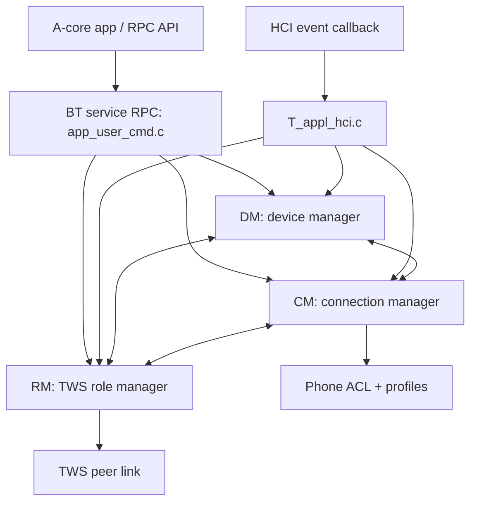
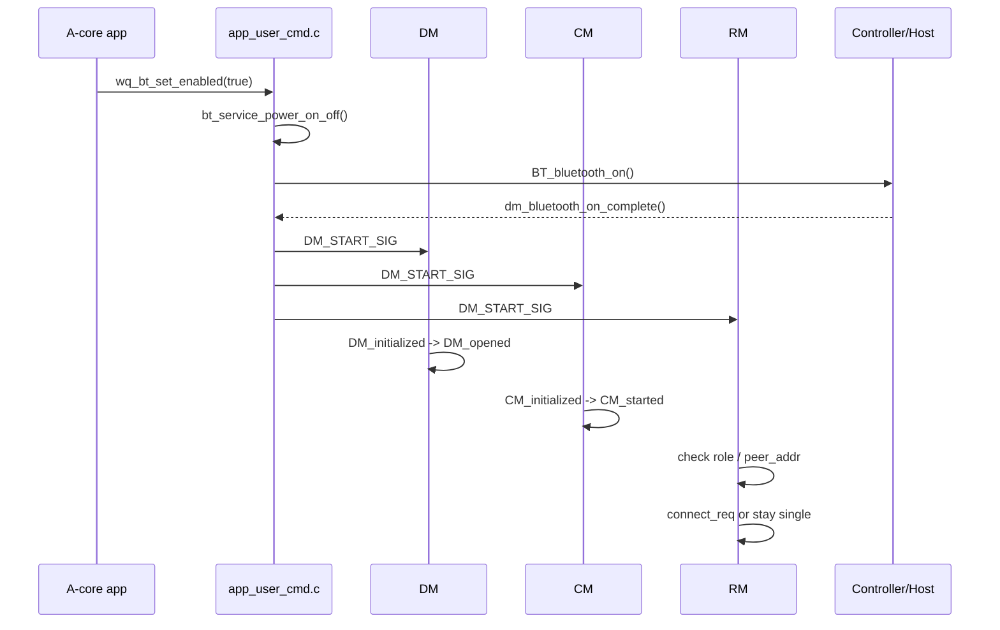
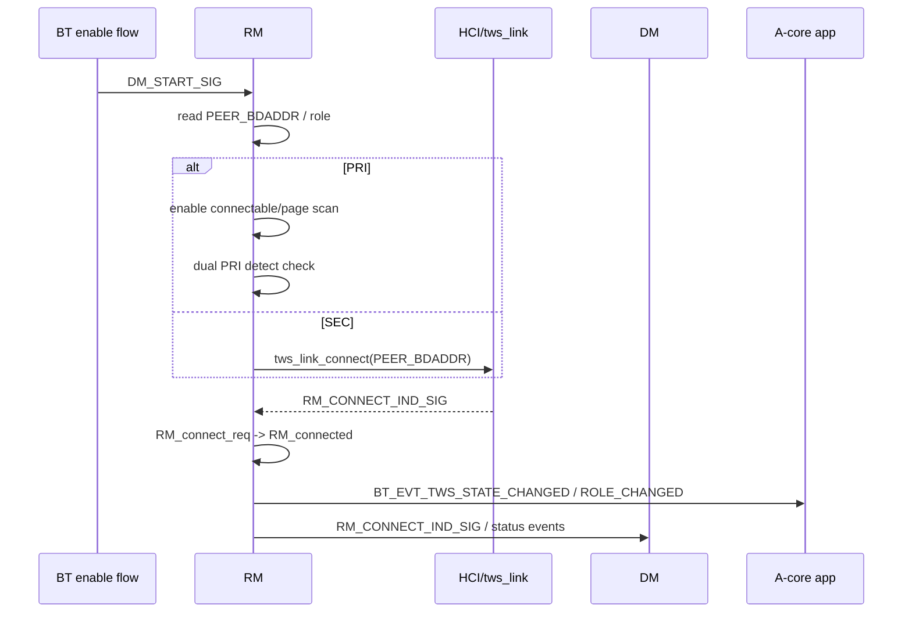
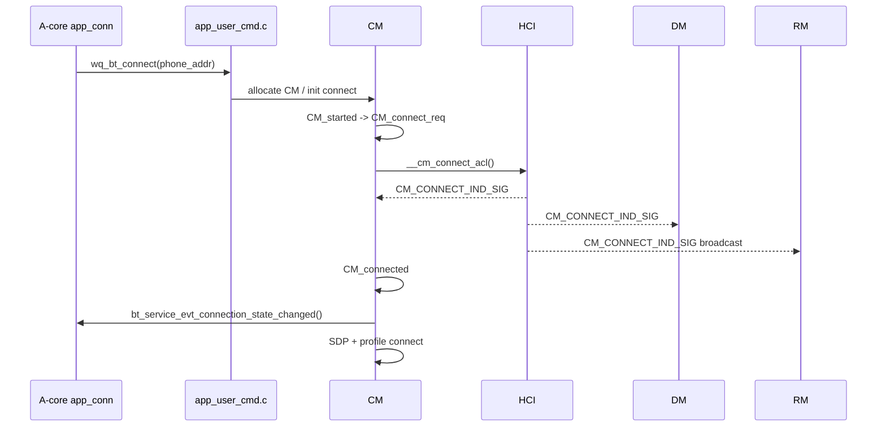
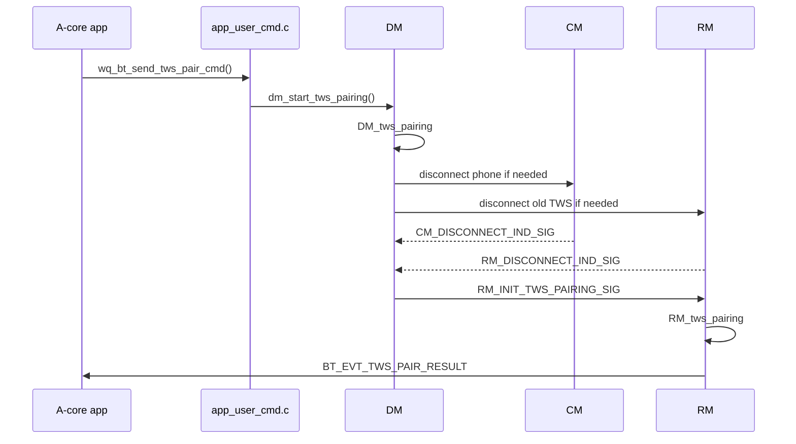

# BT Service 中 RM / CM / DM 模块作用与交互流程

本文梳理 A2007 物奇 TWS SDK 中 BT service 的三个核心状态机模块：

- `DM`: Device Manager，本机蓝牙设备总控。
- `CM`: Connection Manager，手机/AG 等普通远端连接管理。
- `RM`: Role/Remote Manager，TWS 对耳角色和对耳链路管理。

重点说明三者各自负责什么、状态机状态含义、典型事件如何在模块间流转，以及如何从日志和代码定位问题。

## 1. 总体分工

| 模块 | 主要职责 | 典型对象 | 关键文件 |
| --- | --- | --- | --- |
| `DM` | 本机蓝牙开关、可发现/可连接、DUT、factory reset、关机、TWS pairing 总调度、维护当前连接设备列表 | 本机设备状态和全局动作 | `components/bt_service/dm/T_dm.h`, `components/bt_service/dm/T_dm_top.c` |
| `CM` | 普通远端设备连接，主要是手机/AG 的 ACL、SDP、A2DP/HFP/AVRCP/SPP profile 连接和断开 | 手机/AG/普通 BR device | `components/bt_service/cm/T_cm.h`, `components/bt_service/cm/T_cm_top.c` |
| `RM` | TWS 对耳角色、对耳地址、双主检测、对耳 ACL/TWS link 连接、TWS link PM、TDS 配合 | 对耳设备/TWS link | `components/bt_service/rm/T_rm.h`, `components/bt_service/rm/T_rm_top.c` |

一句话区分：

```text
DM 管本机蓝牙总状态
CM 管手机/普通设备连接
RM 管对耳/TWS 连接和主从角色
```

## 2. 三者在系统中的位置



RPC 命令入口主要在：

`wq-adk/components/bt_service/bt_rpc/app_user_cmd.c`

HCI 事件分发主要在：

`wq-adk/components/bt_service/cm/T_appl_hci.c`

## 3. DM: Device Manager

### 3.1 状态表

定义位置：

`wq-adk/components/bt_service/dm/T_dm.h`

```c
#define DM_TABLE(DEF)             \
    DEF(DM_initialized, _ID)      \
    DEF(DM_opened, _ID)           \
    DEF(DM_connected, _ID)        \
    DEF(DM_role_switch, _ID)      \
    DEF(DM_bt_power_off_req, _ID) \
    DEF(DM_dut_mode, _ID)         \
    DEF(DM_disconnect_all, _ID)   \
    DEF(DM_factoryresetting, _ID) \
    DEF(DM_closing, _ID)          \
    DEF(DM_tws_pairing, _ID)      \
    DEF(DM_bt_factory_reset_req, _ID)
```

### 3.2 状态含义

| DM 状态 | 含义 |
| --- | --- |
| `DM_initialized` | BT service 设备管理初始化状态，蓝牙 host/controller 尚未完全打开或已关闭回到初始态。 |
| `DM_opened` | 蓝牙已经打开，本机可处理可发现、可连接、连接请求等。 |
| `DM_connected` | 至少存在普通设备连接或进入连接态后的全局状态。 |
| `DM_role_switch` | 处理主从/角色切换相关等待和协调，常和 TDS/TWS 配合。 |
| `DM_bt_power_off_req` | 收到关机请求，等待 CM/RM/LE 断开后关闭。 |
| `DM_dut_mode` | DUT/产测模式。 |
| `DM_disconnect_all` | 全部连接断开流程，用于关机、factory reset 等前置清理。 |
| `DM_factoryresetting` | factory reset 进行中。 |
| `DM_closing` | 关闭蓝牙 host/controller 阶段。 |
| `DM_tws_pairing` | DM 层进入 TWS pairing 调度态，等待 CM/RM 断开后启动 RM pairing。 |
| `DM_bt_factory_reset_req` | factory reset 请求等待态。 |

### 3.3 DM 的核心职责

DM 更像 BT service 的“总闸门”和“调度器”：

1. 接收 A-core/RPC 发来的开关机、可见性、factory reset、set peer addr、TWS pairing 等命令。
2. 控制 `BT_bluetooth_on()` / `BT_bluetooth_off()`。
3. 控制 page scan / inquiry scan，即可连接、可发现。
4. 维护本机连接设备列表，接收 `CM_CONNECT_IND_SIG`、`CM_DISCONNECT_IND_SIG` 更新状态。
5. 在关机和 factory reset 前，协调 CM、RM、LE 都断开。
6. 在 TWS pairing 前，先确保手机连接和已有 TWS 链路被妥善处理。

### 3.4 DM 关键入口

蓝牙打开流程从 RPC 进入：

`wq-adk/components/bt_service/bt_rpc/app_user_cmd.c`

```c
bt_result_t bt_service_power_on_off(void *param, uint32_t param_len)
```

打开后会发送：

```c
RT_MSG_NEW(DM_START_SIG, RT_BUILD_ID(MODULE_RM, RM_ID_0), 0, RMEvt_T);
```

同时 `DM_START_SIG` 是广播/订阅型事件，DM、CM、RM 都订阅了它。

DM 初始化态处理 `DM_START_SIG`：

`wq-adk/components/bt_service/dm/T_dm_top.c`

```c
SM_STATE_HANDLER(DM_initialized)
{
    case DM_START_SIG:
        RT_STATE_TRANS_TO(dest_id, DM_opened_ID);
        break;
}
```

### 3.5 DM 的订阅事件

DM 构造函数中订阅事件：

`wq-adk/components/bt_service/dm/T_dm_top.c`

```c
rt_msg_subscribe(DM_START_SIG, task_id);
rt_msg_subscribe(DM_STOP_SIG, task_id);
rt_msg_subscribe(CM_DISCONNECT_IND_SIG, task_id);
rt_msg_subscribe(RM_DISCONNECT_IND_SIG, task_id);
rt_msg_subscribe(RM_TWS_LINK_PM_MODE_IND_SIG, task_id);
rt_msg_subscribe(DM_PRI_ENTER_SINGLE_MODE_SIG, task_id);
rt_msg_subscribe(DM_ROLE_SWITCH_SIG, task_id);
rt_msg_subscribe(CM_ALLOCATE_SIG, task_id);
rt_msg_subscribe(LE_DISCONNECT_IND_SIG, task_id);
```

说明 DM 会监听 CM 和 RM 的断开事件，是为了在关机、DUT、factory reset、TWS pairing 等全局流程中判断“是否已经断干净”。

## 4. CM: Connection Manager

### 4.1 状态表

定义位置：

`wq-adk/components/bt_service/cm/T_cm.h`

```c
#define CM_TABLE(DEF)               \
    DEF(CM_initialized, _ID)        \
    DEF(CM_started, _ID)            \
    DEF(CM_assist_connect_req, _ID) \
    DEF(CM_connect_req, _ID)        \
    DEF(CM_connected, _ID)          \
    DEF(CM_disconnecting, _ID)
```

### 4.2 状态含义

| CM 状态 | 含义 |
| --- | --- |
| `CM_initialized` | CM 实例初始化，未启动。 |
| `CM_started` | CM 可用，等待连接请求或 HCI 连接事件。 |
| `CM_assist_connect_req` | TWS/TDS 场景下的辅助连接请求状态。 |
| `CM_connect_req` | 正在发起手机/AG ACL 连接。 |
| `CM_connected` | 普通远端 ACL 已连接，后续处理 SDP/profile。 |
| `CM_disconnecting` | 普通远端正在断开。 |

### 4.3 CM 的核心职责

CM 管的是“手机链路”，不是对耳链路：

1. 管理 `g_CM_app[]` 多个 CM 实例，每个实例对应一个普通远端设备。
2. 处理手机 ACL connect/disconnect。
3. 处理 SDP，发现手机支持的 HFP/A2DP/AVRCP/SPP 等 profile。
4. 触发 profile connect/disconnect。
5. 维护 `profile_flag`、`profile_support`、`acl_handle`、`device_handle` 等。
6. 上报 `bt_service_evt_connection_state_changed()` 给上层。
7. 在 TWS 存在时配合 TDS，把手机链路信息同步给对耳。

### 4.4 手机连接入口

A-core 连接手机最终进入：

`wq-adk/components/bt_service/bt_rpc/app_user_cmd.c`

```c
bt_result_t bt_service_connect(void *param, uint32_t param_len)
```

CM 连接状态中真正发起 ACL paging：

`wq-adk/components/bt_service/cm/T_cm_top.c`

```c
SM_STATE_HANDLER(CM_connect_req)
{
    case MODULE_MSG_STATE_ENTER:
        __cm_connect_acl(me);
        return SM_MSG_HANDLED;
}
```

`__cm_connect_acl()` 会调用底层 paging/ACL 建链相关逻辑。

连接成功后，HCI 回调分发 `CM_CONNECT_IND_SIG`，CM 收到后进入 `CM_connected`：

```c
case CM_CONNECT_IND_SIG:
    if (pe->status == 0) {
        me->device_handle = pe->device_handle;
        me->acl_handle = pe->acl_handle;
        RT_STATE_TRANS_TO(dest_id, CM_connected_ID);
    }
```

### 4.5 CM_connected 后处理 profile

CM 进入 connected 后会上报上层：

```c
bt_service_evt_connection_state_changed(
    me->bd_addr,
    CM_connected_ID,
    me->initiator ? CONNECTED_BY_LOCAL : CONNECTED_BY_REMOTE,
    me->acl_disconnect_original_reason,
    me->cod);
```

然后处理 SDP 和 profile：

```c
cm_sdp_done()
  -> __cm_connect_profile()
      -> PROFILE_INIT_CONNECT_SIG to HFP/A2DP/AVRCP/SPP modules
```

profile 连接完成后，CM 收到：

```c
PROFILE_CONNECT_IND_SIG
PROFILE_DISCONNECT_IND_SIG
```

并更新 `profile_flag`。

### 4.6 CM 的订阅事件

CM 构造函数中订阅事件：

`wq-adk/components/bt_service/cm/T_cm_top.c`

```c
rt_msg_subscribe(DM_START_SIG, task_id);
rt_msg_subscribe(DM_STOP_SIG, task_id);
rt_msg_subscribe(CM_CONNECT_IND_SIG, task_id);
rt_msg_subscribe(CM_DISCONNECT_IND_SIG, task_id);
rt_msg_subscribe(PROFILE_CONNECT_IND_SIG, task_id);
rt_msg_subscribe(PROFILE_DISCONNECT_IND_SIG, task_id);
rt_msg_subscribe(CM_UPDATE_RES_SIG, task_id);
rt_msg_subscribe(CM_MODE_CHANGE_SIG, task_id);
rt_msg_subscribe(CM_SWITCH_ROLE_RESULT_SIG, task_id);
rt_msg_subscribe(RM_CONNECT_IND_SIG, task_id);
rt_msg_subscribe(RM_TWS_LINK_STATUS_IND_SIG, task_id);
rt_msg_subscribe(CM_INIT_DISCONNECT_SIG, task_id);
rt_msg_subscribe(RM_LC_START_SIG, task_id);
rt_msg_subscribe(DM_ROLE_SWITCH_SIG, task_id);
rt_msg_subscribe(CM_CONNECTION_STATUS_SIG, task_id);
rt_msg_subscribe(CM_ALLOCATE_SIG, task_id);
rt_msg_subscribe(CM_CONNECTION_CHECK_SIG, task_id);
```

CM 会监听 RM 事件，是因为手机链路在 TWS 场景下要做 TDS、辅助连接、link policy/PM 协调。

## 5. RM: Role / Remote Manager

### 5.1 状态表

定义位置：

`wq-adk/components/bt_service/rm/T_rm.h`

```c
#define RM_TABLE(DEF)         \
    DEF(RM_initialized, _ID)  \
    DEF(RM_tws_pairing, _ID)  \
    DEF(RM_detect_role, _ID)  \
    DEF(RM_connect_req, _ID)  \
    DEF(RM_disconnected, _ID) \
    DEF(RM_connected, _ID)    \
    DEF(RM_disconnecting, _ID)
```

### 5.2 状态含义

| RM 状态 | 含义 |
| --- | --- |
| `RM_initialized` | RM 初始化，尚未建立 TWS link。启动时根据 `peer_addr` 决定是否进入 TWS 连接。 |
| `RM_tws_pairing` | 正在 TWS pairing，可能 inquiry/page 对耳。 |
| `RM_detect_role` | 主从角色检测，尤其处理双主检测。 |
| `RM_connect_req` | 正在请求 TWS 对耳连接。 |
| `RM_disconnected` | TWS link 断开后的管理状态，可触发重连。 |
| `RM_connected` | TWS 对耳 link 已连接。 |
| `RM_disconnecting` | 正在断开 TWS 对耳 link。 |

### 5.3 RM 的核心职责

RM 管的是“对耳链路”和“TWS 主从角色”：

1. 读取 `PEER_BDADDR()`、`PRI_BDADDR()`、`SEC_BDADDR()` 等地址。
2. 根据本机角色 `IS_PRI_ROLE()` / `IS_SEC_ROLE()` 做不同动作。
3. PRI 负责开放 page scan、做双主检测。
4. SEC 负责 page PRI，即 `tws_link_connect(PEER_BDADDR(), timeout)`。
5. TWS 成功连接后，上报 TWS state/role changed。
6. 处理 TWS link PM、TDS 触发、role switch、link loss。
7. 参考 CM 状态，避免在手机通话/音乐/多连接繁忙时频繁做 TWS 检测。

### 5.4 RM 启动和自动连接

RM 收到 `DM_START_SIG` 后：

`wq-adk/components/bt_service/rm/T_rm_top.c`

```c
SM_STATE_HANDLER(RM_initialized)
{
    case DM_START_SIG:
        bt_service_evt_tws_role_changed(IS_PRI_ROLE(), LOCAL_BDADDR(), PEER_BDADDR(),
                                        TWS_ROLE_CHANGED_REASON_POWER_ON);
        ...
}
```

如果没有有效对耳地址，RM 留在初始化/单耳逻辑；如果有对耳地址，则进入连接相关流程。

RM 发起连接的核心函数：

```c
__rm_connect()
```

逻辑：

```c
if (IS_PRI_ROLE()) {
    __rm_set_connectable(true);
    rm_dual_pri_detect_check(me, 0);
} else {
    tws_link_connect(PEER_BDADDR(), page_timeout);
}
```

也就是说：

- PRI 通常开 page scan 等 SEC 来连，并做双主检测。
- SEC 主动 page/connect PRI。

### 5.5 RM 与手机连接状态的关系

RM 不代表手机连接状态，但会参考 CM：

```c
uint8_t cm_conn_cnt = cm_get_connected_dev_cnt();
if ((cm_conn_cnt > 1) || RM_IS_CONNECTED() || ((1 == cm_conn_cnt) && (!AM_IS_IDLE()))) {
    RT_MSG_TIMER_CANCEL(me->rtx_timer);
    return;
}
```

这段在 `rm_dual_pri_detect_check()` 中，含义是：

- 手机连接多于 1 个时，不做双主检测。
- TWS 已连接时，不做双主检测。
- 只有一个手机连接但音频不空闲时，也不打扰。

所以 RM 会“看”手机状态，但不“管理”手机状态。

### 5.6 RM 的订阅事件

RM 构造函数中订阅事件：

`wq-adk/components/bt_service/rm/T_rm_top.c`

```c
rt_msg_subscribe(DM_START_SIG, task_id);
rt_msg_subscribe(DM_STOP_SIG, task_id);
rt_msg_subscribe(CM_CONNECT_IND_SIG, task_id);
rt_msg_subscribe(CM_DISCONNECT_IND_SIG, task_id);
rt_msg_subscribe(CM_MODE_CHANGE_SIG, task_id);
rt_msg_subscribe(RM_CONNECT_IND_SIG, task_id);
rt_msg_subscribe(RM_DISCONNECT_IND_SIG, task_id);
rt_msg_subscribe(RM_TWS_LINK_STATUS_IND_SIG, task_id);
rt_msg_subscribe(RM_LC_START_SIG, task_id);
```

RM 监听 CM 连接/断开，是为了在手机连接变化时重新判断是否应该做 TWS 检测或角色调整。

## 6. HCI 事件如何分流给 RM / CM / DM

HCI 事件处理主要在：

`wq-adk/components/bt_service/cm/T_appl_hci.c`

### 6.1 TWS ACL 连接完成

如果连接对象是对耳，HCI 连接完成会发给 RM：

```c
RMEvt_T *pe = RT_MSG_NEW(RM_CONNECT_IND_SIG, RT_TASK_ID_BC, 0, RMEvt_T);
pe->status = status;
pe->conn_handle = handle;
BT_CPY_BD_ADDR(pe->bd_addr, bd_addr);
RT_MSG_PUT(pe);
```

RM 收到 `RM_CONNECT_IND_SIG` 后，在 `RM_connect_req` 或 `RM_tws_pairing` 中处理 TWS link up。

### 6.2 手机 ACL 连接完成

如果连接对象是普通远端，会发给 CM：

```c
CMEvt_T *pe = RT_MSG_NEW(CM_CONNECT_IND_SIG, RT_TASK_ID_BC, 0, CMEvt_T);
pe->cm_id = index;
pe->status = status;
BT_CPY_BD_ADDR(pe->bd_addr, bd_addr);
RT_MSG_PUT(pe);
```

同时 DM 也可能收到一份 `CM_CONNECT_IND_SIG`，用于维护全局设备列表和状态：

```c
pe = RT_MSG_NEW(CM_CONNECT_IND_SIG, RT_BUILD_ID(MODULE_DM, DM_DEF_ID), 0, CMEvt_T);
```

### 6.3 断开事件

对耳断开：

```text
HCI disconnect
  -> RM_DISCONNECT_IND_SIG
  -> RM 处理 TWS link down
  -> DM 监听，用于关机/factory reset/DUT 等流程判断
```

手机断开：

```text
HCI disconnect
  -> CM_DISCONNECT_IND_SIG
  -> CM 处理普通 ACL/profile 清理
  -> DM 监听，用于全局状态更新和等待全部断开
  -> RM 监听，用于手机断开后重新做 TWS 检测/重连
```

## 7. 典型流程 1: 蓝牙开机



代码索引：

- `bt_service_power_on_off()`: `components/bt_service/bt_rpc/app_user_cmd.c`
- `DM_initialized`: `components/bt_service/dm/T_dm_top.c`
- `CM_initialized`: `components/bt_service/cm/T_cm_top.c`
- `RM_initialized`: `components/bt_service/rm/T_rm_top.c`

## 8. 典型流程 2: 已烧录 peer_addr 后 TWS 自动组队



注意：这里的 `RM_connected` 表示“对耳连上”，不是“手机连上”。

## 9. 典型流程 3: 手机连接



RM 会收到 `CM_CONNECT_IND_SIG`，但只是用来调整 TWS 检测/角色逻辑，不表示 RM 管手机连接。

## 10. 典型流程 4: TWS pairing 命令



RPC 入口：

`bt_service_tws_start_pair()` 调用：

```c
dm_start_tws_pairing(info->vid, info->pid, info->magic, info->timeout_ms);
```

DM 中 `__handle_start_tws_pair()` 会在合适时机向 RM 发送 pairing 相关事件。

## 11. 三者交互关系总结

| 交互 | 说明 |
| --- | --- |
| `DM_START_SIG` -> DM/CM/RM | 蓝牙打开后，三个模块一起启动。 |
| `CM_CONNECT_IND_SIG` -> CM | 手机 ACL 连接结果，CM 进入 connected 或回 started。 |
| `CM_CONNECT_IND_SIG` -> DM | DM 更新全局连接设备列表和状态。 |
| `CM_CONNECT_IND_SIG` -> RM | RM 根据手机连接变化决定是否做 TWS 检测/角色调整。 |
| `RM_CONNECT_IND_SIG` -> RM | TWS 对耳 ACL/TWS link 连接结果。 |
| `RM_CONNECT_IND_SIG` -> DM/CM | DM/CM 参考 TWS 状态做全局协调或 TDS/辅助连接。 |
| `CM_DISCONNECT_IND_SIG` -> CM/DM/RM | CM 清理手机连接；DM 判断是否全部断开；RM 可能重新检测/连接对耳。 |
| `RM_DISCONNECT_IND_SIG` -> RM/DM | RM 清理 TWS link；DM 判断关机、DUT、factory reset、pairing 等等待条件。 |
| `PROFILE_CONNECT_IND_SIG` -> CM | HFP/A2DP/AVRCP/SPP 等 profile 连接结果。 |
| `DM_SET_VISIBILITY_SIG` -> DM | 设置本机 discoverable/connectable。 |
| `DM_SET_PEER_ADDR_SIG` -> DM | 设置 `PEER_BDADDR()` 并可写入 storage。 |

## 12. 常见判断宏

| 宏/函数 | 所属 | 含义 |
| --- | --- | --- |
| `RM_IS_CONNECTED()` | RM | TWS 对耳已连接。 |
| `RM_IS_DISCONNECTED()` | RM | TWS 对耳未连接或处于未连接类状态。 |
| `RM_IS_TWS_PAIRING()` | RM | 正在 TWS pairing。 |
| `CM_DEVICE_CONNECTED()` | CM | 至少有一个普通远端/手机 ACL 连接。 |
| `cm_get_connected_dev_cnt()` | CM | 当前普通远端连接数量。 |
| `IS_TWS_LINK_CONNECTED()` | TWS link | 底层 TWS link 是否已连。 |
| `IS_PRI_ROLE()` | DM/RM 公共上下文 | 本机是否 PRI。 |
| `IS_SEC_ROLE()` | DM/RM 公共上下文 | 本机是否 SEC。 |
| `IS_PEER_ADDR(addr)` | DM/RM 公共上下文 | 地址是否为对耳地址。 |
| `IS_REMOTE_ADDR(addr)` | DM/CM | 地址是否为当前手机/普通远端地址。 |

## 13. 排查建议

### 13.1 手机连不上

优先看 CM 和 DM：

1. `bt_service_connect()` 是否被调用。
2. CM 是否分配到有效 `cm_id`。
3. 是否进入 `CM_connect_req`。
4. `__cm_connect_acl()` 是否发起 paging。
5. HCI 是否回 `CM_CONNECT_IND_SIG`。
6. `CM_connected` 是否上报 `bt_service_evt_connection_state_changed()`。
7. DM 是否因为 `DM_DISCONNECTING_FLAG`、role switch、scan 设置等拒绝连接。

### 13.2 对耳不组队

优先看 RM：

1. `DM_START_SIG` 是否到达 RM。
2. `PEER_BDADDR()` 是否有效。
3. 本机 `IS_PRI_ROLE()` / `IS_SEC_ROLE()` 是否符合烧录配置。
4. PRI 是否打开 page scan。
5. SEC 是否调用 `tws_link_connect(PEER_BDADDR(), ...)`。
6. HCI 是否回 `RM_CONNECT_IND_SIG`。
7. RM 是否进入 `RM_connected`。

### 13.3 关机或 factory reset 卡住

优先看 DM，同时看 CM/RM 是否都断开：

1. DM 是否进入 `DM_disconnect_all`、`DM_bt_power_off_req` 或 `DM_factoryresetting`。
2. 是否还有 `CM_DEVICE_CONNECTED()`。
3. 是否 `RM_IS_DISCONNECTED()`。
4. 是否还有 LE 连接。
5. 是否等到了 `CM_DISCONNECT_IND_SIG` 和 `RM_DISCONNECT_IND_SIG`。

### 13.4 TWS pairing 后手机回连异常

同时看 DM、RM、CM：

1. A-core 是否处于 `STATE_WWS_PAIRING`。
2. `app_conn_handle_bt_power_on()` 是否因为 WWS pairing 暂停手机回连。
3. RM 是否发出 pair result。
4. pair result 后 A-core 是否重新调用 `app_conn_handle_bt_power_on()`。
5. CM 是否重新发起手机回连。

## 14. 代码阅读顺序建议

第一次阅读建议按下面顺序：

1. `components/bt_service/dm/T_dm.h`: 看 DM 状态和信号。
2. `components/bt_service/cm/T_cm.h`: 看 CM 状态和信号。
3. `components/bt_service/rm/T_rm.h`: 看 RM 状态、TWS 宏和信号。
4. `components/bt_service/bt_rpc/app_user_cmd.c`: 看 A-core 命令如何进入 BT service。
5. `components/bt_service/cm/T_appl_hci.c`: 看 HCI connect/disconnect 如何分发给 CM/RM/DM。
6. `components/bt_service/dm/T_dm_top.c`: 看开关机、factory reset、TWS pairing 总调度。
7. `components/bt_service/cm/T_cm_top.c`: 看手机 ACL/profile 连接。
8. `components/bt_service/rm/T_rm_top.c`: 看 TWS 对耳连接、主从检测和 role switch。

