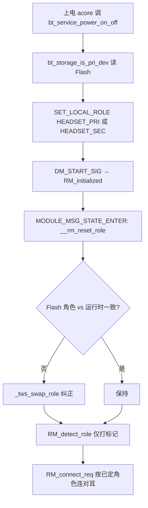
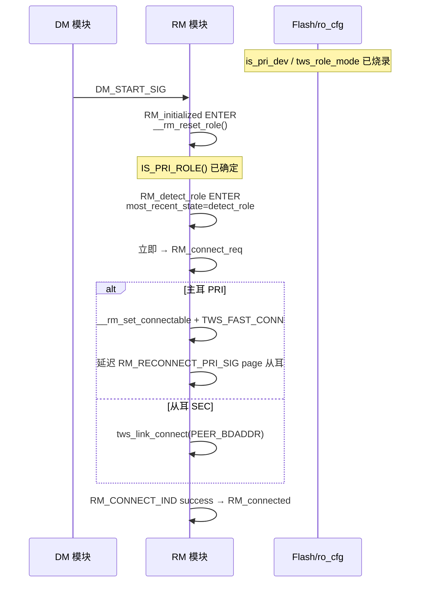

# RM_detect_role 与 TWS 主从角色判定 Q&A

本文档整理 `RM_detect_role` 状态的真实作用，以及物奇 BT Service / A2007 项目中 **TWS 主耳（PRI）/ 从耳（SEC）** 的确定与纠正逻辑。

> 相关文档：[RT_RM_LOGIC.md](./RT_RM_LOGIC.md)（RM 全状态机）、[TWS_PAIRING_LOGIC.md](./TWS_PAIRING_LOGIC.md)（组队与重连）、[TWS_PAIRING_GUIDE.md](./TWS_PAIRING_GUIDE.md)（烧录模式速查）

---

## 目录

1. [Q1：RM_detect_role 是干什么的？](#1-q1rm_detect_role-是干什么的)
2. [Q2：在这里探测/决定主从角色吗？](#2-q2在这里探测决定主从角色吗)
3. [Q3：左耳默认是主耳吗？](#3-q3左耳默认是主耳吗)
4. [主从角色确定的完整逻辑](#4-主从角色确定的完整逻辑)
5. [运行时角色纠正（真正的探测）](#5-运行时角色纠正真正的探测)
6. [与 TWS 重连流程的关系](#6-与-tws-重连流程的关系)
7. [配置字段速查](#7-配置字段速查)
8. [关键源文件索引](#8-关键源文件索引)

---

## 1. Q1：RM_detect_role 是干什么的？

### 结论

`RM_detect_role` 是一个 **过渡标记态（temp state）**，进入后 **立即跳转** 到 `RM_connect_req`，几乎不处理任何业务消息。

代码注释写得很明确：*just used for indicate page scan param*（用于指示 page scan 相关参数/场景）。

### 源码

文件：`wq-adk/components/bt_service/rm/T_rm_top.c`

```c
SM_STATE_HANDLER(RM_detect_role)
{
    switch (msg_id) {
    case MODULE_MSG_STATE_ENTER: {
        DBGLOG_BT_APP_INFO("[RM]RM_detect_role ++\n");
        me->most_recent_state = RM_detect_role_ID;   // ① 打标记
        // RM_detect_role is the temp state,
        // just used for indicate page scan param
        RT_STATE_TRANS_TO(dest_id, RM_connect_req_ID); // ② 立刻跳转
        return SM_MSG_HANDLED;
    }
    ...
    }
}
```

### 标记的用途

`most_recent_state = RM_detect_role_ID` 供后续 `RM_connect_req` 识别 **「上电 TWS 重连路径」**，主耳可开启快速连接：

```c
// RM_connect_req — MODULE_MSG_STATE_ENTER
__rm_connect(me);

if (IS_PRI_ROLE() && RM_detect_role_ID == me->most_recent_state && !CM_DEVICE_CONNECTED()) {
    bts_sys_state_set(BTS_SYSTEM_STATE_TWS_FAST_CONN);
    RT_MSG_PUT_DELAY(RM_FAST_CONN_EXPIRE_SIG, FULL_PAGE_SCAN_TIMEOUT_MS);
}
```

| 行为 | 说明 |
|------|------|
| 设 `most_recent_state` | 标记来自 `DM_START` 的已组队重连 |
| 立即 `→ RM_connect_req` | 真正连对耳在 connect_req 里做 |
| PRI + 标记匹配 + 未连手机 | 开启 `TWS_FAST_CONN` 加速 page scan |

### 何时进入 RM_detect_role

典型入口：`RM_initialized` 收到 `DM_START_SIG`，且 Flash 中 **peer 地址有效**（非全 0、非全 FF）：

```c
case DM_START_SIG: {
    ...
    } else {
        // tws paired, detect role   ← 注释易误解，实际并非在此探测角色
        if (IS_PRI_ROLE()) {
            RT_MSG_PUT_DELAY(RM_RECONNECT_PRI_SIG, TWS_PRI_PAGING_DELAY_MS, ...);
        }
        me->rm_start_tick = wq_rtc_get_global_time_ms();
        RT_STATE_TRANS_TO(dest_id, RM_detect_role_ID);
    }
}
```

其他重试场景（连接失败、鉴权失败等）也会 `RT_STATE_TRANS_TO(RM_detect_role_ID)`，含义相同：**标记后重新走 connect_req**。

---

## 2. Q2：在这里探测/决定主从角色吗？

### 结论

**不是。** 进入 `RM_detect_role` 时，`IS_PRI_ROLE()` 已经确定；该状态 **不做任何角色判定**。

主从在进入此状态之前，已由 **烧录配置 + 上电初始化 + RM_initialized 校正** 完成。

### 角色判定的三个时机（均在 detect_role 之前）



---

## 3. Q3：左耳默认是主耳吗？

### 结论

**产品惯例是左主右从**，但这是 **产线烧录 / ro_cfg 配置约定**，不是 `RM_detect_role` 运行时自动识别左右耳。

**左/右（声道）** 与 **主/从（TWS 角色）** 是两套独立字段：

| 字段 | 存储位置 | 含义 | 典型左耳 | 典型右耳 |
|------|----------|------|----------|----------|
| `is_left_dev` | `bt_readonly_data` / `ro_cfg.general` | 物理左/右声道 | 1 | 0 |
| `tws_role_mode` | `bt_readonly_data` / `ro_cfg.general` | 强制主从：1=PRI，2=SEC，0=读 `is_pri_dev` | 1 | 2 |
| `is_pri_dev` | `bt_general_data`（可写烧录区） | 主从标志（mode=0 时生效） | 1 | 0 |

A2007 `ro_cfg.xml`（7035AX-B）示例：

- 左耳模板：`general.tws_role_mode = 1`（强制主耳）
- 右耳模板：`general.tws_role_mode = 2`（强制从耳）

产线给左右耳各烧对应镜像，上电后自然左主右从。

### acore 层同步

`app_wws_init()` 用同样配置初始化应用层角色/声道：

```c
// app_wws.c
if (ro_cfg_is_left_dev()) {
    context->channel = TWS_CHANNEL_LEFT;
} else {
    context->channel = TWS_CHANNEL_RIGHT;
}

if (wws_role == TWS_ROLE_UNKNOWN) {
    if (ro_cfg()->general.tws_role_mode == 1) {
        context->role = TWS_ROLE_MASTER;
    } else if (ro_cfg()->general.tws_role_mode == 2) {
        context->role = TWS_ROLE_SLAVE;
    }
}
```

上电 RPC 时 acore 还会把 channel/role 传给 bcore：

```c
param.wws_info.channel = app_wws_is_left() ? BT_WWS_LEFT : BT_WWS_RIGHT;
param.wws_info.role    = app_wws_is_master() ? TWS_ROLE_MASTER : TWS_ROLE_SLAVE;
```

---

## 4. 主从角色确定的完整逻辑

### 4.1 `bt_storage_is_pri_dev()` — 角色数据源

文件：`wq-adk/components/bt_service/common/bt_srv_storage.c`

```c
uint32_t bt_storage_is_pri_dev(void)
{
    if (TWS_DEV_PRI == bt_srv_ro_data.tws_role_mode) {
        return 1;   // ro_cfg 强制主耳
    }
    if (TWS_DEV_SEC == bt_srv_ro_data.tws_role_mode) {
        return 0;   // ro_cfg 强制从耳
    }
    return bt_srv_general_data.is_pri_dev;  // mode=0(AUTO) 时读烧录区
}
```

优先级：**`tws_role_mode`（只读）> `is_pri_dev`（可写）**。

`TWS_ROLE_MODE` 枚举（`bt_srv_storage.h`）：

| 值 | 宏 | 含义 |
|----|-----|------|
| 0 | `TWS_DEV_AUTO` | 使用 `is_pri_dev` |
| 1 | `TWS_DEV_PRI` | 强制主耳 |
| 2 | `TWS_DEV_SEC` | 强制从耳 |

### 4.2 上电设角色 — `bt_service_power_on_off()`

文件：`wq-adk/components/bt_service/bt_rpc/app_user_cmd.c`

```c
const uint8_t *peer_addr = bt_storage_get_peer_addr();
bool force_pri = !RM_IS_VALID_PEER_ADDR(peer_addr);  // peer 无效时强制 PRI

// 可选：acore 传入 channel/role 覆盖
if (info->wws_info.channel != BT_WWS_DEFAULT)
    bt_storage_set_tws_channel(info->wws_info.channel);
if (info->wws_info.role != TWS_ROLE_UNKNOWN)
    bt_storage_set_tws_role(info->wws_info.role);

if (bt_storage_is_pri_dev() || force_pri) {
    SET_LOCAL_ROLE(HEADSET_PRI);
    BT_CPY_BD_ADDR(PRI_BDADDR(), info->local_addr.addr);
    BT_CPY_BD_ADDR(SEC_BDADDR(), peer_addr);
} else {
    SET_LOCAL_ROLE(HEADSET_SEC);
    BT_CPY_BD_ADDR(PRI_BDADDR(), peer_addr);
    BT_CPY_BD_ADDR(SEC_BDADDR(), info->local_addr.addr);
}
```

| 条件 | 角色 |
|------|------|
| `bt_storage_is_pri_dev() == 1` | PRI（主耳） |
| `bt_storage_is_pri_dev() == 0` 且 peer 有效 | SEC（从耳） |
| peer 无效（全 0 等） | `force_pri=true` → PRI |

角色宏（`T_dm.h`）：

```c
#define IS_PRI_ROLE()   (LOCAL_ROLE() == HEADSET_PRI)
#define IS_SEC_ROLE()   (LOCAL_ROLE() == HEADSET_SEC)
#define SET_LOCAL_ROLE(r) (LOCAL_DEVICE().headset_role = (r))
```

### 4.3 RM 初始化校正 — `__rm_reset_role()`

文件：`wq-adk/components/bt_service/rm/T_rm_top.c`  
触发：`RM_initialized` 的 `MODULE_MSG_STATE_ENTER`

```c
__STATIC_INLINE void __rm_reset_role(RM_CONTEXT *me)
{
    // Flash 角色与运行时角色不一致 → 自动 swap
    if ((bt_storage_is_pri_dev() != IS_PRI_ROLE())
        && (!RM_IS_SINGLE_MODE_PEER_ADDR(PEER_BDADDR()))
        && BT_BD_ADDR_IS_NON_ZERO(PEER_BDADDR())) {
        _tws_swap_role(me, TWS_ROLE_CHANGED_REASON_RESET);
    }

    // 若运行时 peer 为空但 Flash 有 peer → 恢复 peer 并按 Flash 设角色
    const uint8_t *peer_addr = bt_storage_get_peer_addr();
    if (BT_BD_ADDR_IS_NON_ZERO(peer_addr) && !BT_BD_ADDR_IS_NON_ZERO(PEER_BDADDR())) {
        uint8_t target_role = bt_storage_is_pri_dev() ? HEADSET_PRI : HEADSET_SEC;
        _tws_pairing_role_set(target_role);
        BT_CPY_BD_ADDR(PEER_BDADDR(), peer_addr);
    }
}
```

### 4.4 TWS 配对完成时写角色

配对成功后，左右耳各自写入对侧地址，并固化主从：

- 主耳：`is_pri_dev = 1`，`peer_addr = 从耳 MAC`
- 从耳：`is_pri_dev = 0`，`peer_addr = 主耳 MAC`

（详见 [TWS_PAIRING_LOGIC.md](./TWS_PAIRING_LOGIC.md) 组队章节。）

### 4.5 角色确定时序总览

```
① bt_storage_load()          读 ro_cfg + Flash（is_pri_dev / tws_role_mode / peer_addr）
        ↓
② bt_service_power_on_off()  SET_LOCAL_ROLE + 设 PRI_BDADDR / SEC_BDADDR
        ↓
③ DM_START → RM_initialized  __rm_reset_role() 校正
        ↓
④ RM_detect_role             仅打 most_recent_state 标记（不改角色）
        ↓
⑤ RM_connect_req             IS_PRI_ROLE() ? page scan : tws_link_connect(peer)
```

---

## 5. 运行时角色纠正（真正的探测）

名称含 "detect" 的 **实际角色冲突处理** 发生在 `RM_connect_req` / `RM_connected` 等状态，而非 `RM_detect_role`。

### 5.1 双主检测 — `rm_dual_pri_detect_check()`

主耳在空闲、未连手机、未播音乐等条件下，周期性 page 对耳地址，检测是否出现 **双主**：

- 发现对耳已是主耳且已连手机 → 设 `RM_DEV_TWS_DUAL_FOUND_FLAG`，后续可能 swap 成从耳
- 通过 `RM_DETECT_ENABLE_SIG` 可开关检测

### 5.2 已有主耳连手机 — 本机降从

`RM_connect_req` 收到 `CM_CONNECT_IND_SIG`，status = `HCI_ERR_CONN_ALREADY_EXISTS`：

```c
/* another master already connected to phone.
 * switch to slave, page existed master.
 */
_tws_swap_role(me, TWS_ROLE_CHANGED_REASON_USER);
__rm_connect(me);   // 现在以 SEC 身份连对耳
```

### 5.3 从耳连上手机 — 角色互换

SEC 收到手机 `CM_CONNECT_IND_SIG` 成功时，取消连 peer 并 swap 成 PRI。

### 5.4 `_tws_swap_role()` 做了什么

```c
SET_LOCAL_ROLE(PEER_ROLE());                    // PRI ↔ SEC
bt_srv_device_queue_switch_role(LOCAL, PEER);   // 交换 MAC 队列
aud_sv_set_role(IS_PRI_ROLE() ? PRI : SEC);     // 音频层同步
bt_service_evt_tws_role_changed(...);           // 通知 acore
```

### 5.5 运行时纠正场景速查

| 场景 | 处理函数/位置 | 结果 |
|------|---------------|------|
| Flash 角色与运行时不一致 | `__rm_reset_role` | swap（RESET 原因） |
| 双主同时存在 | `rm_dual_pri_detect_check` | 标记 / 后续 swap |
| 对耳已连手机，本机还是 PRI | `RM_connect_req` CONN_ALREADY_EXISTS | swap → SEC |
| 从耳先连上手机 | `RM_connect_req` CM_CONNECT success (SEC) | swap → PRI |
| 用户/电量/RSSI 触发 | `app_wws` + `bt_service_tws_role_switch` | 协商 swap |
| page 超时（从耳） | `RM_CONNECT_IND` PAGE_TIMEOUT | 可能升 PRI 重试 |

---

## 6. 与 TWS 重连流程的关系

已组队上电（peer 有效 MAC）完整路径：



与 [TWS_PAIRING_LOGIC.md §5](./TWS_PAIRING_LOGIC.md) 的对应关系：

| 文档描述 | 准确理解 |
|----------|----------|
| 「RM_detect_role（角色探测）」 | 应理解为 **重连标记态**，非角色探测 |
| 「主耳 page 从耳」 | 发生在 **RM_connect_req**，角色已预先确定 |
| 「从耳主动连主耳」 | 发生在 **RM_disconnected / RM_connect_req**，`IS_SEC_ROLE()` 分支 |

---

## 7. 配置字段速查

### ro_cfg.xml 关键字段

```xml
<!-- general（只读，决定 tws_role_mode） -->
<is_left_dev>1</is_left_dev>           <!-- 1=左耳, 0=右耳 -->
<tws_role_mode>1</tws_role_mode>       <!-- 1=强制PRI, 2=强制SEC, 0=AUTO -->

<!-- bt_general_data（可写烧录区） -->
<is_pri_dev>1</is_pri_dev>             <!-- tws_role_mode=0 时生效 -->
<peer_addr>AA:BB:CC:DD:EE:FF</peer_addr>
<tws_single_mode>0</tws_single_mode>   <!-- 0=双耳, 1=单耳 -->
```

### 产线预组队烧录示例

| 耳 | peer_addr | is_pri_dev | tws_role_mode | is_left_dev |
|----|-----------|------------|---------------|-------------|
| 左 | 右耳 MAC | 1 | 1 | 1 |
| 右 | 左耳 MAC | 0 | 2 | 0 |

---

## 8. 关键源文件索引

| 文件 | 内容 |
|------|------|
| `rm/T_rm_top.c` | `RM_detect_role`、`__rm_reset_role`、`RM_connect_req`、双主检测 |
| `rm/T_rm.h` | `IS_PRI_ROLE()`、`RM_TABLE`、RM 信号枚举 |
| `dm/T_dm.h` | `HEADSET_PRI/SEC`、`SET_LOCAL_ROLE`、`PRI_BDADDR()` |
| `bt_rpc/app_user_cmd.c` | `bt_service_power_on_off()` 上电设角色 |
| `common/bt_srv_storage.c` | `bt_storage_is_pri_dev()`、`bt_storage_load()` |
| `common/bt_srv_storage.h` | `TWS_ROLE_MODE`、`bt_general_data` 结构 |
| `apps/acore/wws/src/app_wws.c` | `app_wws_init()` 声道/角色初始化 |
| `config/7035AX-B/ro_cfg.xml` | 左右耳 `tws_role_mode` 模板 |

---

## 速记

| 问题 | 答案 |
|------|------|
| `RM_detect_role` 干什么？ | **过渡标记态**，标记上电重连，立刻进 `RM_connect_req` |
| 在这里定主从吗？ | **不定**，进入时 `IS_PRI_ROLE()` 已确定 |
| 主从谁决定？ | `tws_role_mode` / `is_pri_dev`（Flash）→ 上电 `SET_LOCAL_ROLE` → `__rm_reset_role` 校正 |
| 左耳默认主耳？ | **产线配置约定**（左 `tws_role_mode=1`，右 `=2`），非 detect_role 探测 |
| 真正的运行时探测？ | `rm_dual_pri_detect_check`、双主冲突 swap、CONN_ALREADY_EXISTS 降从 |
