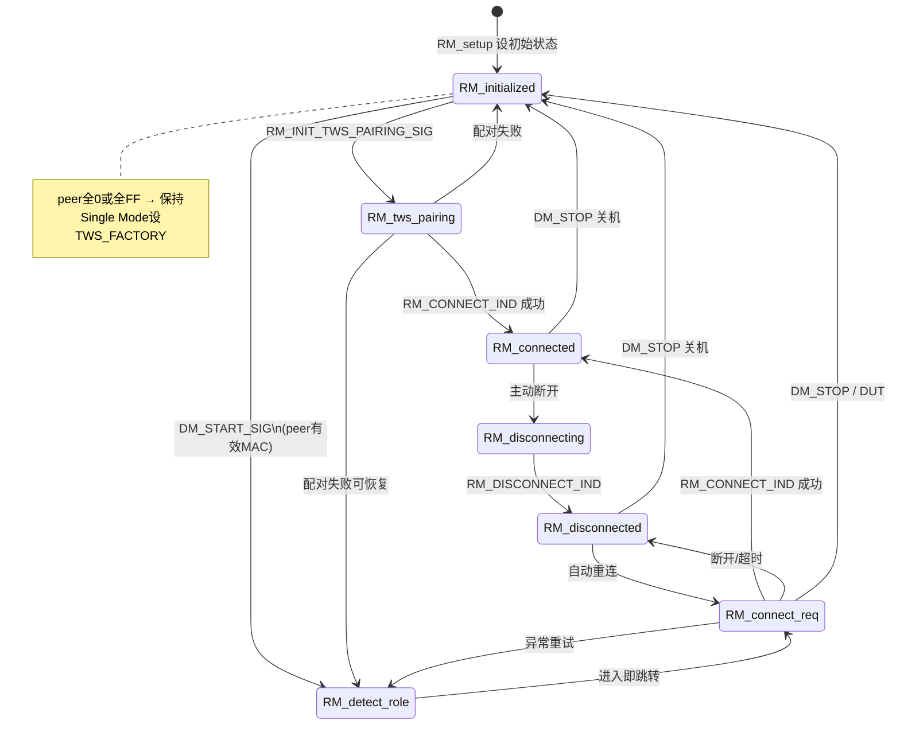
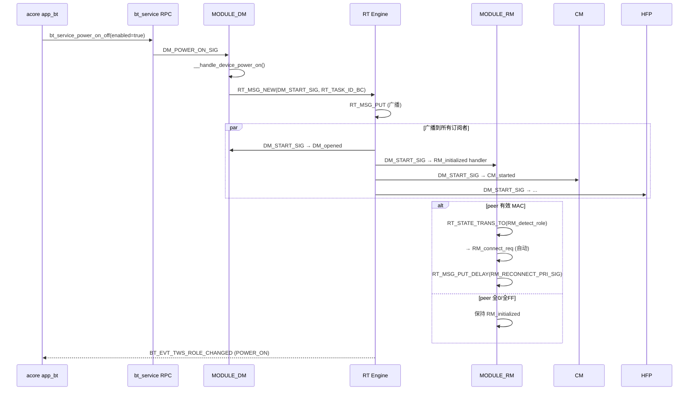

# RT 与 RM 代码逻辑详解

本文档从源码层面梳理物奇 BT Service 中 **RT（Runtime 运行时框架）** 与 **RM（Role Manager，TWS 角色/对耳链路管理）** 的架构、初始化、消息流转和状态机逻辑。

> 前缀速查：[BT_SERVICE_PREFIX_GUIDE.md](./BT_SERVICE_PREFIX_GUIDE.md)  
> TWS 业务场景：[TWS_PAIRING_GUIDE.md](./TWS_PAIRING_GUIDE.md)

---

## 目录

1. [整体架构](#1-整体架构)
2. [RT 运行时框架](#2-rt-运行时框架)
3. [RM 模块注册与上下文](#3-rm-模块注册与上下文)
4. [RM 状态机全览](#4-rm-状态机全览)
5. [各状态代码逻辑](#5-各状态代码逻辑)
6. [RT + RM 协作：上电启动链](#6-rt--rm-协作上电启动链)
7. [TWS 配对 vs 重连两条路径](#7-tws-配对-vs-重连两条路径)
8. [RM 关键信号表](#8-rm-关键信号表)
9. [源码索引](#9-源码索引)

---

## 1. 整体架构

```
┌──────────────────────────────────────────────────────────┐
│  acore 应用层                                             │
│  app_bt / app_wws  ←RPC→  bt_service (USER_TASK)         │
└────────────────────────────┬─────────────────────────────┘
                             │ RT_MSG (跨 Task 消息)
┌────────────────────────────▼─────────────────────────────┐
│  RT Runtime 引擎 (rt_run 事件循环)                         │
│  ├─ 消息队列 (RT_RTX_Q_N / RT_RTX_Q_H)                    │
│  ├─ 定时器 (RT_MSG_PUT_DELAY)                             │
│  └─ 状态机调度 (MODULE_message_handler)                   │
└────────────────────────────┬─────────────────────────────┘
                             │ 每个 MODULE_XX = 一个 RT Task
        ┌────────────────────┼────────────────────┐
        ▼                    ▼                    ▼
      MODULE_DM           MODULE_RM           MODULE_CM
   (Device Manager)   (Role Manager)    (Connection Mgr)
        │                    │                    │
        └──────── DM_START_SIG (广播) ─────────────┘
```

**层次关系：**

- **RT** 是底层调度框架，负责 Task 创建、消息投递、状态跳转
- **RM** 是跑在 RT 上的一个 Task（`MODULE_RM`），专门管理 TWS 对耳链路
- **DM** 是总控 Task，BT 上电后广播 `DM_START_SIG` 通知包括 RM 在内的各模块启动

---

## 2. RT 运行时框架

### 2.1 头文件与职责

路径：`bt_service/internal/lib/<chip>/inc/`

| 文件 | 职责 |
|------|------|
| `rt_engine.h` | `rt_init()` / `rt_run()` 引擎生命周期 |
| `rt_task.h` | Task 创建、状态 get/set |
| `rt_msg.h` | 消息分配、投递、延迟投递 |
| `rt_module.h` | 模块状态机宏、`MODULE_message_handler` |
| `rt_timer.h` | 定时器 |
| `rt_queue.h` | 消息队列 |
| `rt_buffer.h` | 消息内存池 |
| `rt_common.h` | 汇总头文件 |

### 2.2 BT Service 启动序列

文件：`common/T_appl_main.c` → `bt_service_main()`

```
bt_service_main()
  ├─ bt_aud_sv_init()
  ├─ bt_service_user_cmd_init()
  ├─ bt_storage_load()
  └─ Tws_entry()
       ├─ rt_init(pool_cfg, entry)          // 初始化 RT 引擎、内存池
       ├─ MODULE_init(l_modules, ...)         // 注册所有模块
       ├─ MODULE_ctor()                       // 各模块 ctor（含 RM_ctor）
       └─ MODULE_setup()                      // 各模块 setup（含 RM_setup）
  └─ Tws_run()
       └─ rt_run()                            // 进入消息事件循环（阻塞）
```

**模块注册表**（`l_modules[]`）：

```c
static RT_MODULE l_modules[MODULE_MAX] = {
    RT_MODULE_INIT(BTRPC), RT_MODULE_INIT(CM), RT_MODULE_INIT(RM), ...
    RT_MODULE_INIT(DM), RT_MODULE_INIT(HFP), RT_MODULE_INIT(A2DP), ...
};
```

每个 `RT_MODULE_INIT(XX)` 包含：`context`、`ctor`、`setup`、`exit` 函数指针。

### 2.3 核心数据模型

#### Task ID（`RT_TASK_ID`，16 bit）

```c
#define RT_BUILD_ID(module_type, index)  (((index) << 8) | (module_type))
// 低 8 bit = 模块类型 (MODULE_RM = 2)
// 高 8 bit = 实例下标 (RM 只有 0)
#define RM_TASK_ID()  RT_BUILD_ID(MODULE_RM, 0)
```

#### 消息 ID（`RT_MSG_ID`，16 bit）

```c
#define RT_MODULE_MSG_ID_BUILD(module_id, signal_index)
// 高 8 bit = 模块类型
// 低 8 bit = 信号序号 (DM_START_SIG, RM_CONNECT_IND_SIG ...)
```

#### 状态（`RT_STATE`，`uint8_t`）

由 `XX_TABLE(DEF)` 宏展开生成状态索引，如：

```c
// T_rm.h
#define RM_TABLE(DEF)         \
    DEF(RM_initialized, _ID)  \
    DEF(RM_tws_pairing, _ID)  \
    DEF(RM_detect_role, _ID)  \
    DEF(RM_connect_req, _ID)  \
    DEF(RM_disconnected, _ID) \
    DEF(RM_connected, _ID)    \
    DEF(RM_disconnecting, _ID)
// → 生成 RM_initialized_ID, RM_tws_pairing_ID, ...
```

### 2.4 消息投递 API

| API | 作用 |
|-----|------|
| `RT_MSG_NEW(id, dest, src, Type)` | 从内存池分配消息 + 参数 |
| `RT_MSG_PUT(p)` | 投入普通优先级队列 |
| `RT_MSG_PUT_URGENT(p)` | 投入高优先级队列 |
| `RT_MSG_PUT_DELAY(p, ms, timer)` | 延迟 ms 后投递（定时器触发） |
| `RT_STATE_TRANS_TO(task_id, state_id)` | 状态转移 |
| `RT_STATE_GET(task_id)` | 读取当前状态 |

### 2.5 状态机处理流程

每个模块通过 `FUNC_TBL_DEF(RM)` 生成 **状态 → 处理函数** 映射表：

```c
// T_rm_top.c 编译期生成
const STATE_HANDLER_FN RM_FUNC_TBL[] = {
    (STATE_HANDLER_FN) RM_initialized,
    (STATE_HANDLER_FN) RM_tws_pairing,
    (STATE_HANDLER_FN) RM_detect_role,
    ...
};
```

`MODULE_message_handler()`（RT 框架内部）收到消息后：

```
1. 根据 dest_id 找到目标 Task（如 MODULE_RM）
2. RT_STATE_GET(dest_id) 得到当前状态索引
3. 调用 RM_FUNC_TBL[current_state](msg_id, dest_id, src_id, param)
4. 若 handler 内调用 RT_STATE_TRANS_TO：
     a. 发送 MODULE_MSG_STATE_EXIT 给旧状态
     b. 更新状态索引
     c. 发送 MODULE_MSG_STATE_ENTER 给新状态
5. 返回 SM_MSG_HANDLED / SM_MSG_DEFER 等
```

**状态处理函数签名**（`SM_STATE_HANDLER` 宏展开）：

```c
int RM_initialized(uint16_t msg_id, uint16_t dest_id, uint16_t src_id, void const *param)
```

### 2.6 消息订阅

模块在 `XX_ctor()` 中声明关心哪些信号：

```c
// RM_ctor()
rt_msg_subscribe(DM_START_SIG, task_id);
rt_msg_subscribe(DM_STOP_SIG, task_id);
rt_msg_subscribe(CM_CONNECT_IND_SIG, task_id);
...
```

只有订阅过的信号才会路由到该 Task 的当前状态 handler。

### 2.7 广播投递

```c
RT_MSG_NEW(DM_START_SIG, RT_TASK_ID_BC, ...)  // RT_TASK_ID_BC = 0xFFFF
RT_MSG_PUT(pe);
```

`RT_TASK_ID_BC`（Broadcast）会将消息投递给所有订阅了 `DM_START_SIG` 的 Task（RM、CM、HFP、A2DP、LE…）。

---

## 3. RM 模块注册与上下文

### 3.1 注册三步骤

文件：`rm/T_rm_top.c`

```c
void RM_ctor(void)
{
    rt_task_create(MODULE_RM, &RM_DESC);           // ① 创建 RT Task
    RT_MODULE_SET_USER_DATA(MODULE_RM, &RM_STATE_INFO);  // ② 绑定状态表
    rt_msg_subscribe(DM_START_SIG, task_id);      // ③ 订阅消息
    rt_msg_subscribe(DM_STOP_SIG, task_id);
    rt_msg_subscribe(CM_CONNECT_IND_SIG, task_id);
    ...
}

void RM_setup(void)
{
    RT_MODULE_SET_INIT_STATE(MODULE_RM, task_id, RM_initialized_ID);  // 初始状态
}
```

**编译期自动生成的 RM 描述符：**

```c
RT_MODULE_CONTEXT_DEF(RM, RM_CONTEXT, N_RM);   // g_RM_app[1]
RT_MODULE_STATE_DEF(RM, N_RM);                  // RM_STATE[1]
RT_MODULE_DESC_DEF(RM, N_RM);                   // RM_DESC = {handler, states, idx_max}
FUNC_TBL_DEF(RM);                               // RM_FUNC_TBL[]
SM_STATE_INFO_DEF(RM, NULL);                    // RM_STATE_INFO
```

### 3.2 RM_CONTEXT 运行时数据

文件：`rm/T_rm.h`

| 字段 | 含义 |
|------|------|
| `most_recent_state` | 上一个状态 ID（用于判断连接场景） |
| `conn_handle` / `dev_handle` | TWS ACL 连接句柄 |
| `dev_flag` | 设备标志位（`RM_DEV_*`） |
| `rtx_timer` | 通用定时器（配对超时/重连/paging） |
| `vid` / `pid` / `magic_no` | TWS 配对参数 |
| `tws_pairing_diac` / `tws_pairing_timeout_ms` | 配对专用 DIAC 和超时 |
| `peer_conn_reject_reason` | 对耳拒绝连接原因 |
| `rm_start_tick` | RM 启动时间戳 |
| `exchange_data` | 双耳交换数据（版本信息等） |

### 3.3 RM 设备标志（`dev_flag`）

| 标志 | 含义 |
|------|------|
| `RM_DEV_TWS_FACTORY_MODE_FLAG` | 产线 Single Mode |
| `RM_DEV_TWS_LINK_LOSS` | TWS 链路丢失 |
| `RM_DEV_TWS_AUTH_FAIL_FLAG` | 鉴权失败 |
| `RM_DEV_TWS_DET_DISABLE_FLAG` | 禁用双主检测 |
| `RM_DEV_TWS_DUAL_FOUND_FLAG` | 检测到双主 |

---

## 4. RM 状态机全览



---

## 5. 各状态代码逻辑

### 5.1 RM_initialized — 初始待命

**进入时（`MODULE_MSG_STATE_ENTER`）：**

```c
__rm_reset_instance(me);       // 清空连接句柄、标志
__tws_clear_exchange_data();   // 清空交换数据
__rm_reset_role(me);           // 按 Flash is_pri_dev 校正角色
__rm_set_connectable(false);   // 关闭 scan
```

**`RM_INIT_TWS_PAIRING_SIG`（手动/命令触发配对）：**

- 保存 vid/pid/magic/timeout
- `RT_STATE_TRANS_TO → RM_tws_pairing`

**`DM_START_SIG`（BT 上电后 DM 广播）：**

```c
bt_service_evt_tws_role_changed(IS_PRI_ROLE(), LOCAL_BDADDR(), PEER_BDADDR(), POWER_ON);

if (peer 全0 || peer 全FF) {
    bt_storage_write_tws_single_mode(SINGLE);
    if (全FF) → TWS_FACTORY 标志 + 调整 inquiry scan
    return;  // 保持 initialized
} else {
    if (IS_PRI_ROLE())
        RT_MSG_PUT_DELAY(RM_RECONNECT_PRI_SIG, TWS_PRI_PAGING_DELAY_MS);
    RT_STATE_TRANS_TO → RM_detect_role
}
```

---

### 5.2 RM_tws_pairing — TWS 配对

**进入时：**

| 角色 | 行为 |
|------|------|
| **SEC（从耳）** | 写 EIR 配对信息；设 DIAC；开 page scan；启动配对超时定时器 |
| **PRI（主耳）** | 关 scan；设 vendor info；发起 HCI inquiry 搜索从耳 |

**`RM_TWS_PAIRING_RESULT_SIG`：**

- PRI 发现 SEC → 保存 peer 地址 → `tws_link_connect()`
- 超时 → 上报 `bt_service_evt_tws_pair_result(false)`

**`RM_CONNECT_IND_SIG` + SUCCESS：**

- `bt_storage_write_peer_addr()`
- `bt_storage_write_tws_single_mode(DOUBLE)`
- `RT_STATE_TRANS_TO → RM_connected`

---

### 5.3 RM_detect_role — 重连标记态（过渡态）

> 主从角色确定逻辑详见 [RM_DETECT_ROLE_QA.md](./RM_DETECT_ROLE_QA.md)

**作用：** 设置 `most_recent_state = RM_detect_role_ID`，供 `RM_connect_req` 识别上电重连并开启 PRI 的 `TWS_FAST_CONN`。**不在此状态探测或决定主从。**

**进入即跳转：**

```c
me->most_recent_state = RM_detect_role_ID;
RT_STATE_TRANS_TO(dest_id, RM_connect_req_ID);  // 不做实质处理，纯过渡
```

---

### 5.4 RM_connect_req — TWS 连接请求（重连主战场）

**进入时（`__rm_connect`）：**

```c
bts_sys_state_set(BTS_SYSTEM_STATE_TWS_CONNECTING);

if (IS_PRI_ROLE()) {
    __rm_set_connectable(true);          // 开 page scan
    rm_dual_pri_detect_check(me, 0);     // 双主检测
} else {
    tws_link_connect(PEER_BDADDR(), page_timeout);  // 从耳主动连主耳
}
```

**PRI 从 detect_role 来且未连手机时：**

- 额外设 `BTS_SYSTEM_STATE_TWS_FAST_CONN`
- 启动 `RM_FAST_CONN_EXPIRE_SIG` 定时器

**`RM_RECONNECT_PRI_SIG`（定时 paging）：**

- PRI：`rm_dual_pri_detect_check(me, 1)` 后 page 从耳
- SEC：`tws_link_connect(PEER_BDADDR())` + 周期性重试定时器

**`RM_CONNECT_IND_SIG`：**

| status | 处理 |
|--------|------|
| `HCI_ERR_SUCCESS` | 保存 handle → `DOUBLE_MODE` → `RM_connected` |
| `HCI_ERR_PAGE_TIMEOUT` | 写 `SINGLE_MODE`；SEC 可能切 PRI 重试 |
| `HCI_ERR_CONN_REJECTED` | 记录 reject reason；可能 swap role |
| 其他 | 通常 → `RM_detect_role` 重试 |

**`RM_SWAP_IND_SIG`（主从切换）：**

- `_tws_swap_role()` → `__rm_connect()` 重新连接

**`DM_STOP_SIG`：**

- `__rm_handle_power_off()` → `RM_initialized`

---

### 5.5 RM_connected — TWS 已连接

**进入时：**

```c
bts_sys_state_set(BTS_SYSTEM_STATE_TWS_CONNECTED);
RT_MSG_TIMER_CANCEL(me->rtx_timer);   // 停掉重连定时器
```

**退出时：**

```c
bts_sys_state_clear(BTS_SYSTEM_STATE_TWS_CONNECTED);
```

**主要处理：**

| 信号 | 行为 |
|------|------|
| `RM_TWS_LINK_STATUS_IND_SIG` | TWS L2CAP 就绪；PRI 可能触发 TDS |
| `RM_RETRY_TRIGGER_TDS_SIG` | 检查 RSSI 后通过 LM 触发 TDS |
| `CM_AUTH_KEY_MISSING_SIG` | 鉴权失败 → 断链重连 |
| `RM_SWAP_IND_SIG` | 用户/链路触发主从切换 |
| `DM_STOP_SIG` | 关机 → `RM_disconnecting` 或 `RM_initialized` |

---

### 5.6 RM_disconnected — TWS 已断开

**进入时：**

```c
if (IS_PRI_ROLE() && !DM_DISCONNECTING_FLAG)
    RT_STATE_TRANS_TO → RM_connect_req;  // 主耳自动重连
```

**`CM_DISCONNECT_IND_SIG`（手机断开）：**

- SEC 在手机断开后主动 `→ RM_connect_req` 连 PRI

---

### 5.7 RM_disconnecting — 正在断开

**`RM_DISCONNECT_IND_SIG`：**

```c
bt_service_evt_tws_state_changed(DISCONNECTED);
aud_sv_set_tws_mode(SINGLE);
// 鉴权失败 → RM_detect_role
// 正常 → RM_disconnected
```

**`DM_STOP_SIG`：**

- `__rm_handle_power_off()` → `RM_initialized`

---

## 6. RT + RM 协作：上电启动链



**关键代码位置：**

| 步骤 | 文件 | 函数/信号 |
|------|------|-----------|
| RPC 上电 | `bt_rpc/app_user_cmd.c` | `bt_service_power_on_off()` |
| DM 处理上电 | `dm/T_dm_top.c` | `__handle_device_power_on()` |
| 广播 START | `dm/T_dm_top.c` | `RT_MSG_NEW(DM_START_SIG, RT_TASK_ID_BC)` |
| RM 响应 START | `rm/T_rm_top.c` | `RM_initialized` case `DM_START_SIG` |

---

## 7. TWS 配对 vs 重连两条路径

两条路径 **入口不同**，但最终连接成功都进入 `RM_connected`。

### 路径 A：TWS 配对（peer 全 0 或手动触发）

```
DM_START_SIG → RM_initialized (保持, peer无效)
     或
RM_INIT_TWS_PAIRING_SIG → RM_tws_pairing
     ├─ PRI: HCI inquiry (DIAC)
     ├─ SEC: page scan + EIR
     └─ 发现 + tws_link_connect → RM_connected
```

应用层配合：`app_wws_start_pair()` → `BT_CMD_TWS_START_PAIR` → DM → RM

### 路径 B：TWS 重连（peer 有效 MAC，含烧录预写）

```
DM_START_SIG → RM_initialized
  → RM_detect_role → RM_connect_req
     ├─ PRI: page scan + RM_RECONNECT_PRI_SIG paging
     ├─ SEC: tws_link_connect(peer)
     └─ RM_CONNECT_IND SUCCESS → RM_connected
```

应用层：`app_wws_handle_bt_power_on()` 只保存 peer，不 `start_pair`。

### 路径 C：Single Mode（peer 全 FF）

```
DM_START_SIG → RM_initialized (保持)
  + TWS_FACTORY 标志
  不进入 connect_req / tws_pairing
```

---

## 8. RM 关键信号表

| 信号 | 方向 | 触发场景 |
|------|------|----------|
| `DM_START_SIG` | DM → RM（广播） | BT 上电完成 |
| `DM_STOP_SIG` | DM → RM | BT 关机 / ULP |
| `RM_INIT_TWS_PAIRING_SIG` | DM → RM | 启动 TWS 配对 |
| `RM_RECONNECT_PRI_SIG` | 自投递（定时） | PRI 延迟 paging / 周期重连 |
| `RM_CONNECT_IND_SIG` | TWS Link → RM | ACL 连接结果 |
| `RM_DISCONNECT_IND_SIG` | TWS Link → RM | ACL 断开 |
| `RM_TWS_PAIRING_RESULT_SIG` | 内部定时 | 配对超时 / inquiry 完成 |
| `RM_SWAP_IND_SIG` | 内部 | 主从角色切换 |
| `RM_FAST_CONN_EXPIRE_SIG` | 内部定时 | 快速连接窗口到期 |
| `RM_DETECT_ENABLE_SIG` | RPC | 双主检测开关 |
| `CM_CONNECT_IND_SIG` | CM → RM | 手机连接事件（影响双主检测） |
| `CM_DISCONNECT_IND_SIG` | CM → RM | 手机断开（SEC 触发重连 PRI） |
| `LM_PEER_PLINK_CHANGED_SIG` | LM → RM | 手机主链路变化 |

---

## 9. 源码索引

| 层级 | 文件 | 内容 |
|------|------|------|
| RT 框架 | `internal/lib/*/inc/rt_*.h` | Task/Msg/Timer/Module API |
| RT 启动 | `common/T_appl_main.c` | `bt_service_main` / `Tws_entry` / `rt_run` |
| 模块 ID | `common/T_module_defs.h` | `MODULE_RM` 等枚举 |
| RM 头文件 | `rm/T_rm.h` | 状态表、信号、RM_CONTEXT |
| RM 实现 | `rm/T_rm_top.c` | 全部状态 handler、ctor/setup |
| DM 广播 | `dm/T_dm_top.c` | `DM_START_SIG` 广播 |
| RPC 入口 | `bt_rpc/app_user_cmd.c` | 上电/配对/设 peer 地址 |
| TWS 链路 | `tws_link/tws_link_bt/tws_link_bt.c` | 底层 ACL 连接 |
| 应用层 | `apps/acore/wws/src/app_wws.c` | WWS 状态同步 |

---

## 附录：读代码建议顺序

1. `T_appl_main.c` — 理解 RT 怎么启动
2. `rt_module.h` + `rt_msg.h` — 理解消息/状态机 API
3. `T_rm.h` — RM 状态表和 RM_CONTEXT
4. `T_rm_top.c` → `RM_ctor/setup` — RM 怎么注册到 RT
5. `T_rm_top.c` → `RM_initialized` — 上电入口
6. `T_rm_top.c` → `RM_connect_req` — 重连核心
7. `T_dm_top.c` → `__handle_device_power_on` — DM 怎么广播 START
8. `app_user_cmd.c` → `bt_service_power_on_off` — 从 RPC 追入

---

*基于物奇 WuQi BT Service / A2007 项目源码整理。*
