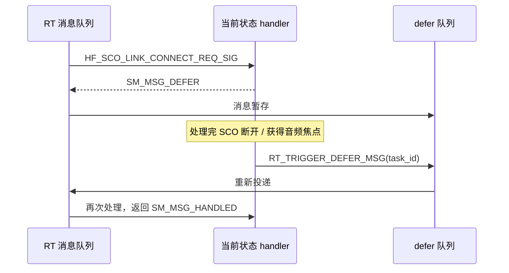

# SM_ 状态机模块用法指南（物奇 BT Service / RT 框架）

本文档整理 `wq-adk/components/bt_service` 中 **`SM_` 前缀宏**的用途、写法和典型模式，便于阅读/编写 `T_XX_top.c` 里的状态处理函数。

> 相关文档：[BT_SERVICE_PREFIX_GUIDE.md](./BT_SERVICE_PREFIX_GUIDE.md)（前缀速查）、[RT_RM_LOGIC.md](./RT_RM_LOGIC.md)（RT 启动链与 RM 状态机）

---

## 目录

1. [SM_ 是什么](#1-sm_-是什么)
2. [与蓝牙 Security Manager 的区别](#2-与蓝牙-security-manager-的区别)
3. [核心宏一览](#3-核心宏一览)
4. [消息处理返回值](#4-消息处理返回值)
5. [模块注册样板（编译期生成）](#5-模块注册样板编译期生成)
6. [状态生命周期](#6-状态生命周期)
7. [层次状态（父子状态）](#7-层次状态父子状态)
8. [三种委托/复用模式](#8-三种委托复用模式)
9. [延迟消息（DEFER）](#9-延迟消息defer)
10. [完整状态处理函数模板](#10-完整状态处理函数模板)
11. [实战示例](#11-实战示例)
12. [常见误区](#12-常见误区)

---

## 1. SM_ 是什么

**`SM_` = State Machine（状态机语法糖）**，定义在 RT 框架头文件 `rt_module.h` 中，用于在业务模块（RM/DM/CM/HFP/A2DP…）里 **声明状态处理函数、定义返回值、实现父子状态委托**。

它与 `RT_` 宏分工明确：

| 层次 | 前缀 | 职责 |
|------|------|------|
| 框架引擎 | `RT_` | 任务创建、消息投递、状态读写、定时器 |
| 状态机写法 | `SM_` | 状态函数签名、处理结果、父子委托 |
| 业务语义 | `RM_`/`DM_`/… | 具体状态名、信号名、上下文结构 |

典型调用链：

```
RT_MSG_PUT(pe)
    ↓ RT 消息队列
MODULE_message_handler()          ← RT 框架（库内实现）
    ↓ 查当前状态索引
RM_FUNC_TBL[current](msg_id, …)   ← SM_STATE_HANDLER 定义的函数
    ↓ 可能调用
RT_STATE_TRANS_TO(dest_id, next)  ← 触发 STATE_EXIT → 切状态 → STATE_ENTER
    ↓ 返回
SM_MSG_HANDLED / SM_MSG_DELEGATE / SM_MSG_DEFER
```

头文件路径（按芯片选对应目录）：

```
bt_service/internal/lib/<chip>/<ver>/inc/rt_module.h
```

`T_module_defs.h` 还定义了框架内部消息：

```c
enum T_MODULE_MSG_INTERNAL {
    MODULE_MSG_STATE_ENTER = RT_MODULE_MSG_ID_BUILD(MODULE_MAX, 0),
    MODULE_MSG_STATE_EXIT,
};
```

---

## 2. 与蓝牙 Security Manager 的区别

代码里还有另一套 `SM_` 前缀，来自 **蓝牙协议栈 Security Manager（配对/加密）**，与 RT 状态机 **完全无关**：

| 来源 | 示例 | 含义 |
|------|------|------|
| `rt_module.h` | `SM_STATE_HANDLER`、`SM_MSG_HANDLED` | RT 业务状态机 |
| `BT_sm_api.h` / `sm_ssp_pl.h` | `SM_LINK_KEY_REQUEST_NTF`、`SM_IO_CAPABILITY_DEFAULT` | 蓝牙配对与安全 |

阅读 `T_rm_top.c` 时看到 `SM_STATE_HANDLER` → RT 状态机；  
阅读 `T_appl_gap.c` / HCI 回调里看到 `SM_LINK_KEY_*` → 蓝牙安全协议。

---

## 3. 核心宏一览

定义于 `rt_module.h`：

| 宏 | 展开/作用 |
|----|-----------|
| `SM_STATE_HANDLER(FN_)` | 定义状态处理函数：`int FN_(uint16_t msg_id, uint16_t dest_id, uint16_t src_id, void const *param)` |
| `SM_STATE_FUNC_DEC(N)` | 在 `T_XX.h` 中声明模块全部状态函数原型（由 `XX_TABLE` 生成） |
| `FUNC_TBL_DEF(N)` | 在 `T_XX_top.c` 生成 `N_FUNC_TBL[]` 函数指针表 |
| `SM_STATE_INFO_DEF(N, st_base_)` | 绑定状态表 + 可选父子关系数组 → `N_STATE_INFO` |
| `SM_STATE_ROOT` | `0xFF`，表示该状态无父状态（顶层） |
| `SM_STATE_NEST_DEPTH` | 最大嵌套深度 `6` |
| `SM_STATE_DELEGATE(FN_)` | 直接调用另一个状态 handler 处理当前消息（**不改变当前状态**） |

与 `RT_` 配合使用的关键宏（同在 `rt_module.h` / `rt_task.h`）：

| 宏 | 作用 |
|----|------|
| `RT_STATE_TRANS_TO(id_, state_)` | 状态跳转（自动发 EXIT/ENTER） |
| `RT_STATE_GET(id_)` | 读取当前状态索引 |
| `RT_TRIGGER_DEFER_MSG(id_)` | 重放 defer 队列中的消息 |

---

## 4. 消息处理返回值

```c
enum T_SM_MSG_STATUS {
    SM_MSG_HANDLED,     // 消息已处理，结束
    SM_MSG_DELEGATE,    // 交给父状态 handler 处理（需配置 st_base）
    SM_MSG_DEFER,       // 暂不处理，放入 defer 队列
    SM_MSG_UNHANDLED,   // 未处理（框架保留）
};
```

| 返回值 | 何时使用 | 框架行为 |
|--------|----------|----------|
| `SM_MSG_HANDLED` | `switch` 里处理了该 `msg_id`，或 `default` 忽略 | 消息消费完毕 |
| `SM_MSG_DELEGATE` | 子状态不处理此消息，交给父状态 | 沿 `st_base` 向上找父状态 handler 重入 |
| `SM_MSG_DEFER` | 当前时机不对（资源忙、等前置事件） | 消息入 defer 队列，稍后 `RT_TRIGGER_DEFER_MSG` 重放 |
| `SM_MSG_UNHANDLED` | 极少显式返回 | 框架默认行为 |

**注意：** `switch` 的 `default: break;` 后 `return SM_MSG_HANDLED` 表示"收到但忽略"，与 `SM_MSG_DELEGATE` 不同。

---

## 5. 模块注册样板（编译期生成）

每个 `T_XX_top.c` 文件头部有固定五件套（以 RM 为例）：

```c
// T_rm_top.c
RT_MODULE_CONTEXT_DEF(RM, RM_CONTEXT, N_RM);   // g_RM_app[]
RT_MODULE_STATE_DEF(RM, N_RM);                  // RM_STATE[] 每实例当前状态
RT_MODULE_DESC_DEF(RM, N_RM);                   // RM_DESC → handler = MODULE_message_handler
FUNC_TBL_DEF(RM);                               // RM_FUNC_TBL[] 状态→函数映射
SM_STATE_INFO_DEF(RM, NULL);                    // RM_STATE_INFO（无层次时用 NULL）
```

`T_rm.h` 中用 `XX_TABLE` + `FUNC_INDEX_DEC` 生成状态 ID 枚举：

```c
#define RM_TABLE(DEF)         \
    DEF(RM_initialized, _ID)  \
    DEF(RM_tws_pairing, _ID)  \
    ...

FUNC_INDEX_DEC(RM);
// 展开为：enum RM_FUNC_INDEX { RM_initialized_ID, RM_tws_pairing_ID, ..., RM_FUNC_MAX_ID };
```

`RM_ctor()` / `RM_setup()` 完成运行时挂接：

```c
void RM_ctor(void) {
    rt_task_create(MODULE_RM, &RM_DESC);
    RT_MODULE_SET_USER_DATA(MODULE_RM, &RM_STATE_INFO);
    rt_msg_subscribe(DM_START_SIG, task_id);   // 订阅关心的信号
    ...
}

void RM_setup(void) {
    RT_MODULE_SET_INIT_STATE(MODULE_RM, task_id, RM_initialized_ID);
}
```

---

## 6. 状态生命周期

调用 `RT_STATE_TRANS_TO(dest_id, RM_connect_req_ID)` 时，框架自动：

```
1. 向旧状态发送 MODULE_MSG_STATE_EXIT
2. 更新 RM_STATE[index] = RM_connect_req_ID
3. 向新状态发送 MODULE_MSG_STATE_ENTER
```

因此在 handler 里应处理 `MODULE_MSG_STATE_ENTER` / `EXIT`：

```c
SM_STATE_HANDLER(RM_initialized)
{
    switch (msg_id) {
    case MODULE_MSG_STATE_ENTER:
        __rm_reset_instance(me);       // 进入时初始化
        __rm_set_connectable(false);
        return SM_MSG_HANDLED;

    case DM_START_SIG:
        RT_STATE_TRANS_TO(dest_id, RM_detect_role_ID);  // 触发 EXIT→ENTER
        return SM_MSG_HANDLED;

    default:
        break;
    }
    return SM_MSG_HANDLED;
}
```

| 消息 | 触发时机 | 典型用途 |
|------|----------|----------|
| `MODULE_MSG_STATE_ENTER` | 刚进入该状态 | 重置变量、开定时器、上报事件、设 HCI 参数 |
| `MODULE_MSG_STATE_EXIT` | 即将离开该状态 | 清定时器、释放资源、保存 `most_recent_state` |

---

## 7. 层次状态（父子状态）

部分模块有 **子状态继承父状态逻辑**，通过 `st_base` 数组配置。

AVRCP 示例（`T_avrcp_top.c`）：

```c
static const RT_STATE AVRCP_STATE_BASE[] = {
    SM_STATE_ROOT,        /* AVRCP_initialized — 顶层 */
    SM_STATE_ROOT,        /* AVRCP_started */
    SM_STATE_ROOT,        /* AVRCP_connect_req */
    SM_STATE_ROOT,        /* AVRCP_connected */
    AVRCP_connected_ID,   /* AVRCP_playing — 父状态是 connected */
    AVRCP_connected_ID,   /* AVRCP_suspend — 父状态是 connected */
    SM_STATE_ROOT,        /* AVRCP_disconnecting */
};

SM_STATE_INFO_DEF(AVRCP, AVRCP_STATE_BASE);
```

含义：

- `AVRCP_playing` / `AVRCP_suspend` 是 `AVRCP_connected` 的 **子状态**
- 子状态 `default` 返回 `SM_MSG_DELEGATE` → 框架自动转到 `AVRCP_connected` 处理
- 父状态仍需存在的消息（如断连）不必在子状态重复写

```
AVRCP_connected（父）
├── AVRCP_playing（子）
└── AVRCP_suspend（子）
```

RM 等模块无层次关系：`SM_STATE_INFO_DEF(RM, NULL)`。

---

## 8. 三种委托/复用模式

### 8.1 `SM_MSG_DELEGATE` — 交给父状态

子状态不认识的 `msg_id`，由父状态统一处理：

```c
// T_avrcp_top.c — AVRCP_playing
default: {
    return SM_MSG_DELEGATE;   // 未处理的消息交给 AVRCP_connected
}
```

**前提：** `st_base` 中该子状态指向了有效父状态 ID。

### 8.2 `SM_STATE_DELEGATE(FN_)` — 转调另一个状态函数

**不改变当前状态索引**，只是把消息交给另一个 handler 的 `switch` 逻辑复用：

```c
// T_rm_top.c — RM_disconnected
case RM_RECONNECT_PRI_SIG: {
    if (IS_PRI_ROLE()) {
        return SM_STATE_DELEGATE(RM_connect_req);  // 复用 connect_req 里的重连逻辑
    }
    return SM_MSG_HANDLED;
}

// T_dm_top.c — DM_connected
case DM_SET_PEER_ADDR_SIG: {
    return SM_STATE_DELEGATE(DM_initialized);      // 复用 initialized 的设地址逻辑
}
```

宏展开：`SM_STATE_DELEGATE(RM_connect_req)` → `return RM_connect_req(msg_id, dest_id, src_id, param);`

### 8.3 直接调用 handler（手动触发 ENTER）

极少数场景手动以 `MODULE_MSG_STATE_ENTER` 调用另一状态函数：

```c
// lm_top.c
LM_set_plink(MODULE_MSG_STATE_ENTER, dest_id, src_id, param);
```

等价于"不跳转状态，只执行目标状态的 ENTER 分支逻辑"。

---

## 9. 延迟消息（DEFER）

当消息 **现在不能处理、但之后要处理** 时用 `SM_MSG_DEFER`。

### 典型场景：HFP SCO 冲突

```c
// T_hfp_top.c — HFP_connecting
case HF_SCO_LINK_CONNECT_REQ_SIG: {
    return SM_MSG_DEFER;   // 等其他 SCO 断开后再说
}
```

### 重放时机

处理完前置条件后，调用 `RT_TRIGGER_DEFER_MSG` 把 defer 队列里的消息重新投递：

```c
// T_hfp_top.c — HFP_connected，SCO 断开后
uint8_t hf_id = __hfp_is_any_sco_waitting();
if (hf_id < N_HFP) {
    RT_TRIGGER_DEFER_MSG(RT_BUILD_ID(MODULE_HFP, hf_id));
}

// 或音频焦点恢复后
if (IS_WAITING_SCO_HANDLE(me->sco.link.handle)) {
    RT_TRIGGER_DEFER_MSG(dest_id);
}
```

### LM 模块：操作冲突时 defer

```c
// lm_top.c — LM_switch_start
case LM_REQUST_TDS_SIG:
case LM_REQUST_SET_PLINK_SIG: {
    return SM_MSG_DEFER;   // 链路切换进行中，TDS/plink 请求稍后重试
}
```

流程图：



---

## 10. 完整状态处理函数模板

```c
SM_STATE_HANDLER(XX_my_state)
{
    uint8_t index = RT_INDEX_GET(dest_id);
    XX_CONTEXT *me = RT_MODULE_CONTEXT(XX, index);

    switch (msg_id) {
    case MODULE_MSG_STATE_ENTER:
        // 进入：初始化、上报、开定时器
        return SM_MSG_HANDLED;

    case MODULE_MSG_STATE_EXIT:
        // 离开：清定时器、保存 most_recent_state
        return SM_MSG_HANDLED;

    case SOME_SIG: {
        SOME_EVT_T *pe = (SOME_EVT_T *)param;
        // 处理业务逻辑
        RT_STATE_TRANS_TO(dest_id, XX_next_state_ID);  // 需要跳转时
        return SM_MSG_HANDLED;
    }

    case ANOTHER_SIG:
        return SM_STATE_DELEGATE(XX_other_state);  // 复用另一状态逻辑

    default:
        return SM_MSG_DELEGATE;   // 有父状态时交给父状态；无父状态则 break
    }

    return SM_MSG_HANDLED;         // 无父状态、default 仅 break 时
}
```

---

## 11. 实战示例

### 11.1 RM_initialized — 待命 + 条件跳转

文件：`rm/T_rm_top.c`

| 信号 | 行为 |
|------|------|
| `MODULE_MSG_STATE_ENTER` | 重置实例、清交换数据、关 connectable |
| `RM_INIT_TWS_PAIRING_SIG` | 保存配对参数 → `RM_tws_pairing` |
| `DM_START_SIG` | peer 全 0 / 全 FF → 停留；有效 MAC → `RM_detect_role` |

### 11.2 DM_connected — 多状态委托

文件：`dm/T_dm_top.c`

`DM_connected` 本身逻辑较多，对部分信号 **委托给** `DM_initialized` 或 `DM_opened`，避免重复代码：

```c
case DM_SET_PEER_ADDR_SIG:
    return SM_STATE_DELEGATE(DM_initialized);

case DM_SET_VISIBILITY_SIG:
case CM_CONNECT_IND_SIG:
    return SM_STATE_DELEGATE(DM_opened);
```

### 11.3 AVRCP — 父子状态 + DELEGATE

| 状态 | 类型 | 未处理消息 |
|------|------|------------|
| `AVRCP_connected` | 父 | `return SM_MSG_HANDLED` |
| `AVRCP_playing` | 子 | `default → SM_MSG_DELEGATE` |
| `AVRCP_suspend` | 子 | 仅处理 ENTER，其余 `SM_MSG_DELEGATE` |

### 11.4 使用 SM_ 宏的模块文件

| 文件 | 是否有层次状态（st_base） |
|------|--------------------------|
| `rm/T_rm_top.c` | 否（NULL） |
| `dm/T_dm_top.c` | 否 |
| `cm/T_cm_top.c` | 否 |
| `hfp/T_hfp_top.c` | 否（大量 DELEGATE + DEFER） |
| `avrcp/T_avrcp_top.c` | **是**（playing/suspend 继承 connected） |
| `lm/lm_top.c` | 否（有 DEFER） |
| `le/le_audio/T_ga_top.c` | 部分委托 `GA_bc_scanning` |

---

## 12. 常见误区

| 误区 | 正确理解 |
|------|----------|
| `SM_` = 蓝牙 Security Manager | RT 状态机与 `BT_sm_*` 是两套体系，看文件名/context 区分 |
| 忘记 `return` | 每个 `case` 分支必须 `return SM_MSG_*`，否则未定义行为 |
| `SM_MSG_DELEGATE` 无父状态 | `st_base` 为 NULL 或 `SM_STATE_ROOT` 时 DELEGATE 无效 |
| `SM_STATE_DELEGATE` 会跳转状态 | **不会**改状态，只复用另一函数的 switch 逻辑 |
| `RT_STATE_TRANS_TO` 后还处理同消息 | 跳转后框架发 ENTER/EXIT，当前 handler 应 `return`，勿继续 fall-through |
| `SM_MSG_DEFER` 后消息丢失 | 必须后续 `RT_TRIGGER_DEFER_MSG`，否则 defer 队列不会自动重放 |
| `MODULE_MSG_STATE_ENTER` 的 `param` | 跳转时 `param` 可能为 NULL；RM_initialized ENTER 用 `if (NULL != param)` 区分首次/跳转进入 |

---

## 速查：SM_ 与 RT_ / 业务前缀对照

```
写状态函数    → SM_STATE_HANDLER(RM_initialized) { ... }
读当前状态    → RT_STATE_GET(RM_TASK_ID())  或 RM_STATE_IDX_CURRENT()
跳转状态      → RT_STATE_TRANS_TO(dest_id, RM_connect_req_ID)
发消息        → RT_MSG_NEW(...) + RT_MSG_PUT(pe)
订阅消息      → rt_msg_subscribe(DM_START_SIG, task_id)  // 在 XX_ctor()
处理完毕      → return SM_MSG_HANDLED
交给父状态    → return SM_MSG_DELEGATE
复用他态逻辑  → return SM_STATE_DELEGATE(RM_connect_req)
延后处理      → return SM_MSG_DEFER;  …  RT_TRIGGER_DEFER_MSG(dest_id);
```

---

## 关键源文件索引

| 文件 | 内容 |
|------|------|
| `internal/lib/*/inc/rt_module.h` | 全部 `SM_*` 宏定义 |
| `common/T_module_defs.h` | `MODULE_MSG_STATE_ENTER/EXIT` |
| `rm/T_rm.h` | `RM_TABLE`、`FUNC_INDEX_DEC` 范例 |
| `rm/T_rm_top.c` | 扁平状态机 + `SM_STATE_DELEGATE` |
| `avrcp/T_avrcp_top.c` | 层次状态 + `SM_MSG_DELEGATE` |
| `hfp/T_hfp_top.c` | `SM_MSG_DEFER` + `RT_TRIGGER_DEFER_MSG` |
| `dm/T_dm_top.c` | 多状态间 `SM_STATE_DELEGATE` |
