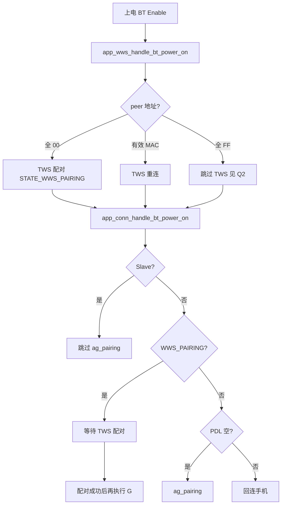
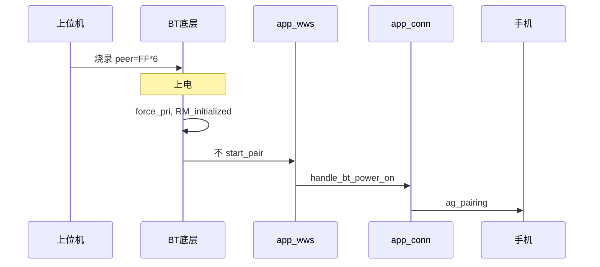
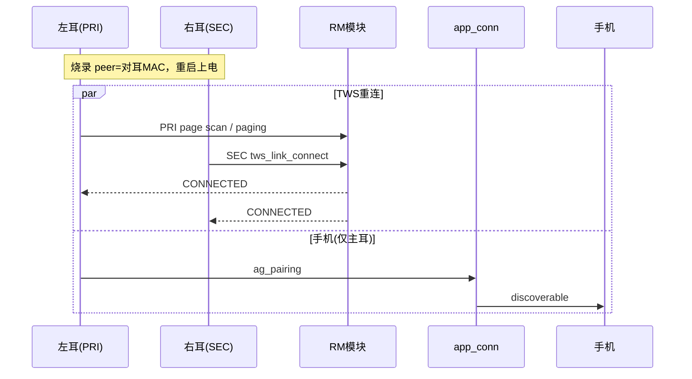
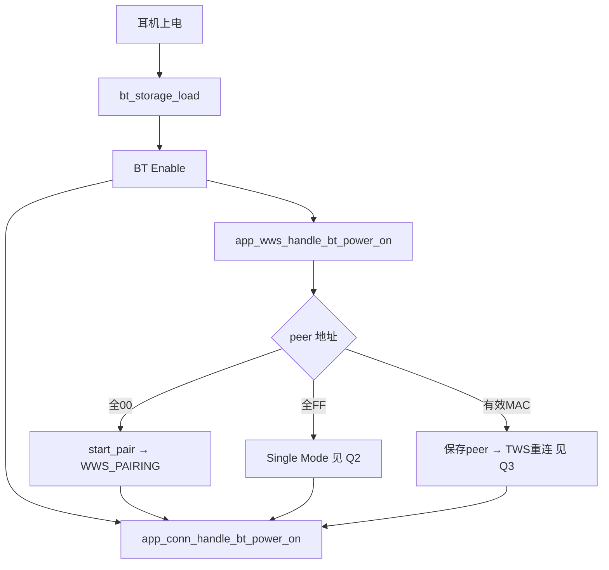

# TWS 组队与 ag_pairing 完整指南（A2007 / 物奇 SDK）

本文档汇总 TWS 组队、手机 `ag_pairing`、物奇上位机烧录三种模式（未组队 / Single Mode / 预写 MAC）的问答与代码流程。

> 更细的代码章节见 [TWS_PAIRING_LOGIC.md](./TWS_PAIRING_LOGIC.md)  
> RM_detect_role 与主从角色判定：[RM_DETECT_ROLE_QA.md](./RM_DETECT_ROLE_QA.md)

---

## 目录

1. [总览：三种 peer 地址模式](#1-总览三种-peer-地址模式)
2. [Q1：上电 TWS 组队逻辑与 ag_pairing 先后关系](#2-q1上电-tws-组队逻辑与-ag_pairing-先后关系)
3. [Q2：烧录 Single Mode（peer 全 FF）](#3-q2烧录-single-modepeer-全-ff)
4. [Q3：烧录预写对耳 MAC（产线预组队）](#4-q3烧录预写对耳-mac产线预组队)
5. [公共代码路径](#5-公共代码路径)
6. [关键源文件索引](#6-关键源文件索引)

---

## 1. 总览：三种 peer 地址模式

物奇上位机通过 `ro_cfg.xml` → `bt_general_data` 烧录 `peer_addr`，决定上电后 TWS 行为：

| peer 地址 | 烧录场景 | RM 底层 | app_wws | ag_pairing 时机 |
|-----------|----------|---------|---------|-----------------|
| 全 `0x00` | 未组队（默认） | 不连 TWS | **会** `start_pair` | TWS **配对完成后**（主耳） |
| 全 `0xFF` | Single Mode | 不连 TWS + 产线标志 | 不 `start_pair` | **立即**（主耳） |
| 有效 MAC | 预写对耳地址 | TWS **重连** | 不 `start_pair` | **并行**（主耳，不等 TWS） |

**地址判定宏**（`appl_utils.h` / `T_rm.h`）：

```c
#define APPL_IS_ALL_FF_ADDR(addr)    // 全 FF
#define APPL_IS_VALID_ADDR(addr_)    // 非全 FF 且 非全 0
#define RM_IS_SINGLE_MODE_PEER_ADDR  APPL_IS_ALL_FF_ADDR
#define RM_IS_VALID_PEER_ADDR        APPL_IS_VALID_ADDR
```

**一句话记忆：**

- **全 0** → TWS 自动**配对**，组队完才能 ag_pairing
- **有效 MAC** → TWS **重连**，主耳并行 ag_pairing
- **全 FF** → Single Mode，不组队，主耳直接 ag_pairing
- **从耳** → 永远不直接执行 ag_pairing

---

## 2. Q1：上电 TWS 组队逻辑与 ag_pairing 先后关系

### 问题

耳机上电后，TWS 组队的逻辑是怎样的？是不是要先组完队才能进入 ag_pairing？

### 结论

**视场景而定：**

| 场景 | 是否必须先完成 TWS 组队才能 ag_pairing |
|------|----------------------------------------|
| 首次 TWS 组队（peer 全 0） | **是** |
| 已组队 / 预写 MAC（有效 MAC，仅重连） | **否**，可并行 |
| 烧录 Single Mode（peer 全 FF） | **否**，根本不组队 |
| 从耳（Slave） | 不执行 ag_pairing，由主耳处理 |

---

### 上电调用链

```
BT Enable
  └─ app_wws_handle_bt_power_on()    // TWS 层
  └─ app_conn_handle_bt_power_on()   // 手机层
```

入口：`wq-adk/components/apps/acore/bt/src/app_bt.c`

---

### TWS 侧：配对 vs 重连

**应用层**（`app_wws_handle_bt_power_on`）：

```c
#define AUTO_TWS_PAIR_PEER_BDADDR { 0x00, 0x00, 0x00, 0x00, 0x00, 0x00 }

if (!bdaddr_is_equal(&cmd.addr, &auto_tws_pair_peer_bdaddr)) {
    context->peer_addr = cmd.addr;
    return;                    // 非全 0：不启动配对
}
app_wws_start_pair(vid, pid, magic);  // 仅全 0 触发
```

**底层 RM**（`DM_START_SIG`）：

- peer 全 0 或全 FF → 停留 `RM_initialized`
- peer 有效 MAC → `RM_detect_role` → `RM_connect_req` 自动重连

---

### ag_pairing 阻塞逻辑

`app_conn_handle_bt_power_on()`：

| 条件 | 行为 |
|------|------|
| `app_wws_is_slave()` | 直接 return |
| `STATE_WWS_PAIRING` | 阻塞，`connectable=false`，等 TWS 配对完成 |
| PDL 为空 | `app_bt_enter_ag_pairing()` |
| PDL 有记录 | 启动手机回连 |

TWS 配对完成后重新触发：

```c
// bt_evt_tws_pair_result_handler
if (app_conn_get_connect_reason() == CONNECT_REASON_POWER_ON) {
    app_conn_handle_bt_power_on();
}
```

---

### A2007 额外约束（首次手机配对）

PDL 为空且 `pairingwav_delay=true` 时，`EVTSYS_ENTER_PAIRING` 还要求：

- `app_wws_is_connected_master()` — TWS 主耳已连接
- `app_charger_is_in_box()` — 在充电盒内

否则每 3 秒重试（`app_econn_demo.c`，bug 1695）。

---

### Q1 流程图



---

## 3. Q2：烧录 Single Mode（peer 全 FF）

### 问题

物奇上位机烧录选 Single Mode，对耳地址为全 FF，上电后不 TWS 组队、直接 ag_pairing，代码流程是什么？

### 结论

1. RM **不发起** TWS 连接/配对
2. 应用层 **不调用** `app_wws_start_pair()`（触发条件是 peer 等于全 **0**，不是全 FF）
3. `force_pri=true`，强制主耳，**直接进入** ag_pairing

---

### 烧录配置

```xml
<!-- ro_cfg.xml → bt_general_data -->
<peer_addr type="bytes" len="6">FFFFFFFFFFFF</peer_addr>
<tws_single_mode type="uint8">1</tws_single_mode>
```

加载：`bt_storage_load()` → `_bt_general_data_load()`（`bt_srv_storage.c`）

---

### 代码流程（5 层）

```
① bt_storage_load()          peer = FF*6
② bt_service_power_on_off()  force_pri=true → HEADSET_PRI
③ RM DM_START_SIG            RM_initialized，TWS_FACTORY 标志
④ app_wws_handle_bt_power_on peer≠全00 → 不 start_pair
⑤ app_conn_handle_bt_power_on → app_bt_enter_ag_pairing()
```

**② 强制主耳**（`app_user_cmd.c`）：

```c
bool force_pri = !RM_IS_VALID_PEER_ADDR(peer_addr);  // 全 FF → true
SET_LOCAL_ROLE(HEADSET_PRI);
```

**③ RM 跳过**（`T_rm_top.c`）：

```c
if (RM_IS_SINGLE_MODE_PEER_ADDR(PEER_BDADDR())) {
    bt_storage_write_tws_single_mode(STORAGE_TWS_SINGLE_MODE);
    RM_SET_FLAG(RM_DEV_TWS_FACTORY_MODE_FLAG);
    return;  // 停留 RM_initialized
}
```

**回连保护**（`app_conn.c`）：peer 为 `FTM_PEER_BDADDR`（全 FF）时，`connect_last()` 禁止自动回连。

---

### Q2 时序图



---

## 4. Q3：烧录预写对耳 MAC（产线预组队）

### 问题

物奇上位机支持直接写入对耳 MAC，烧录后重启自动与该 MAC 的耳机组队，代码流程是什么？

### 结论

1. 走 **TWS 重连**（`RM_connect_req`），**不走** `RM_tws_pairing`
2. 应用层 **不调用** `app_wws_start_pair()`
3. 主耳 page/scan，从耳 `tws_link_connect(peer)`
4. 主耳 **并行** ag_pairing，**不等待** TWS 连上

---

### 产线烧录配置

左耳 MAC = A，右耳 MAC = B：

| 字段 | 左耳 | 右耳 |
|------|------|------|
| `peer_addr` | B | A |
| `is_pri_dev` | 1 | 0 |
| `is_left_dev` | 1 | 0 |
| `tws_single_mode` | 0 | 0 |
| `tws_linkkey` | 相同（可选） | 相同（可选） |

```xml
<ro_cfg_bt_general_data_t name="bt_general_data">
  <tws_linkkey type="bytes" len="16">...</tws_linkkey>
  <is_pri_dev type="uint8">1</is_pri_dev>
  <peer_addr type="bytes" len="6">AABBCCDDEEFF</peer_addr>
  <tws_single_mode type="uint8">0</tws_single_mode>
</ro_cfg_bt_general_data_t>
```

---

### 代码流程（6 步）

#### ① 存储加载

```
bt_storage_load()
  ├─ peer_addr = 对耳 MAC
  ├─ is_pri_dev = 1/0
  ├─ tws_linkkey（可选）
  └─ tws_single_mode = 0
```

#### ② BT 上电：角色与地址映射

```c
// app_user_cmd.c → bt_service_power_on_off()
bool force_pri = !RM_IS_VALID_PEER_ADDR(peer_addr);  // 有效MAC → false

if (bt_storage_is_pri_dev() || force_pri) {
    SET_LOCAL_ROLE(HEADSET_PRI);
    BT_CPY_BD_ADDR(PRI_BDADDR(), local_addr);
    BT_CPY_BD_ADDR(SEC_BDADDR(), peer_addr);
} else {
    SET_LOCAL_ROLE(HEADSET_SEC);
    BT_CPY_BD_ADDR(PRI_BDADDR(), peer_addr);
    BT_CPY_BD_ADDR(SEC_BDADDR(), local_addr);
}
```

`bt_storage_is_pri_dev()` 优先读 `tws_role_mode`，否则读 `is_pri_dev`。

#### ③ RM：TWS 重连

```c
// T_rm_top.c → DM_START_SIG（有效 peer）
if (IS_PRI_ROLE()) {
    RT_MSG_PUT_DELAY(RM_RECONNECT_PRI_SIG, TWS_PRI_PAGING_DELAY_MS);
}
RT_STATE_TRANS_TO(dest_id, RM_detect_role_ID);  // → RM_connect_req
```

| 角色 | 连接行为 |
|------|----------|
| PRI（主耳） | `__rm_set_connectable(true)`，page scan，paging 从耳 |
| SEC（从耳） | `tws_link_connect(PEER_BDADDR())` 主动连主耳 |

连接成功 → `bt_storage_write_tws_single_mode(DOUBLE)` → `RM_connected`

#### ④ Link Key

```c
// T_appl_gap.c — 建链鉴权
if (IS_PEER_ADDR(bd_addr)) {
    if (bt_store_is_link_key_valid())
        BT_sm_link_key_request_reply(bd_addr, link_key, 1);  // 用烧录 key
    else
        BT_sm_link_key_request_reply(bd_addr, link_key, 0);  // 首次生成
}

// T_appl_hci.c — 连接后保存
if (IS_PEER_ADDR(bd_addr))
    bt_storage_write_link_key(link_key);
```

#### ⑤ 应用层

```c
// app_wws — peer ≠ 全00，不 start_pair，保存 peer
// app_conn — 主耳并行 ag_pairing；从耳 return
```

#### ⑥ 连接成功上报

```
RM_connected
  → BT_EVT_TWS_STATE_CHANGED
  → app_wws_handle_state_changed()
  → EVTSYS_WWS_CONNECTED
```

---

### 异常与角色纠错

`RM_connect_req` 中 page 超时、双主冲突等会触发 `_tws_swap_role()` 后重试。

`__rm_reset_role()` 启动时校验 `is_pri_dev` 与当前角色，不一致时自动 swap。

---

### Q3 时序图



---

## 5. 公共代码路径

### 5.1 上电总流程



### 5.2 核心数据结构

```c
// bt_general_data_t（bt_srv_storage.h）
typedef struct _bt_general_data {
    uint8_t tws_link_key[16];
    uint8_t is_pri_dev;       // 1=主耳
    uint8_t peer_addr[6];     // 对耳 MAC
    uint8_t tws_single_mode;  // 1=单耳, 0=双耳
    ...
} bt_general_data_t;
```

### 5.3 运行时修改 peer（补充）

```
BT_CMD_TWS_SET_PEER_ADDR
  └─ bt_service_tws_set_peer_addr()
       └─ DM_SET_PEER_ADDR_SIG → bt_storage_write_peer_addr()
```

---

## 6. 关键源文件索引

| 模块 | 文件路径 | 职责 |
|------|----------|------|
| BT 上电入口 | `components/apps/acore/bt/src/app_bt.c` | Enable 事件、TWS 事件分发 |
| 手机连接 | `components/apps/acore/bt/src/app_conn.c` | 回连/配对、WWS_PAIRING 阻塞、FTM 保护 |
| TWS 应用层 | `components/apps/acore/wws/src/app_wws.c` | 上电初始化、`start_pair` 触发 |
| BT 上电 RPC | `components/bt_service/bt_rpc/app_user_cmd.c` | `force_pri`、PRI/SEC 映射 |
| RM 状态机 | `components/bt_service/rm/T_rm_top.c` | 配对/重连/Single Mode |
| 地址判定 | `components/bt_service/common/appl_utils.h` | 全 FF / 有效地址宏 |
| 存储 | `components/bt_service/common/bt_srv_storage.c` | `bt_general_data` 加载 |
| Link Key | `components/bt_service/cm/T_appl_gap.c` | TWS 鉴权 |
| Link Key 保存 | `components/bt_service/cm/T_appl_hci.c` | 连接后写 Flash |
| 烧录配置 | `project/a2007/config/*/ro_cfg.xml` | 上位机写入字段 |
| A2007 定制 | `project/a2007/acore/app/src/app_econn_demo.c` | 首次配对延迟、`peer_addr_monomode()` |

---

## 附录：文档索引

| 文档 | 内容 |
|------|------|
| [TWS_PAIRING_GUIDE.md](./TWS_PAIRING_GUIDE.md) | 本文档，问答汇总 |
| [TWS_PAIRING_LOGIC.md](./TWS_PAIRING_LOGIC.md) | 详细代码章节、状态机、时序图 |
| [TWS_PAIRING_QA.md](./TWS_PAIRING_QA.md) | 精简问答版 |
| [BT_SERVICE_PREFIX_GUIDE.md](./BT_SERVICE_PREFIX_GUIDE.md) | BT Service 前缀/模块/状态速查 |
| [RT_RM_LOGIC.md](./RT_RM_LOGIC.md) | RT 框架与 RM 状态机代码逻辑 |

---

*基于 A2007 项目 / 物奇 SDK 代码整理。*
