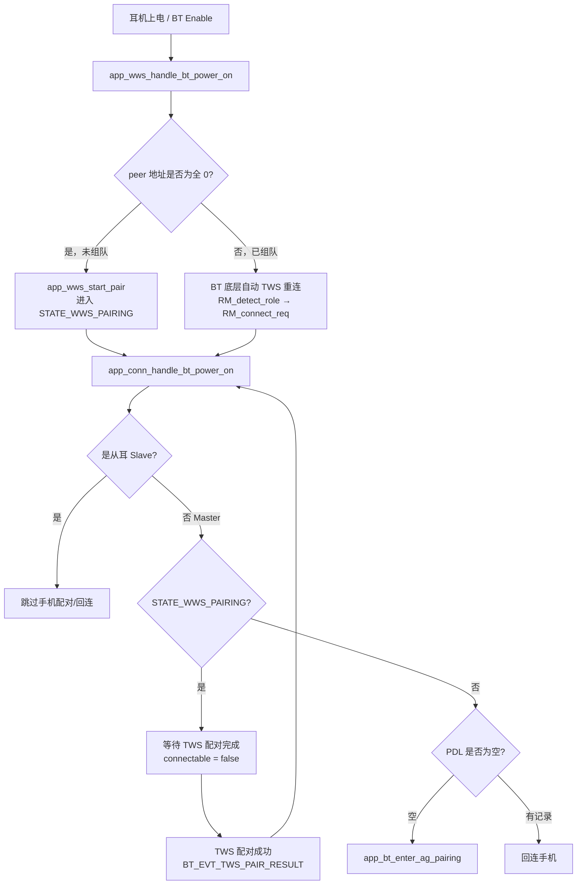
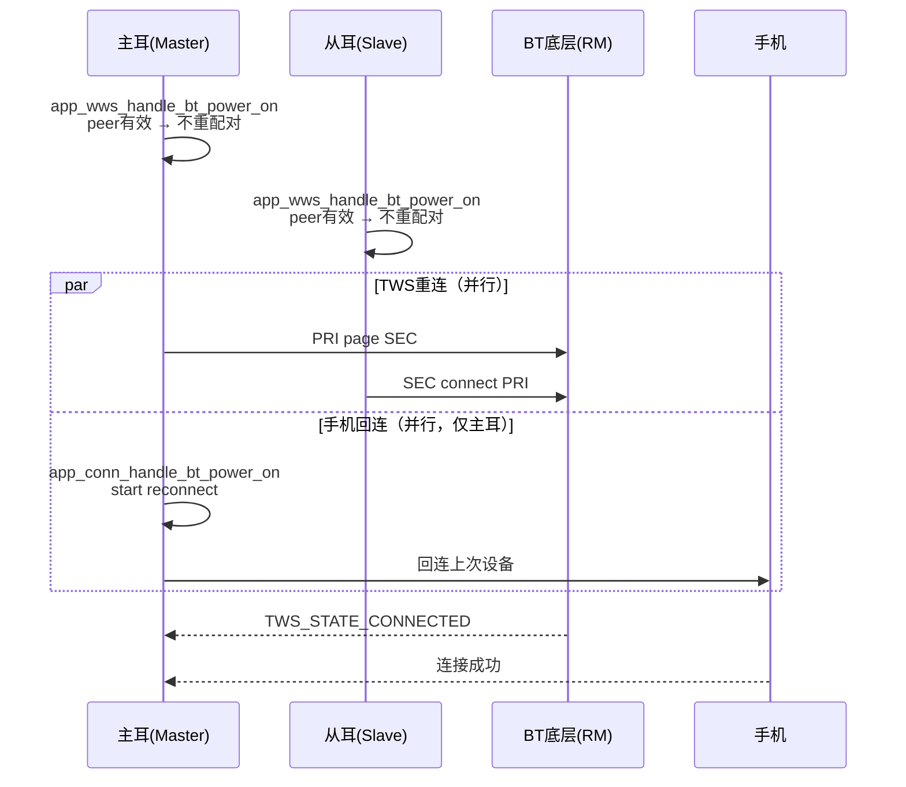
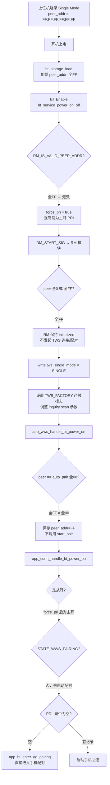
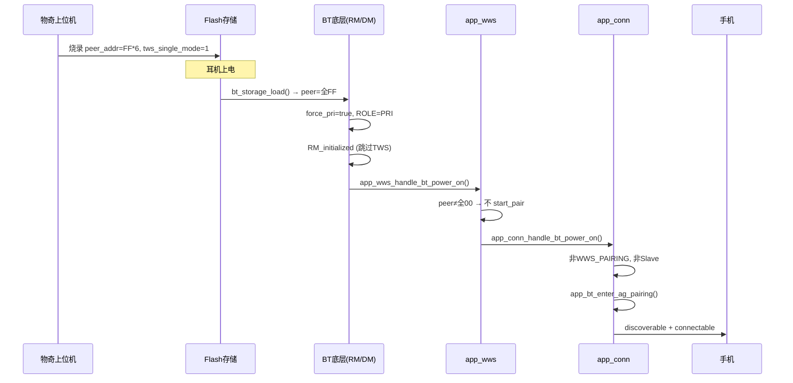
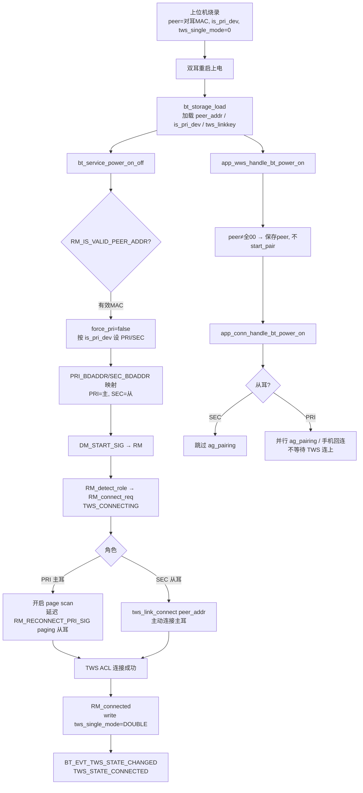
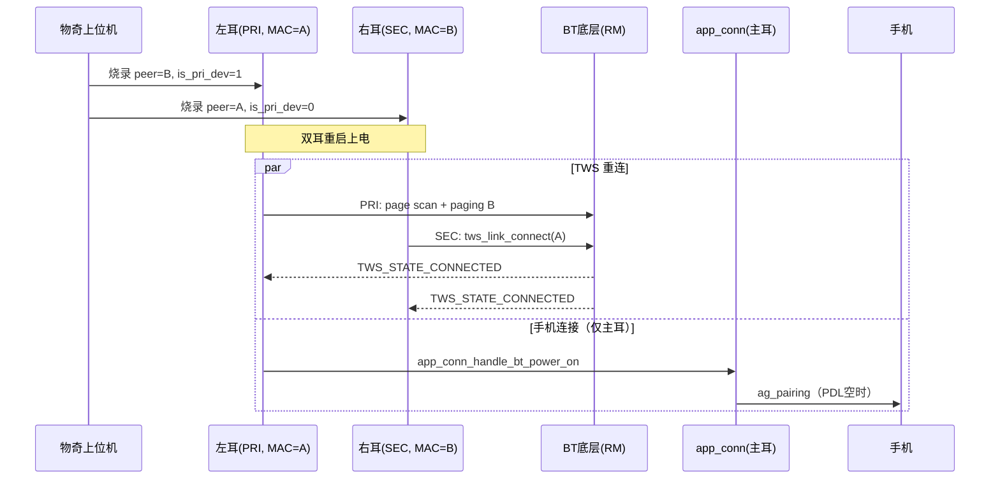

# TWS 组队逻辑说明（A2007）

本文档整理 A2007 项目中耳机上电后 TWS（True Wireless Stereo）组队的完整逻辑，以及与手机 `ag_pairing` 的先后关系。

> 问答汇总：[TWS_PAIRING_GUIDE.md](./TWS_PAIRING_GUIDE.md) | 精简问答：[TWS_PAIRING_QA.md](./TWS_PAIRING_QA.md)

---

## 1. 核心概念

### 1.1 TWS 角色

| 角色 | 说明 |
|------|------|
| **Master（PRI / 主耳）** | 负责与手机配对/回连、控制可见性 |
| **Slave（SEC / 从耳）** | 不直接执行 `ag_pairing`，由主耳同步状态 |

角色来源（初始化时）：

- Flash 中存储的 `tws_role`（`bt_storage_is_pri_dev()`）
- 项目配置 `ro_cfg()->general.tws_role_mode`
- 项目自定义 `app_econn_get_wws_role()`

相关文件：`wq-adk/components/apps/acore/wws/src/app_wws.c` → `app_wws_init()`

### 1.2 TWS 状态

| 状态 | 含义 |
|------|------|
| `TWS_STATE_DISABLED` | BT 关闭 |
| `TWS_STATE_PAIRING` | 正在 TWS 配对（组队） |
| `TWS_STATE_CONNECTING` | 正在 TWS 重连 |
| `TWS_STATE_CONNECTED` | TWS 已连接 |
| `TWS_STATE_DISCONNECTED` | TWS 已断开 |

### 1.3 系统状态（与手机连接相关）

| 状态 | 含义 |
|------|------|
| `STATE_WWS_PAIRING` | TWS 配对中，**禁止**手机配对/回连 |
| `STATE_AG_PAIRING` | 手机配对模式（可发现 + 可连接） |
| `STATE_CONNECTABLE` | 仅可连接，不可发现 |
| `STATE_IDLE` | 空闲 |
| `STATE_CONNECTED` | 已连接手机 |

`STATE_WWS_PAIRING` 在 `context->tws_pairing == true` 时生效（`app_bt.c` → `get_sys_state_with_device()`）。

---

## 2. 上电总体流程

蓝牙上电后，应用层按以下顺序处理：

```
BT Enable
  └─ app_wws_handle_bt_power_on()    // TWS 层初始化
  └─ app_conn_handle_bt_power_on()   // 手机连接/配对逻辑
```

入口文件：`wq-adk/components/apps/acore/bt/src/app_bt.c`（`bt_evt_enable_state_changed_handler`）



---

## 3. TWS 组队 vs 重连的判断

### 3.1 应用层判断（`app_wws_handle_bt_power_on`）

文件：`wq-adk/components/apps/acore/wws/src/app_wws.c`

```c
// peer 地址为全 0 时，触发自动 TWS 配对
#define AUTO_TWS_PAIR_PEER_BDADDR { 0x00, 0x00, 0x00, 0x00, 0x00, 0x00 }

if (!bdaddr_is_equal(&cmd.addr, &auto_tws_pair_peer_bdaddr)) {
    context->peer_addr = cmd.addr;  // 已有 peer，直接保存
    return;                         // 不启动配对
}

// peer 为全 0 → 首次组队
app_wws_start_pair(vid, pid, magic);
```

| 条件 | 行为 |
|------|------|
| Flash 中 **有** peer 地址 | 跳过重连触发，由底层 RM 模块自动重连 |
| Flash 中 **无** peer 地址（全 0） | 调用 `app_wws_start_pair()` 进入 TWS 配对 |

### 3.2 BT 底层判断（RM 模块）

文件：`wq-adk/components/bt_service/rm/T_rm_top.c` → `DM_START_SIG`

| 条件 | 行为 |
|------|------|
| `PEER_BDADDR` 为全 0 或单耳模式地址 | 保持 `RM_initialized`，不自动重连 |
| `PEER_BDADDR` 有效 | 进入 `RM_detect_role` → `RM_connect_req`，主耳延迟 paging 从耳 |

主耳重连延迟：`TWS_PRI_PAGING_DELAY_MS`（定义于 `bt_srv_common_cfg.h`）

---

## 4. TWS 配对（首次组队）详细流程

### 4.1 触发入口

| 触发方式 | 入口 |
|----------|------|
| 上电自动触发 | `app_wws_handle_bt_power_on()`（peer 地址为全 0） |
| 用户/产线命令 | `EVTUSR_START_WWS_PAIR` → `app_wws_start_pair()` |
| 充电盒命令 | `CHARGER_EVT_TWS_PAIR` → `EVTUSR_START_WWS_PAIR` |
| 产线测试 | `factory_test.c` → `cgroup0x03_factory_sub_id_twspair` |

### 4.2 应用层配对启动

文件：`wq-adk/components/apps/acore/wws/src/app_wws.c`

```c
void app_wws_start_pair(uint16_t vid, uint16_t pid, uint8_t magic)
{
    app_bt_send_tws_pair_cmd(vid, pid, magic, TWS_PAIR_TIMEOUT_MS);  // 默认 2 分钟
    context->state = TWS_STATE_PAIRING;
}
```

`app_bt_send_tws_pair_cmd()` 会设置 `context->tws_pairing = true`，系统状态变为 `STATE_WWS_PAIRING`。

### 4.3 BT 底层配对状态机（`RM_tws_pairing`）

文件：`wq-adk/components/bt_service/rm/T_rm_top.c`

配对参数：`vid`、`pid`、`magic_no`（由 `app_econn_get_vid/pid/tws_pair_magic()` 提供）

| 角色 | 配对行为 |
|------|----------|
| **主耳（PRI）** | 关闭 scan；设置 vendor info（magic/vid/pid）；发起专用 DIAC inquiry 搜索从耳 |
| **从耳（SEC）** | 开启 fast page scan + discoverable；EIR 写入配对信息；等待主耳连接 |

配对成功：

1. 主耳发现从耳 → `tws_link_connect()`
2. 连接成功 → `bt_storage_write_peer_addr()` 写入 Flash
3. 切换为双耳模式 `STORAGE_TWS_DOUBLE_MODE`
4. 上报 `BT_EVT_TWS_PAIR_RESULT`（succeed = true）
5. 进入 `RM_connected` 状态

配对失败/超时：

- 上报 `BT_EVT_TWS_PAIR_RESULT`（succeed = false）
- 发送 `EVTSYS_WWS_PAIR_FAILED`
- 若可恢复则回到 `RM_detect_role`，否则回到 `RM_initialized`

关键超时：

| 宏 | 值 | 说明 |
|----|-----|------|
| `TWS_PAIR_TIMEOUT_MS` | 120000（2 分钟） | 应用层配对总超时 |
| `DM_START_TWS_PAIR_TIMEOUT_MS` | 5000 | DM 层启动配对超时 |
| `TWS_INQ_MAX_TIMEOUT_MS` | - | 单次 inquiry 最大时长（1.28s 为单位） |

---

## 5. TWS 重连（已组队）详细流程

已组队上电后，不走 `RM_tws_pairing`，而是：

```
DM_START_SIG
  └─ peer 地址有效（角色已在 Flash + 上电时确定，见 RM_DETECT_ROLE_QA.md）
       └─ RM_detect_role（重连标记态，立即跳转）
            └─ RM_connect_req（主耳 page 从耳 / 从耳连主耳）
                 └─ 连接成功 → RM_connected
                 └─ page 超时 → 单耳模式（STORAGE_TWS_SINGLE_MODE）
```

> `RM_detect_role` 并非运行时探测主从，详见 [RM_DETECT_ROLE_QA.md](./RM_DETECT_ROLE_QA.md)

文件：`wq-adk/components/bt_service/rm/T_rm_top.c`

- 主耳（PRI）：延迟 `TWS_PRI_PAGING_DELAY_MS` 后发起 paging
- 从耳（SEC）：在 `RM_disconnected` 状态下主动连接主耳
- 连接成功后上报 `BT_EVT_TWS_STATE_CHANGED`（`TWS_STATE_CONNECTED`）

应用层回调：`app_wws_handle_state_changed()` → 同步 peer 地址、发送 `EVTSYS_WWS_CONNECTED` 等事件。

---

## 6. 与手机 ag_pairing 的关系

### 6.1 框架层规则

文件：`wq-adk/components/apps/acore/bt/src/app_conn.c` → `app_conn_handle_bt_power_on()`

| 条件 | 行为 |
|------|------|
| 从耳（Slave） | **直接 return**，不执行手机配对/回连 |
| `STATE_WWS_PAIRING`（TWS 配对中） | **阻塞**，设置 `connect_reason = CONNECT_REASON_POWER_ON`，`connectable = false`，等待 TWS 配对完成 |
| PDL 为空 | 调用 `app_bt_enter_ag_pairing()` |
| PDL 有记录 | 启动手机回连（`CONN_MSG_ID_POWER_ON_CONNECT`） |

TWS 配对完成后的衔接（`app_bt.c` → `bt_evt_tws_pair_result_handler`）：

```c
if (app_conn_get_connect_reason() == CONNECT_REASON_POWER_ON) {
    app_conn_handle_bt_power_on();  // 重新执行手机连接逻辑
}
```

### 6.2 结论

| 场景 | 是否必须先完成 TWS 组队才能 ag_pairing |
|------|----------------------------------------|
| **首次 TWS 组队**（peer 地址为全 0） | **是**，必须等 `STATE_WWS_PAIRING` 结束 |
| **已 TWS 组队**（仅重连） | **否**，TWS 重连与手机回连/配对可并行进行 |
| **从耳** | 永远不直接执行 `ag_pairing`，由主耳处理 |

`app_bt_enter_ag_pairing()` 内部也会忽略从耳：

```c
if (app_wws_is_slave()) {
    return WQ_RET_OK;  // ignored for slave
}
```

---

## 7. A2007 项目特有逻辑

文件：`wq-adk/project/a2007/acore/app/src/app_econn_demo.c`

### 7.1 首次手机配对延迟（`pairingwav_delay`）

上电时若 PDL 为空，设置 `pairingwav_delay = true`（`CHARGER_EVT_POWER_ON`）。

收到 `EVTSYS_ENTER_PAIRING` 时：

```c
if (usr_cfg_pdl_is_empty() && pairingwav_delay) {
    if (app_wws_is_connected_master() && app_charger_is_in_box()) {
        app_econn_enter_ag_pairing();   // bug 1695
    } else {
        app_evt_send_delay(EVTSYS_ENTER_PAIRING, 3000);  // 3 秒后重试
    }
}
```

即：**A2007 首次手机配对**，除框架层等待 TWS 配对外，还要求：

1. TWS 主耳已连接（`app_wws_is_connected_master()`）
2. 耳机在充电盒内（`app_charger_is_in_box()`）

### 7.2 已连接状态下的上电保护

```c
// CHARGER_EVT_POWER_ON
if (app_wws_is_connected() && sys_state >= STATE_CONNECTED) {
    return true;  // 已 TWS 连接且已连手机，跳过上电处理（bug 2227）
}
```

### 7.3 TWS 连接后的主从校验

手机连接成功后，主耳会延迟 1s 触发 `ECONN_MSG_ID_TWS_CONNECT_CHECK_MASTER_SLAVE`，用于校验主从角色是否正确。

### 7.4 `app_econn_enter_ag_pairing` 封装

```c
void app_econn_enter_ag_pairing(void)
{
    app_send_msg_delay(MSG_TYPE_ECONN, ECONN_MSG_ENTEY_PAIRING, NULL, 0, 1000);
    if (app_wws_is_connected_master()) {
        app_send_msg(MSG_TYPE_ECONN, ECONN_MSG_ID_RESTART_AUTO_POWER_OFF, NULL, 0);
    }
}
```

比直接调用 `app_bt_enter_ag_pairing()` 多了 1s 延迟和自动关机重启逻辑。

---

## 8. 手动触发 TWS 组队

| 方式 | 事件/命令 | 说明 |
|------|-----------|------|
| 用户事件 | `EVTUSR_START_WWS_PAIR` | 随时可触发，会断开所有手机连接 |
| 充电盒 | `CHARGER_EVT_TWS_PAIR` | 充电盒 UART 协议下发 |
| 产线测试 | `factory_test.c` sub_id `0x33` | 延迟 500ms 发送 `EVTUSR_START_WWS_PAIR` |
| CLI | `app_cli.c` | 带 magic number 参数 |

手动触发时，DM 层会：

1. 断开所有手机连接（`__dm_disconnect_all`）
2. 进入 `DM_tws_pairing` 状态
3. 启动 RM 配对流程

---

## 9. 关键事件一览

| 事件 | 触发时机 | 处理 |
|------|----------|------|
| `BT_EVT_TWS_PAIR_RESULT` | TWS 配对成功/失败 | 清除 `tws_pairing` 标志；成功发 `EVTSYS_WWS_PAIRED`；失败发 `EVTSYS_WWS_PAIR_FAILED`；若 `connect_reason == POWER_ON` 则重新执行 `app_conn_handle_bt_power_on()` |
| `BT_EVT_TWS_STATE_CHANGED` | TWS 连接/断开 | `app_wws_handle_state_changed()`；连接时发 `EVTSYS_WWS_CONNECTED`，断开时发 `EVTSYS_WWS_DISCONNECTED` |
| `BT_EVT_TWS_ROLE_CHANGED` | 主从切换 | `app_wws_handle_role_changed()`；上电原因时仅更新角色，不发切换事件 |
| `EVTSYS_ENTER_PAIRING` | 进入手机配对模式 | 框架层调 `app_econn_enter_ag_pairing()`；A2007 首次配对有额外延迟逻辑 |

---

## 10. 关键源文件索引

| 模块 | 文件路径 | 职责 |
|------|----------|------|
| BT 上电入口 | `wq-adk/components/apps/acore/bt/src/app_bt.c` | BT enable/disable，TWS 事件分发 |
| 手机连接逻辑 | `wq-adk/components/apps/acore/bt/src/app_conn.c` | 上电回连/配对，`STATE_WWS_PAIRING` 阻塞 |
| TWS 应用层 | `wq-adk/components/apps/acore/wws/src/app_wws.c` | TWS 状态管理、配对启动、上电初始化 |
| TWS 底层 RM | `wq-adk/components/bt_service/rm/T_rm_top.c` | 配对/重连状态机 |
| TWS 底层 DM | `wq-adk/components/bt_service/dm/T_dm_top.c` | DM 层配对命令、断开手机 |
| RPC 接口 | `wq-adk/components/bt_service/bt_rpc/app_user_cmd.c` | `bt_service_tws_start_pair()` |
| 用户事件 | `wq-adk/components/apps/acore/event/src/app_evt.c` | `EVTUSR_START_WWS_PAIR` 等 |
| 充电盒 | `wq-adk/components/apps/acore/battery/src/app_charger.c` | `CHARGER_EVT_TWS_PAIR` |
| A2007 定制 | `wq-adk/project/a2007/acore/app/src/app_econn_demo.c` | 首次配对延迟、上电保护 |
| 产线测试 | `wq-adk/project/a2007/acore/app/src/factory_test.c` | TWS 配对产线命令 |

---

## 11. 时序图：首次上电（未组队 + PDL 为空）

```mermaid
sequenceDiagram
    participant Box as 充电盒
    participant M as 主耳(Master)
    participant S as 从耳(Slave)
    participant BT as BT底层(RM)
    participant Phone as 手机

    Box->>M: 上电
    Box->>S: 上电
    M->>M: app_wws_handle_bt_power_on<br/>peer=0 → start_pair
    S->>S: app_wws_handle_bt_power_on<br/>peer=0 → start_pair

    M->>BT: PRI: inquiry(DIAC)
    S->>BT: SEC: page scan + EIR

    M->>S: tws_link_connect
    BT-->>M: BT_EVT_TWS_PAIR_RESULT(succeed)
    BT-->>S: BT_EVT_TWS_PAIR_RESULT(succeed)

    M->>M: app_conn_handle_bt_power_on<br/>(TWS配对已完成)
    M->>M: app_bt_enter_ag_pairing()
    Note over M: A2007: 等待 TWS连接+在盒内
    M->>Phone: 可发现/可连接
```

---

## 12. 时序图：正常上电（已组队 + PDL 有记录）



---

## 13. 烧录 Single Mode 场景（peer 地址全 0xFF）

物奇上位机烧录固件时，若选择 **Single Mode**，会将 `bt_general_data.peer_addr` 写成 `FF:FF:FF:FF:FF:FF`。此场景下耳机上电 **不进行 TWS 组队**，主耳直接进入 `ag_pairing`（或手机回连）。

### 13.1 烧录数据来源

上位机通过 `ro_cfg.xml` 中的 `bt_general_data` 区写入 Flash：

```xml
<!-- wq-adk/project/a2007/config/7035AX-B/ro_cfg.xml -->
<ro_cfg_bt_general_data_t name="bt_general_data">
  <peer_addr type="bytes" len="6" input="hex">FFFFFFFFFFFF</peer_addr>  <!-- Single Mode -->
  <tws_single_mode type="uint8">1</tws_single_mode>
  ...
</ro_cfg_bt_general_data_t>
```

| 烧录模式 | `peer_addr` | `tws_single_mode` | 上电行为 |
|----------|-------------|-------------------|----------|
| Double Mode（未组队） | `00:00:00:00:00:00` | 0 | 触发 TWS 自动配对 |
| **Single Mode** | **`FF:FF:FF:FF:FF:FF`** | **1** | 跳过 TWS，直接 ag_pairing |
| 已组队 | 对耳真实 MAC | 0 | TWS 自动重连 |

BT 启动时从 Flash 加载该数据：

```
bt_storage_load()
  └─ _bt_general_data_load()
       ├─ 优先读 Flash 分区 BT_SRV_STORAGE_GENERAL_DATA_ID
       └─ 读失败则 fallback 到 ro_cfg()->bt_general_data（烧录默认值）
```

文件：`wq-adk/components/bt_service/common/bt_srv_storage.c`

数据结构：`bt_general_data_t`（`peer_addr[6]` + `tws_single_mode`）

### 13.2 地址合法性判定宏

文件：`wq-adk/components/bt_service/common/appl_utils.h`

```c
// 全 FF → Single Mode / 产线模式
#define APPL_IS_ALL_FF_ADDR(addr)  (addr[0..5] == 0xFF)

// 合法对耳地址 = 非全 FF 且 非全 0
#define APPL_IS_VALID_ADDR(addr_)  (!APPL_IS_ALL_FF_ADDR(addr_) && BT_BD_ADDR_IS_NON_ZERO(addr_))
```

文件：`wq-adk/components/bt_service/rm/T_rm.h`

```c
#define RM_IS_SINGLE_MODE_PEER_ADDR(addr_)  APPL_IS_ALL_FF_ADDR(addr_)
#define RM_IS_VALID_PEER_ADDR(addr_)        APPL_IS_VALID_ADDR(addr_)
```

应用层产线地址常量（与底层判定一致）：

```c
// app_conn.c / app_econn_demo.c
#define FTM_PEER_BDADDR { 0xFF, 0xFF, 0xFF, 0xFF, 0xFF, 0xFF }
```

### 13.3 完整代码流程



### 13.4 分层详解

#### 第一层：BT 上电角色初始化

文件：`wq-adk/components/bt_service/bt_rpc/app_user_cmd.c` → `bt_service_power_on_off()`

```c
const uint8_t *peer_addr = bt_storage_get_peer_addr();
bool force_pri = !RM_IS_VALID_PEER_ADDR(peer_addr);  // 全FF → force_pri = true

if (bt_storage_is_pri_dev() || force_pri) {
    SET_LOCAL_ROLE(HEADSET_PRI);   // 强制主耳
    BT_CPY_BD_ADDR(SEC_BDADDR(), peer_addr);  // SEC 地址 = 全FF
}
```

全 FF 地址无效 → 每只耳机独立作为主耳运行，不依赖对耳。

#### 第二层：RM 模块跳过 TWS

文件：`wq-adk/components/bt_service/rm/T_rm_top.c` → `DM_START_SIG`

```c
if ((!BT_BD_ADDR_IS_NON_ZERO(PEER_BDADDR()))
    || RM_IS_SINGLE_MODE_PEER_ADDR(PEER_BDADDR())) {
    bt_storage_write_tws_single_mode(STORAGE_TWS_SINGLE_MODE);
    if (RM_IS_SINGLE_MODE_PEER_ADDR(PEER_BDADDR())) {
        // 产线 Single Mode：调整 scan 参数，标记 TWS_FACTORY
        BT_hci_write_inquiry_scan_activity(INQUIRY_SCAN_INTERVAL_SINGLE, ...);
        RM_SET_FLAG(RM_DEV_TWS_FACTORY_MODE_FLAG);
        bts_sys_state_set(BTS_SYSTEM_STATE_TWS_FACTORY);
    }
    return SM_MSG_HANDLED;  // 停留 RM_initialized，不进入 detect_role/connect_req
}
```

与 **全 0 地址** 的区别：

| peer 地址 | RM 层行为 | 应用层 `app_wws` 行为 |
|-----------|-----------|----------------------|
| 全 `0x00` | 同样停留 initialized | **会** 调用 `app_wws_start_pair()`（因等于 `AUTO_TWS_PAIR_PEER_BDADDR`） |
| 全 `0xFF` | 停留 initialized + TWS_FACTORY | **不会** 调用 `start_pair`（不等于全 0） |

#### 第三层：应用层 WWS 不启动配对

文件：`wq-adk/components/apps/acore/wws/src/app_wws.c` → `app_wws_handle_bt_power_on()`

```c
// 自动配对的触发条件是 peer == 全 0，而非全 FF
#define AUTO_TWS_PAIR_PEER_BDADDR { 0x00, 0x00, 0x00, 0x00, 0x00, 0x00 }

if (!bdaddr_is_equal(&cmd.addr, &auto_tws_pair_peer_bdaddr)) {
    context->peer_addr = cmd.addr;  // 保存 FF:FF:FF:FF:FF:FF
    return;                         // ← Single Mode 在此返回，不配对
}
app_wws_start_pair(...);           // 仅全 0 地址才走到这里
```

因此 `context->tws_pairing` 不会被置位，系统状态 **不会** 进入 `STATE_WWS_PAIRING`。

#### 第四层：直接进入 ag_pairing

文件：`wq-adk/components/apps/acore/bt/src/app_conn.c` → `app_conn_handle_bt_power_on()`

Single Mode 上电时各检查项均通过：

| 检查 | Single Mode 结果 |
|------|-----------------|
| `app_wws_is_slave()` | false（force_pri 为主耳） |
| `STATE_WWS_PAIRING` | false（未启动 TWS 配对） |
| `usr_cfg_pdl_is_empty()` | true（出厂无手机配对记录） |

→ 执行 `app_bt_enter_ag_pairing()`，设置 `visible=true, connectable=true`，进入手机配对模式。

```c
// app_bt.c → app_bt_enter_ag_pairing()
if (app_wws_is_slave()) { return; }  // 主耳，通过
wq_bt_set_visibility(visible=true, connectable=true);
app_evt_send(EVTSYS_ENTER_PAIRING);
```

#### 第五层：回连路径保护（有 PDL 时）

若 Flash 中已有手机配对记录（二次上电），走回连分支。`connect_last()` 中有 Single Mode 保护：

文件：`wq-adk/components/apps/acore/bt/src/app_conn.c`

```c
if (app_econn_is_single_mode()) {       // 默认 weak 返回 false
    update_discoverable_and_connectable(true, true);
    return;  // 不自动回连，保持可配对
}

if (bdaddr_is_equal(app_wws_get_peer_addr(), &ftm_peer_bdaddr)) {
    update_discoverable_and_connectable(true, true);
    LOGW("disable auto connect for ftm_peer_bdaddr\n");
    return;  // peer 为全FF时，禁止自动回连
}
```

A2007 项目还提供了 `peer_addr_monomode()`（`app_econn_demo.c`），逻辑与 `ftm_peer_bdaddr` 判断相同，用于 A2DP/SPP 等业务场景跳过双耳同步逻辑。

### 13.5 Single Mode 时序图



### 13.6 相关源文件索引（Single Mode）

| 模块 | 文件 | 职责 |
|------|------|------|
| 烧录配置 | `project/a2007/config/*/ro_cfg.xml` | `bt_general_data.peer_addr` / `tws_single_mode` |
| 存储加载 | `bt_service/common/bt_srv_storage.c` | `_bt_general_data_load()` |
| 地址判定 | `bt_service/common/appl_utils.h` | `APPL_IS_ALL_FF_ADDR` / `APPL_IS_VALID_ADDR` |
| BT 上电 | `bt_service/bt_rpc/app_user_cmd.c` | `force_pri` 强制主耳 |
| RM 跳过 TWS | `bt_service/rm/T_rm_top.c` | `DM_START_SIG` 全FF分支 |
| WWS 不配对 | `apps/acore/wws/src/app_wws.c` | `AUTO_TWS_PAIR_PEER_BDADDR` 全0判定 |
| 手机配对 | `apps/acore/bt/src/app_conn.c` | `app_conn_handle_bt_power_on()` |
| 回连保护 | `apps/acore/bt/src/app_conn.c` | `ftm_peer_bdaddr` 禁止自动回连 |
| A2007 业务 | `project/a2007/acore/app/src/app_econn_demo.c` | `peer_addr_monomode()` |

### 13.7 运行时切换 Single Mode（补充）

除烧录外，运行中也可通过 RPC 命令进入 Single Mode：

```
BT_CMD_TWS_ENTER_SINGLE_MODE
  └─ bt_service_tws_enter_single_mode()
       └─ DM_ENTER_SINGLE_MODE_SIG → tds_start(TDS_MODE_HS_CHG)
```

这会触发 TDS 双耳切换流程，最终上报 `BT_EVT_TWS_MODE_CHANGED(single_mode=true)`，与烧录场景不同——烧录场景是在启动时即通过 peer 地址全 FF 静态配置，无需走 TDS 切换。

---

## 14. 烧录预写对耳 MAC 场景（产线预组队）

物奇上位机支持在烧录时 **直接写入对耳 MAC 地址**（及主从角色、可选 Link Key）。烧录完成重启后，两只耳机按预置信息 **自动 TWS 连接（重连）**，不走 `RM_tws_pairing` 配对流程；主耳可 **并行** 进入 `ag_pairing`。

### 14.1 上位机烧录字段

`ro_cfg.xml` → `bt_general_data` + `bt_readonly_data`：

```xml
<ro_cfg_bt_general_data_t name="bt_general_data">
  <tws_linkkey type="bytes" len="16">...</tws_linkkey>       <!-- 可选，预共享 Link Key -->
  <is_pri_dev type="uint8">1</is_pri_dev>                    <!-- 1=主耳, 0=从耳 -->
  <peer_addr type="bytes" len="6">AABBCCDDEEFF</peer_addr>   <!-- 对耳 MAC -->
  <tws_single_mode type="uint8">0</tws_single_mode>          <!-- 必须为 0（双耳模式） -->
</ro_cfg_bt_general_data_t>
<ro_cfg_bt_readonly_data_t name="bt_readonly_data">
  <is_left_dev type="uint8">1</is_left_dev>                 <!-- 1=左耳, 0=右耳 -->
  <tws_role_mode type="uint8">1</tws_role_mode>              <!-- 1=强制PRI, 2=强制SEC, 0=读is_pri_dev -->
</ro_cfg_bt_readonly_data_t>
```

**产线典型配置（左耳 A，右耳 B）：**

| 字段 | 左耳烧录值 | 右耳烧录值 |
|------|-----------|-----------|
| 本机 MAC | A | B |
| `peer_addr` | B | A |
| `is_pri_dev` | 1（主耳） | 0（从耳） |
| `is_left_dev` | 1 | 0 |
| `tws_single_mode` | 0 | 0 |
| `tws_linkkey` | 相同值（可选） | 相同值（可选） |

### 14.2 与三种 peer 地址模式对比

| peer 地址 | 流程类型 | 应用层是否 `start_pair` |
|-----------|----------|------------------------|
| 全 `0x00` | TWS 配对（`RM_tws_pairing`） | 是 |
| 全 `0xFF` | Single Mode，不连 TWS | 否 |
| **有效对耳 MAC** | **TWS 重连（`RM_connect_req`）** | **否** |

有效 MAC 满足 `RM_IS_VALID_PEER_ADDR()` = 非全 FF 且 非全 0。

### 14.3 完整代码流程



### 14.4 分层详解

#### ① 存储加载

```
bt_storage_load()
  ├─ peer_addr     = 对耳 MAC
  ├─ is_pri_dev    = 1/0
  ├─ tws_link_key  = 预烧录值（可为全 0）
  └─ tws_single_mode = 0
```

文件：`bt_srv_storage.c` → `_bt_general_data_load()`

#### ② BT 上电：角色与地址映射

文件：`app_user_cmd.c` → `bt_service_power_on_off()`

```c
const uint8_t *peer_addr = bt_storage_get_peer_addr();
bool force_pri = !RM_IS_VALID_PEER_ADDR(peer_addr);  // 有效MAC → false

if (bt_storage_is_pri_dev() || force_pri) {
    SET_LOCAL_ROLE(HEADSET_PRI);
    BT_CPY_BD_ADDR(PRI_BDADDR(), local_addr);
    BT_CPY_BD_ADDR(SEC_BDADDR(), peer_addr);   // 从耳地址 = 烧录的对耳MAC
} else {
    SET_LOCAL_ROLE(HEADSET_SEC);
    BT_CPY_BD_ADDR(PRI_BDADDR(), peer_addr);   // 主耳地址 = 烧录的对耳MAC
    BT_CPY_BD_ADDR(SEC_BDADDR(), local_addr);
}
```

`bt_storage_is_pri_dev()` 优先读 `tws_role_mode`（ro_cfg 只读区），否则读 `is_pri_dev`（烧录区）。

#### ③ RM 模块：TWS 重连（非配对）

文件：`T_rm_top.c` → `DM_START_SIG`

```c
// 有效 peer → 不走 single mode / 不走 tws_pairing
if (IS_PRI_ROLE()) {
    RT_MSG_PUT_DELAY(RM_RECONNECT_PRI_SIG, TWS_PRI_PAGING_DELAY_MS);
}
RT_STATE_TRANS_TO(dest_id, RM_detect_role_ID);  // → RM_connect_req
bt_service_evt_tws_role_changed(IS_PRI_ROLE(), LOCAL_BDADDR(), PEER_BDADDR(),
                                TWS_ROLE_CHANGED_REASON_POWER_ON);
```

`RM_connect_req` 进入后（`__rm_connect`）：

| 角色 | 连接行为 |
|------|----------|
| **PRI（主耳）** | `__rm_set_connectable(true)`，开启 page scan，等待/主动 page 从耳 |
| **SEC（从耳）** | `tws_link_connect(PEER_BDADDR(), page_timeout)` 主动连接主耳 |

连接成功（`RM_CONNECT_IND_SIG` + `HCI_ERR_SUCCESS`）：

```c
bt_storage_write_tws_single_mode(STORAGE_TWS_DOUBLE_MODE);
RT_STATE_TRANS_TO(dest_id, RM_connected_ID);
```

#### ④ Link Key 处理（预烧录 vs 首次生成）

TWS 链路建立时若触发 `SM_LINK_KEY_REQUEST_NTF`：

文件：`T_appl_gap.c`

```c
if (IS_PEER_ADDR(bd_addr)) {
    if (bt_store_is_link_key_valid()) {
        // 使用烧录的 tws_linkkey
        BT_MEMCPY_S(link_key, ..., bt_storage_get_link_key(), ...);
        BT_sm_link_key_request_reply(bd_addr, link_key, 1);
    } else {
        // linkkey 全 0：回复无 key，走首次配对生成
        BT_sm_link_key_request_reply(bd_addr, link_key, 0);
    }
}
```

连接完成后若生成了新 key，HCI 通知会写入 Flash：

```c
// T_appl_hci.c → hci_link_key_notify_evt
if (IS_PEER_ADDR(bd_addr)) {
    bt_storage_write_link_key(link_key);
}
```

产线若预烧录相同 `tws_linkkey`，双耳首次连接可直接鉴权成功；未烧录则首次连接时生成并保存。

#### ⑤ 应用层 WWS：不启动 TWS 配对

文件：`app_wws.c` → `app_wws_handle_bt_power_on()`

```c
// peer 为有效 MAC ≠ 全 00
if (!bdaddr_is_equal(&cmd.addr, &auto_tws_pair_peer_bdaddr)) {
    context->peer_addr = cmd.addr;  // 保存烧录的对耳 MAC
    return;                         // 不调用 app_wws_start_pair()
}
```

同时从 BT 栈同步当前 state/role/channel（此时通常为 `TWS_STATE_CONNECTING`）。

#### ⑥ 应用层 CONN：主耳并行 ag_pairing

文件：`app_conn.c` → `app_conn_handle_bt_power_on()`

预写 MAC 场景下：

| 检查项 | 主耳（PRI） | 从耳（SEC） |
|--------|------------|------------|
| `app_wws_is_slave()` | false | **true → 直接 return** |
| `STATE_WWS_PAIRING` | false（未走配对） | — |
| 后续 | PDL 空 → `ag_pairing`；有 PDL → 回连 | 仅 LEA 回连，不做 ag_pairing |

**主耳不等待 TWS 连接完成**，TWS 重连与手机 ag_pairing/回连并行。

#### ⑦ TWS 连接成功上报

```
RM_connected
  └─ bt_service_evt_tws_state_changed(CONNECTED)
       └─ BT_EVT_TWS_STATE_CHANGED
            └─ app_wws_handle_state_changed()
                 ├─ 保存 peer_addr
                 ├─ wws_connected_sync()
                 └─ app_evt_send(EVTSYS_WWS_CONNECTED)  // A2007: econn_handle_tws_state_changed
```

文件：`app_wws.c`、`app_econn_demo.c`

### 14.5 时序图（双耳同时上电）



### 14.6 连接失败与角色纠错

`RM_connect_req` 中若干异常会触发 **主从角色切换** 后重试（`_tws_swap_role`），例如：

- `HCI_ERR_PAGE_TIMEOUT`：page 超时，从耳可能切主再连
- `HCI_ERR_BD_ADDR_UNACCEPTABLE`：双主冲突时角色互换

文件：`T_rm_top.c` → `RM_CONNECT_IND_SIG` 各 status 分支

`__rm_reset_role()` 还会在启动时校验 `bt_storage_is_pri_dev()` 与当前角色是否一致，不一致时自动 swap（非 Single Mode 且 peer 有效时）。

### 14.7 运行时修改 peer 地址（补充）

产线或调试也可通过 RPC 动态写入：

```
BT_CMD_TWS_SET_PEER_ADDR
  └─ bt_service_tws_set_peer_addr()
       └─ DM_SET_PEER_ADDR_SIG
            └─ bt_storage_write_peer_addr() + 写 Flash
```

文件：`app_user_cmd.c`、`T_dm_top.c`（`DM_SET_PEER_ADDR_SIG`）

### 14.8 关键源文件索引（预写 MAC）

| 模块 | 文件 | 职责 |
|------|------|------|
| 烧录配置 | `config/*/ro_cfg.xml` | `peer_addr`、`is_pri_dev`、`tws_linkkey` |
| 存储 | `bt_srv_storage.c` | 加载/保存 general_data |
| 角色判定 | `bt_srv_storage.c` | `bt_storage_is_pri_dev()` |
| BT 上电映射 | `app_user_cmd.c` | PRI/SEC 地址映射 |
| TWS 重连 | `T_rm_top.c` | `DM_START_SIG` → `RM_connect_req` |
| Link Key | `T_appl_gap.c`、`T_appl_hci.c` | 鉴权与保存 |
| WWS 层 | `app_wws.c` | 不触发 `start_pair` |
| 手机连接 | `app_conn.c` | 主耳并行 ag_pairing |
| 连接事件 | `app_bt.c` | `BT_EVT_TWS_STATE_CHANGED` 分发 |

---

*文档基于 A2007 项目代码整理，涉及 `CONFIG_PROJECT_A2002` 的兼容逻辑在部分文件中与 A2007 共用。*
