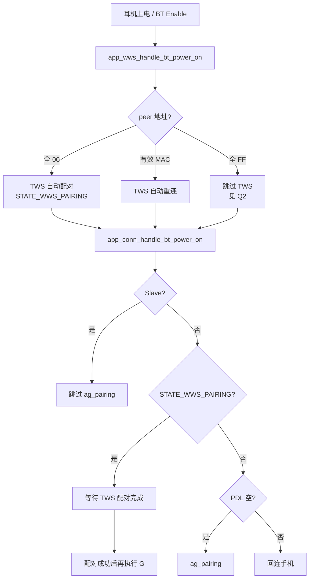
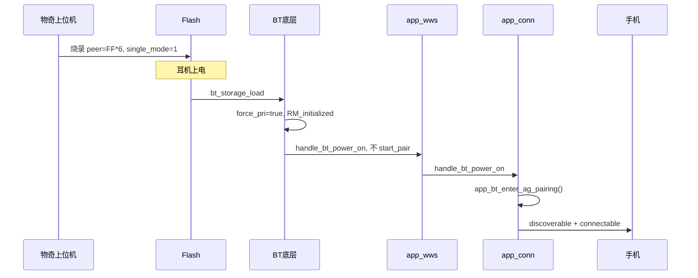
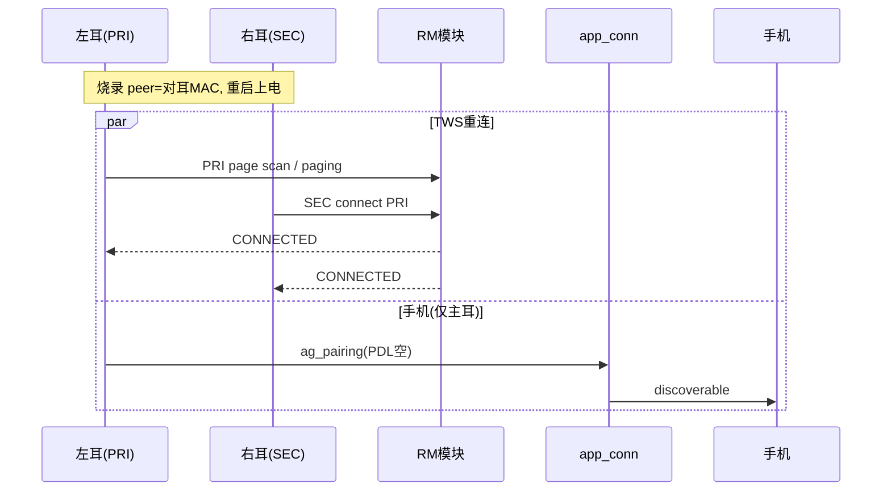

# TWS 组队与 ag_pairing 问答整理（A2007 / 物奇 SDK）

本文档整理开发与烧录相关的三个核心问题及结论。完整汇总见 [TWS_PAIRING_GUIDE.md](./TWS_PAIRING_GUIDE.md)，详细代码路径见 [TWS_PAIRING_LOGIC.md](./TWS_PAIRING_LOGIC.md)。

---

## Q1：耳机上电后，TWS 组队的逻辑是怎样的？是不是要先组完队才能进入 ag_pairing？

### 简要结论

**视场景而定，不能一概而论：**

| 场景 | 是否必须先完成 TWS 组队才能 ag_pairing |
|------|----------------------------------------|
| 首次 TWS 组队（peer 地址为全 0） | **是**，必须等 TWS 配对结束 |
| 已 TWS 组队（peer 为真实 MAC，仅重连） | **否**，TWS 重连与手机回连/配对可并行 |
| 烧录 Single Mode（peer 为全 FF） | **否**，根本不进行 TWS 组队，直接 ag_pairing |
| 从耳（Slave） | 永远不直接执行 ag_pairing，由主耳处理 |

---

### 上电调用顺序

蓝牙 Enable 后，应用层固定顺序为：

```
app_wws_handle_bt_power_on()    // TWS 层
app_conn_handle_bt_power_on()   // 手机连接/配对层
```

入口：`wq-adk/components/apps/acore/bt/src/app_bt.c`

---

### TWS 侧：组队还是重连？

**应用层判断**（`app_wws_handle_bt_power_on`）：

- peer 地址 **不等于** 全 `00:00:00:00:00:00` → 保存 peer，**不** 启动 TWS 配对
- peer 地址 **等于** 全 0 → 调用 `app_wws_start_pair()`，进入 `STATE_WWS_PAIRING`

**底层 RM 模块判断**（`DM_START_SIG`）：

- peer 为全 0 或全 FF → 停留 `RM_initialized`，不发起 TWS 连接
- peer 为有效 MAC → 进入 `RM_detect_role` → `RM_connect_req` 自动重连

---

### 与 ag_pairing 的阻塞关系

`app_conn_handle_bt_power_on()` 中的关键逻辑：

1. **从耳**：直接 return，不处理手机配对/回连
2. **`STATE_WWS_PAIRING`**：阻塞，设置 `connect_reason = CONNECT_REASON_POWER_ON`，`connectable = false`，等待 TWS 配对完成
3. **否则**：
   - PDL 为空 → `app_bt_enter_ag_pairing()`
   - PDL 有记录 → 启动手机回连

TWS 配对完成后会再次触发手机逻辑：

```c
// bt_evt_tws_pair_result_handler
if (app_conn_get_connect_reason() == CONNECT_REASON_POWER_ON) {
    app_conn_handle_bt_power_on();  // 重新执行
}
```

---

### 角色分工

| 角色 | 行为 |
|------|------|
| Master（主耳） | 执行 ag_pairing、回连手机 |
| Slave（从耳） | 跳过；`app_bt_enter_ag_pairing()` 内部也会直接 return |

---

### A2007 项目额外约束（首次手机配对）

当 PDL 为空且 `pairingwav_delay = true`（充电盒上电时置位），`EVTSYS_ENTER_PAIRING` 处理中会额外等待：

- TWS 主耳已连接（`app_wws_is_connected_master()`）
- 耳机在充电盒内（`app_charger_is_in_box()`）

满足条件后才调用 `app_econn_enter_ag_pairing()`，否则每 3 秒重试。这是 A2007 在框架逻辑之上的 UX 定制（bug 1695），不影响底层「TWS 配对中阻塞 ag_pairing」的机制。

---

### Q1 流程图



---

## Q2：物奇上位机烧录选 Single Mode 时，peer 地址为全 FF，上电后不 TWS 组队、直接 ag_pairing，代码流程是怎样的？

### 简要结论

上位机将 `bt_general_data.peer_addr` 烧录为 `FF:FF:FF:FF:FF:FF` 后：

1. 底层 RM **不发起** TWS 连接/配对
2. 应用层 **不调用** `app_wws_start_pair()`（触发条件是 peer 等于全 **0**，不是全 FF）
3. 主耳（`force_pri`）上电后 **直接进入** `ag_pairing`（PDL 为空时）

---

### 烧录数据从哪来？

物奇上位机通过 `ro_cfg.xml` 的 `bt_general_data` 写入 Flash：

```xml
<peer_addr type="bytes" len="6">FFFFFFFFFFFF</peer_addr>
<tws_single_mode type="uint8">1</tws_single_mode>
```

启动时 `bt_storage_load()` → `_bt_general_data_load()` 加载；Flash 无数据时 fallback 到 `ro_cfg()->bt_general_data`。

配置示例路径：`wq-adk/project/a2007/config/7035AX-B/ro_cfg.xml`

---

### 三种 peer 地址对比

| 烧录/存储值 | RM 底层 | app_wws 应用层 | 上电结果 |
|-------------|---------|----------------|----------|
| 全 `0x00` | 不连 TWS | **会** `start_pair` | 自动 TWS 组队，组队完成后 ag_pairing |
| 全 `0xFF` | 不连 TWS + 产线标志 | **不会** `start_pair` | 跳过 TWS，直接 ag_pairing |
| 真实 MAC | TWS 重连 | 不配对 | 并行 TWS 重连 + 手机回连 |

**全 0 与全 FF 在 RM 层行为相似（都不重连），但在应用层差异关键：** 只有全 0 会触发 `app_wws_start_pair()`。

---

### 地址判定宏

```c
// appl_utils.h
#define APPL_IS_ALL_FF_ADDR(addr)   // 全 FF → Single Mode
#define APPL_IS_VALID_ADDR(addr_)   // 非全 FF 且 非全 0 → 有效对耳地址

// T_rm.h
#define RM_IS_SINGLE_MODE_PEER_ADDR(addr_)  APPL_IS_ALL_FF_ADDR(addr_)
#define RM_IS_VALID_PEER_ADDR(addr_)        APPL_IS_VALID_ADDR(addr_)
```

应用层产线常量：`FTM_PEER_BDADDR = { 0xFF, 0xFF, 0xFF, 0xFF, 0xFF, 0xFF }`（`app_conn.c` / `app_econn_demo.c`）

---

### Single Mode 代码流程（5 层）

#### ① 存储加载

```
bt_storage_load() → peer_addr = FF:FF:FF:FF:FF:FF
```

文件：`bt_srv_storage.c`

#### ② BT 上电强制主耳

```c
// bt_service_power_on_off()
bool force_pri = !RM_IS_VALID_PEER_ADDR(peer_addr);  // 全 FF → true
SET_LOCAL_ROLE(HEADSET_PRI);
```

文件：`app_user_cmd.c`

#### ③ RM 跳过 TWS

```c
// DM_START_SIG (T_rm_top.c)
if (RM_IS_SINGLE_MODE_PEER_ADDR(PEER_BDADDR())) {
    bt_storage_write_tws_single_mode(STORAGE_TWS_SINGLE_MODE);
    // 产线标志 TWS_FACTORY，调整 inquiry scan
    return;  // 停留 RM_initialized
}
```

#### ④ app_wws 不启动配对

```c
// app_wws_handle_bt_power_on()
if (!bdaddr_is_equal(&cmd.addr, &AUTO_TWS_PAIR_PEER_BDADDR)) {  // 全00才相等
    context->peer_addr = cmd.addr;  // 保存全 FF
    return;  // ← Single Mode 在此返回
}
```

`context->tws_pairing` 不置位 → 无 `STATE_WWS_PAIRING`。

#### ⑤ app_conn 直接进入 ag_pairing

```c
// app_conn_handle_bt_power_on()
// 非 Slave ✓  非 WWS_PAIRING ✓  PDL 空 → app_bt_enter_ag_pairing()
```

---

### 回连保护（二次上电有 PDL 时）

`connect_last()` 中：

```c
if (bdaddr_is_equal(app_wws_get_peer_addr(), &ftm_peer_bdaddr)) {
    update_discoverable_and_connectable(true, true);
    return;  // 禁止自动回连，保持可配对
}
```

A2007 还提供 `peer_addr_monomode()`（`app_econn_demo.c`），用于 A2DP/SPP 等业务跳过双耳同步。

---

### Q2 时序图



---

### 烧录 vs 运行时切换 Single Mode

| 方式 | 机制 |
|------|------|
| **烧录 Single Mode** | 静态配置 peer=全 FF，上电即生效，不走 TDS |
| **运行时** `BT_CMD_TWS_ENTER_SINGLE_MODE` | 触发 `DM_ENTER_SINGLE_MODE_SIG` → TDS 切换 → `BT_EVT_TWS_MODE_CHANGED` |

两者路径不同，烧录场景无需双耳在线。

---

## Q3：物奇上位机预写对耳 MAC，烧录后重启自动组队，代码流程是怎样的？

### 简要结论

上位机将 **有效对耳 MAC**（非全 0、非全 FF）烧入 `bt_general_data.peer_addr`，并配置 `is_pri_dev`（主/从）后：

1. 上电走 **TWS 重连**（`RM_connect_req`），**不走** `RM_tws_pairing` 配对
2. 应用层 **不调用** `app_wws_start_pair()`
3. 主耳 page/scan，从耳主动 `tws_link_connect` 预置 MAC
4. 主耳 **并行** 进入 `ag_pairing`（不等待 TWS 连上）；从耳跳过 ag_pairing

若同时烧录 `tws_linkkey`，首次连接可直接鉴权；未烧录则连接时生成并保存。

---

### 产线烧录配置示例

左耳 MAC = `AA:...`，右耳 MAC = `BB:...`：

| 字段 | 左耳 | 右耳 |
|------|------|------|
| `peer_addr` | 右耳 MAC（BB） | 左耳 MAC（AA） |
| `is_pri_dev` | 1 | 0 |
| `is_left_dev` | 1 | 0 |
| `tws_single_mode` | 0 | 0 |
| `tws_linkkey` | 相同（可选） | 相同（可选） |

配置路径：`ro_cfg.xml` → `bt_general_data` / `bt_readonly_data`

---

### 代码流程（6 步）

```
① bt_storage_load()
     peer_addr=对耳MAC, is_pri_dev, tws_linkkey

② bt_service_power_on_off()
     force_pri=false
     is_pri_dev=1 → HEADSET_PRI, SEC_BDADDR=peer
     is_pri_dev=0 → HEADSET_SEC, PRI_BDADDR=peer

③ RM: DM_START_SIG
     有效peer → RM_detect_role → RM_connect_req
     PRI: page scan + 延迟 paging
     SEC: tws_link_connect(peer_addr)

④ app_wws_handle_bt_power_on()
     peer ≠ 全00 → 保存peer，不 start_pair

⑤ app_conn_handle_bt_power_on()
     主耳: 并行 ag_pairing / 回连
     从耳: return

⑥ TWS 连接成功
     RM_connected → BT_EVT_TWS_STATE_CHANGED
     → app_wws_handle_state_changed() → EVTSYS_WWS_CONNECTED
```

---

### Link Key 两条路径

| `tws_linkkey` 烧录 | 行为 |
|-------------------|------|
| 有效（非全 0） | `SM_LINK_KEY_REQUEST` 时直接回复预置 key，快速建链 |
| 全 0 | 回复无 key，首次连接走配对生成 → `hci_link_key_notify_evt` 写入 Flash |

---

### 与 Q1/Q2 的关系

| 模式 | peer 地址 | 上电 TWS 行为 |
|------|-----------|--------------|
| 未组队（Q1） | 全 `0x00` | TWS **配对**，完成后 ag_pairing |
| **预写 MAC（Q3）** | **有效 MAC** | TWS **重连**，主耳并行 ag_pairing |
| Single Mode（Q2） | 全 `0xFF` | 不连 TWS，主耳直接 ag_pairing |

---

### Q3 时序图



---

## 关键源文件速查

| 文件 | 作用 |
|------|------|
| `apps/acore/bt/src/app_bt.c` | BT 上电入口，TWS 事件分发 |
| `apps/acore/wws/src/app_wws.c` | TWS 上电初始化、配对启动 |
| `apps/acore/bt/src/app_conn.c` | 手机回连/配对、`STATE_WWS_PAIRING` 阻塞 |
| `bt_service/rm/T_rm_top.c` | RM 配对/重连/Single Mode 状态机 |
| `bt_service/bt_rpc/app_user_cmd.c` | BT 上电、`force_pri` |
| `bt_service/common/appl_utils.h` | 全 FF / 有效地址判定 |
| `bt_service/common/bt_srv_storage.c` | `bt_general_data` 加载 |
| `project/a2007/config/*/ro_cfg.xml` | 上位机烧录配置 |
| `project/a2007/acore/app/src/app_econn_demo.c` | A2007 首次配对延迟、`peer_addr_monomode()` |

---

## 一句话记忆

- **全 0** → TWS 自动**配对**（`start_pair`），组队完才能 ag_pairing（从耳除外）
- **有效 MAC** → 产线预写对耳地址，TWS **重连**，主耳并行 ag_pairing
- **全 FF** → Single Mode，不组队，主耳直接 ag_pairing

---

*整理自 A2007 项目代码分析与物奇 SDK 烧录流程，详细章节见 [TWS_PAIRING_LOGIC.md](./TWS_PAIRING_LOGIC.md)。*
