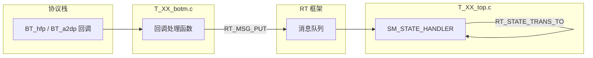

# T_ 前缀文件指南（物奇 BT Service / TWS Application）

本文档整理 `wq-adk/components/bt_service` 中 **`T_` 开头文件**的含义、分层关系和阅读路径。

> 相关文档：[BT_SERVICE_PREFIX_GUIDE.md](./BT_SERVICE_PREFIX_GUIDE.md)（RM/DM 等业务前缀）、[SM_MODULE_GUIDE.md](./SM_MODULE_GUIDE.md)（状态机写法）、[RT_RM_LOGIC.md](./RT_RM_LOGIC.md)（RT 启动链）

---

## 目录

1. [T_ 是什么](#1-t_-是什么)
2. [与 appl_ / RT_ / SM_ 的关系](#2-与-appl_--rt_--sm_-的关系)
3. [文件命名规律](#3-文件命名规律)
4. [公共头文件与入口](#4-公共头文件与入口)
5. [模块文件一览](#5-模块文件一览)
6. [典型三层结构（以 HFP 为例）](#6-典型三层结构以-hfp-为例)
7. [T_ 宏与常量](#7-t_-宏与常量)
8. [例外：无 T_ 前缀的模块](#8-例外无-t_-前缀的模块)
9. [阅读代码推荐路径](#9-阅读代码推荐路径)

---

## 1. T_ 是什么

**`T_` = TWS Application Task Unit（TWS 应用任务单元）**。

物奇 BT Service 在蓝牙协议栈之上，用 RT 框架把各业务拆成独立 Task。每个 Task 的 **对外头文件 + 状态机实现** 统一以 `T_` 命名：

```
T_rm.h / T_rm_top.c   → MODULE_RM（TWS 对耳链路）
T_dm.h / T_dm_top.c   → MODULE_DM（设备总控）
T_cm.h / T_cm_top.c   → MODULE_CM（手机 ACL 连接）
...
```

`T_app.h` 文件头注释写作 **"Tws app heard file"**，即 TWS 应用的 **总头文件**，`#include` 所有 `T_XX.h`。

一句话记忆：

> **`T_` = BT Service 里按 RT Task 划分的业务模块源码**；  
> **`T_appl_` = Service 启动与 HCI/GAP 胶水**；  
> 读 `RM_initialized` 时：`T_rm.h` 看定义，`T_rm_top.c` 看实现，`T_appl_main.c` 看如何挂到 RT 上。

---

## 2. 与 appl_ / RT_ / SM_ 的关系

BT Service 大致分四层：

```
┌─────────────────────────────────────────────────────────┐
│  acore 应用层（app_econn_demo.c、app_wws.c …）           │
├─────────────────────────────────────────────────────────┤
│  T_ 业务 Task 层（T_XX_top.c — SM_STATE_HANDLER 状态机）  │  ← T_ 主战场
├─────────────────────────────────────────────────────────┤
│  T_XX_botm.c / T_appl_hci.c — 协议栈回调 → RT 消息       │  ← T_ 胶水
├─────────────────────────────────────────────────────────┤
│  appl_* — 协议栈适配 API（appl_hci、appl_a2dp、appl_gap）│
├─────────────────────────────────────────────────────────┤
│  BT_* — 物奇蓝牙 Host 协议栈                             │
└─────────────────────────────────────────────────────────┘
         ↑ RT_ 框架贯穿 Task 层（消息、状态、定时器）
         ↑ SM_ 宏用于写 T_XX_top.c 里的状态处理函数
```

| 前缀 | 层次 | 典型文件 | 职责 |
|------|------|----------|------|
| `T_XX` | 业务 Task | `T_rm.h`、`T_rm_top.c` | 状态表、信号、上下文、状态机逻辑 |
| `T_appl_` | Service 胶水 | `T_appl_main.c`、`T_appl_hci.c` | `bt_service_main()`、HCI/GAP 事件转消息 |
| `T_XX_botm` | 协议适配底栏 | `T_hfp_botm.c`、`T_a2dp_botm.c` | Profile 栈回调 → `RT_MSG_PUT` |
| `appl_`（无 T） | 栈适配 API | `appl_common.h`、`appl_hci.h` | 对协议栈的薄封装，被 T_ 层调用 |
| `RT_` | 运行时框架 | `rt_module.h`、`rt_msg.h` | 任务、消息队列、状态调度 |
| `SM_` | 状态机语法 | `SM_STATE_HANDLER` | 定义 `T_XX_top.c` 中的状态函数 |

---

## 3. 文件命名规律

每个业务模块目录（如 `rm/`、`hfp/`、`a2dp/`）通常包含：

| 文件名模式 | 含义 | 示例 |
|------------|------|------|
| `T_XX.h` | **Unit header**：状态列表、信号枚举、上下文结构、`XX_ctor/setup` 声明 | `T_rm.h` — "Role Manager Unit" |
| `T_XX_top.c` | **顶层状态机**：`SM_STATE_HANDLER` 实现，业务决策 | `T_rm_top.c` |
| `T_XX_botm.c` | **底层适配**：协议栈/Profile 回调，封装为 `RT_MSG_NEW` + `RT_MSG_PUT` | `T_hfp_botm.c` |
| `T_XX_top_itl.h` | **top 层内部接口头**：top 与 botm/协议栈之间的 include 桥 | `T_a2dp_top_itl.h` |
| `T_XX_botm_itl.h` | **botm 层内部接口头** | `T_a2dp_botm_itl.h` |
| `T_XX_internal.h` | **模块私有头**：仅本模块 .c 使用的内部类型/宏 | `T_hfp_internal.h` |
| `T_XX_*.c`（其他） | 辅助逻辑 | `T_hfp_at_cmd.c`、`T_gatt_queue.c`、`T_ga_bc_queue.c` |

后缀含义：

| 后缀 | 英文推测 | 作用 |
|------|----------|------|
| `_top` | top layer | RT 状态机，处理消息、跳转状态 |
| `_botm` | bottom layer | 接收 `appl_*` / `BT_*` 回调，向上发 RT 消息 |
| `_itl` | internal / inter-layer | top/botm 之间的中间头文件，收敛 include |
| `_internal` | — | 模块内私有，不对外暴露 |

数据流向（Profile 模块通用）：



---

## 4. 公共头文件与入口

目录：`bt_service/common/`

| 文件 | 作用 |
|------|------|
| `T_app.h` | **总头文件**：include 全部 `T_XX.h`；定义 `T_USED`/`T_UNUSED`、跨模块导航宏（`GET_RM`、`CM_GET_A2DP` 等） |
| `T_module_defs.h` | `enum T_APP_MODULE_ID { MODULE_DM, MODULE_RM, … }`；`MODULE_MSG_STATE_ENTER/EXIT` |
| `T_appl_main.c` | **`bt_service_main()`** 入口：`rt_init` → `MODULE_ctor` → `MODULE_setup` → `rt_run` |
| `T_utils.c` | 工具函数（原 `appl_utils` 部分实现） |

### `T_appl_main.c` 启动链

```c
void bt_service_main(void *arg)
{
    bt_aud_sv_init();
    bt_service_user_cmd_init();
    bt_sv_get_device_info();      // 从 Flash 读 peer/name
    bt_sv_get_task_info();
    Tws_entry();                  // rt_init + MODULE_init/ctor/setup
    Tws_run();                    // rt_run() 消息循环
}
```

模块注册表（节选）：

```c
static RT_MODULE l_modules[MODULE_MAX] = {
    RT_MODULE_INIT(BTRPC), RT_MODULE_INIT(CM), RT_MODULE_INIT(RM),
    RT_MODULE_INIT(AM),    RT_MODULE_INIT(LM), RT_MODULE_INIT(LE),
    RT_MODULE_INIT(DM),    RT_MODULE_INIT(TWS_SYNC),
    RT_MODULE_INIT(HFP),   RT_MODULE_INIT(A2DP), RT_MODULE_INIT(AVRCP),
    ...
};
```

### `T_appl_` 与 CM 模块胶水

| 文件 | 位置 | 职责 |
|------|------|------|
| `T_appl_main.c` | `common/` | Service 总入口、内存池、模块表 |
| `T_appl_hci.c` | `cm/` | HCI 事件表 → 解析后 `RT_MSG_PUT` 给 CM/RM/DM 等 |
| `T_appl_gap.c` | `cm/` | GAP 事件（配对、鉴权、连接完成）→ RT 消息 |

---

## 5. 模块文件一览

`T_XX` 与 `MODULE_XX` 一一对应（定义于 `T_module_defs.h`）：

| T_ 模块 | 目录 | MODULE ID | 职责 |
|---------|------|-----------|------|
| `T_dm` | `dm/` | `MODULE_DM` | 设备管理：上电、可见性、关机、TWS 配对模式 |
| `T_cm` | `cm/` | `MODULE_CM` | 连接管理：手机 ACL 建链/断链、多设备 |
| `T_rm` | `rm/` | `MODULE_RM` | 角色管理：TWS 对耳链路、主从、重连、配对 |
| `T_am` | `am/` | `MODULE_AM` | 音频管理：焦点、会话、A2DP/SCO 路由 |
| `T_lm` | `lm/` | `MODULE_LM` | 链路管理：active link 切换、TDS 触发（头文件为 `lm_top.h`，见 §8） |
| `T_hfp` | `hfp/` | `MODULE_HFP` | 通话 Profile |
| `T_a2dp` | `a2dp/` | `MODULE_A2DP` | 音乐 Profile |
| `T_avrcp` | `avrcp/` | `MODULE_AVRCP` | 媒体控制 |
| `T_spp` | `spp/` | `MODULE_SPP` | 串口 Profile |
| `T_le` | `le/` | `MODULE_LE` | BLE 连接 |
| `T_gatt` | `gatt/` | `MODULE_GATT` | GATT 服务 |
| `T_ga` | `le/le_audio/` | `MODULE_GA` | LE Audio（需 `CONFIG_BLE_AUDIO_ENABLED`） |
| `T_tds` | `tds/` | `MODULE_TDS` | TWS 数据切换（TDS） |
| `T_tws_sync` | `tws_sync/` | `MODULE_TWS_SYNC` | 双耳同步（提示音等） |
| `T_btrpc` | `bt_rpc/` | `MODULE_BTRPC` | 与 acore 的 RPC 桥 |
| `T_fifo` | `fifo/` | `MODULE_FIFO` | 内部 FIFO 任务 |
| `T_hid` | `hid/` | `MODULE_HID` | HID over BREDR（可选） |
| `T_ancs` | `ancs/` | `MODULE_ANCS` | Apple 通知（可选） |
| `T_l2cap` | `l2cap/` | `MODULE_L2CAP` | 自定义 L2CAP（可选） |
| `T_pan` | `pan/` | `MODULE_PAN` | BNEP/PAN（可选） |

每个模块 `T_XX.h` 的典型内容：

```c
#define XX_TABLE(DEF)          // 状态列表 → 生成 XX_initialized_ID 等
enum XX_MSG_INDEX { ... };     // 模块私有信号
FUNC_INDEX_DEC(XX);            // 状态 ID 枚举
typedef struct { ... } XX_CONTEXT;
SM_STATE_FUNC_DEC(XX);         // 状态函数声明
void XX_ctor(void);            // 创建 Task、订阅消息
void XX_setup(void);           // 设初始状态
```

每个模块 `T_XX_top.c` 头部的固定注册块：

```c
RT_MODULE_CONTEXT_DEF(XX, XX_CONTEXT, N_XX);
RT_MODULE_STATE_DEF(XX, N_XX);
RT_MODULE_DESC_DEF(XX, N_XX);
FUNC_TBL_DEF(XX);
SM_STATE_INFO_DEF(XX, NULL);   // 或 AVRCP_STATE_BASE 等父子状态表
```

---

## 6. 典型三层结构（以 HFP 为例）

### 6.1 头文件层

```
T_hfp.h           ← 对外：状态、信号、上下文、ctor 声明
T_hfp_internal.h  ← 模块内：AT 解析、SCO 句柄宏
T_hfp_top_itl.h   ← top 专用 include 桥
```

### 6.2 实现层

| 文件 | 做什么 |
|------|--------|
| `T_hfp_top.c` | `SM_STATE_HANDLER(HFP_initialized/started/connected/…)`；处理 `HF_CALL_SIG`、`AM_AUDIO_FOCUS_CHANGED_SIG` 等 |
| `T_hfp_botm.c` | HFP Unit 栈回调：收到 `HF_SLC_START` → `RT_MSG_NEW(HF_SLC_START_SIG, …)` → `RT_MSG_PUT` |
| `T_hfp_at_cmd.c` | AT 命令收发辅助 |

### 6.3 botm → top 消息示例

```c
// T_hfp_botm.c — 协议栈通知 SLC 建立
pe = RT_MSG_NEW(HF_SLC_START_SIG, RT_BUILD_ID(MODULE_HFP, handle), 0, HFConnEvt_T);
RT_MSG_PUT(pe);
// ↓ RT 投递到 HFP 当前状态的 SM_STATE_HANDLER
```

### 6.4 CM 模块的 HCI 胶水（同类思路）

`T_appl_hci.c` 维护 HCI 事件表，收到 `HCI_CONNECTION_COMPLETE` 等事件后，组装 `CM_CONNECT_IND_SIG` 等消息投递给 `T_cm_top.c`。

---

## 7. T_ 宏与常量

定义于 `T_app.h`：

| 宏 | 值 | 含义 |
|----|-----|------|
| `T_USED` | `0x01` | 模块实例槽位已分配（如 `g_CM_app[i].allocated`） |
| `T_UNUSED` | `0xFF` | 实例槽位空闲 |
| `TWS_BLE_ADDRESS_TYPE` | `0` | TWS 场景 BLE 地址类型默认值 |

跨模块导航宏（读状态机时常见）：

```c
GET_RM(me_)    → g_RM_app[me_->rm_id]
GET_CM(me_)    → g_CM_app[me_->cm_id]
CM_GET_HF(me_) → g_HFP_app[me_->HF_id]
CM_GET_A2DP(me_) → g_A2DP_app[me_->codec_id]
```

`T_module_defs.h` 中的 `T_APP_MODULE_ID` 与 `T_` 文件对应，但枚举名用 `MODULE_XX`（不带 `T_` 前缀），通过 `RT_BUILD_ID(MODULE_RM, 0)` 绑定到 Task。

---

## 8. 例外：无 T_ 前缀的模块

少数文件沿用旧命名，功能上仍属于 T_ Task 体系：

| 文件 | 对应 MODULE | 说明 |
|------|-------------|------|
| `lm/lm_top.h` | `MODULE_LM` | Link Manager，逻辑与 `T_lm` 等价，仅文件名无 `T_` |
| `lm/lm_top.c` | — | 含 `SM_STATE_HANDLER(LM_idle)` 等 |
| `tds/tds_app.c` | `MODULE_TDS` | TDS 应用逻辑，头文件 `T_tds.h` 有 T_ 前缀 |
| `appl_*.h`（`common/`、`cm/`） | — | 协议栈侧 API，**不是** T_ Task，但被 T_ 层调用 |

判断方法：看是否出现在 `T_app.h` 的 include 列表，以及 `l_modules[]` 里的 `RT_MODULE_INIT(XX)`。

---

## 9. 阅读代码推荐路径

### 9.1 从一个状态名入手（如 `RM_initialized`）

```
1. T_rm.h          → RM_TABLE 看有哪些状态、RM_MSG_INDEX 看有哪些信号
2. T_rm_top.c      → SM_STATE_HANDLER(RM_initialized) 看具体逻辑
3. T_appl_main.c   → 确认 RM 何时 ctor/setup、初始状态
4. T_module_defs.h → MODULE_RM 的 ID 编码
5. SM_MODULE_GUIDE.md → SM_MSG_HANDLED / DELEGATE 等返回值含义
```

### 9.2 从一条 HCI/Profile 事件入手

```
1. T_appl_hci.c 或 T_XX_botm.c  → 找栈回调里 RT_MSG_NEW 的信号名
2. T_XX.h                       → 信号在 enum XX_MSG_INDEX 中的定义
3. T_XX_top.c                   → 哪个 SM_STATE_HANDLER 的 case 处理该信号
```

### 9.3 从 acore 发命令入手

```
1. bt_rpc/app_user_cmd.c  → RPC 命令如何 RT_MSG_PUT
2. 目标 T_XX_top.c        → 对应模块状态机响应
```

### 9.4 层次对照速查

```
想知道"这是什么模块"     → T_XX.h 文件头 @brief "XX Unit header"
想知道"有哪些状态"       → T_XX.h 的 XX_TABLE(DEF)
想知道"状态怎么处理"     → T_XX_top.c 的 SM_STATE_HANDLER
想知道"协议栈怎么上来"   → T_XX_botm.c 或 T_appl_hci.c
想知道"模块怎么注册"     → T_appl_main.c 的 l_modules[] + T_XX_top.c 的 XX_ctor
```

---

## 关键源文件索引

| 路径 | 内容 |
|------|------|
| `common/T_app.h` | TWS 应用总头文件、跨模块宏 |
| `common/T_module_defs.h` | `MODULE_XX` 枚举 |
| `common/T_appl_main.c` | `bt_service_main()` |
| `rm/T_rm.h` + `rm/T_rm_top.c` | TWS 角色管理（最常用入口） |
| `dm/T_dm.h` + `dm/T_dm_top.c` | 设备总控 |
| `cm/T_cm_top.c` + `cm/T_appl_hci.c` | 连接管理 + HCI 胶水 |
| `hfp/T_hfp_top.c` + `T_hfp_botm.c` | Profile 三层范例 |
| `a2dp/T_a2dp_top.c` + `T_a2dp_botm.c` | 含 `_itl.h` 的 Profile 范例 |
