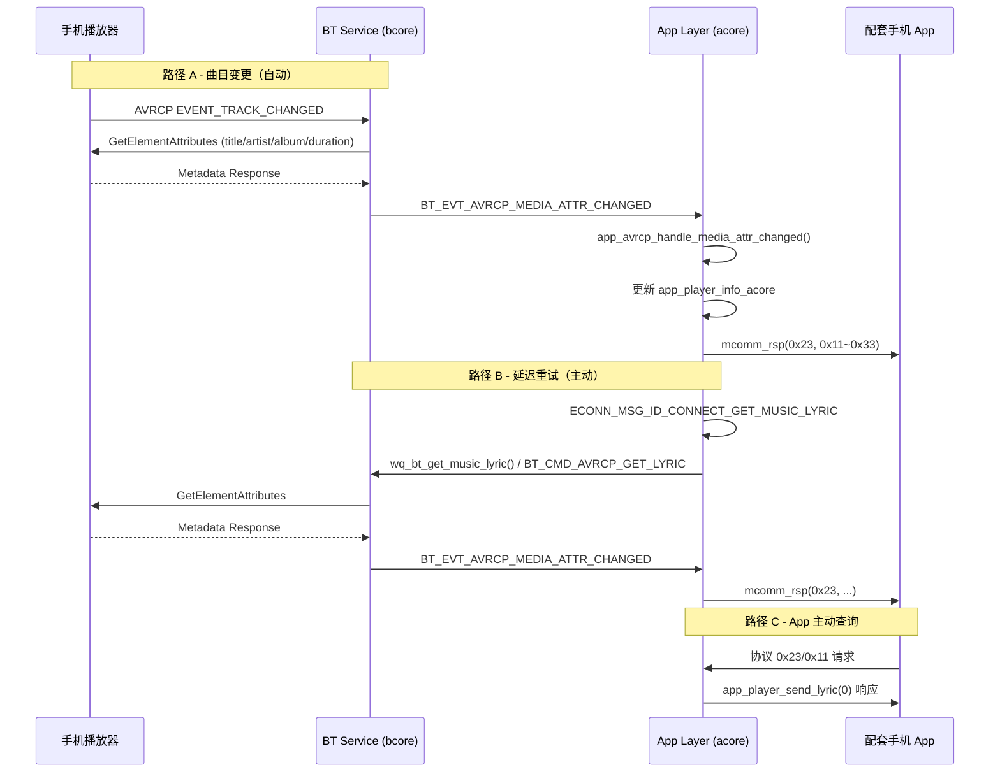

# 播放歌曲时获取歌词相关信息逻辑梳理

> 本文档基于 A2001 TWS 耳机固件代码梳理，涉及模块位于 `wq-adk` 与 `wqcore` 目录。

## 1. 概述

本仓库为 **Dreame A2001 TWS 耳机嵌入式固件**，并非手机端音乐播放器。代码中所谓「歌词（lyric）」功能，实质上是：

- 通过 **蓝牙 AVRCP** 从已连接手机获取 **正在播放歌曲的元数据**（标题、歌手、专辑、时长、播放状态）
- 将元数据缓存到耳机本地，并通过 **自定义协议（group `0x23`）** 上报给 **配套手机 App**

**重要说明：**

| 项目 | 本仓库是否支持 |
|------|----------------|
| AVRCP 歌曲标题 / 歌手 / 专辑 / 时长 | ✅ |
| 播放 / 暂停状态同步 | ✅ |
| LRC 逐行歌词文件 | ❌ |
| 歌词与音频时间轴同步 | ❌ |
| 卡拉 OK / 滚动歌词 | ❌ |
| HTTP / 云端歌词 API | ❌ |
| 耳机端歌词 UI 显示 | ❌ |

代码中 `lyric` 字段实际存储的是 **AVRCP 媒体标题（`AVRCP_MEDIA_ATTR_ID_MEDIA_TITLE`）**，即歌曲名，而非带时间戳的歌词文本。

---

## 2. 功能开关

两项 Kconfig 配置共同启用该功能：

| 配置项 | 位置 | 作用 |
|--------|------|------|
| `CONFIG_AVRCP_LYRIC_ENABLE` | `wq-adk/components/bt_service/Kconfig.in` | 启用 AVRCP 曲目变更监听、GetElementAttributes 请求、RPC 命令 `BT_CMD_AVRCP_GET_LYRIC` |
| `CONFIG_APP_PLAYER_REPORT_ENABLE` | `wqcore/dreame_config/Kconfig` | 启用应用层元数据解析、缓存、上报及 Flash 持久化 |

A2001 项目默认均已开启：

- `wq-adk/project/a2001/config/7036AC/defconfig.pro` → `CONFIG_AVRCP_LYRIC_ENABLE=y`
- `CONFIG_APP_PLAYER_REPORT_ENABLE` 默认 `y`

启用 `CONFIG_AVRCP_LYRIC_ENABLE` 时的 BT 栈调整：

- AVRCP 上下文数量：`3` → `7`（`bt_srv_common_cfg.h`）
- AVCTP MTU：`672`（`T_avrcp_top.c`，用于承载更长的元数据）

---

## 3. 整体架构

```
┌─────────────┐     AVRCP      ┌──────────────────┐     RPC      ┌─────────────────┐
│  手机播放器  │ ◄────────────► │ BT Service       │ ◄──────────► │ App Layer       │
│             │  GetElement    │ (bcore)          │  BT_EVT_*    │ (acore)         │
│             │  Attributes    │ T_avrcp_*.c      │              │ app_bt.c 等     │
└─────────────┘                └──────────────────┘              └────────┬────────┘
                                                                          │
                                                                          │ mcomm_rsp
                                                                          │ group 0x23
                                                                          ▼
                                                                 ┌─────────────────┐
                                                                 │ 配套手机 App     │
                                                                 │ (不在本仓库)     │
                                                                 └─────────────────┘
```

固件分层：

1. **BT Service（bcore）**：处理 AVRCP 协议，注册曲目变更通知，发起 `GetElementAttributes` 请求
2. **BT RPC**：acore ↔ bcore 跨核通信（命令 `BT_CMD_AVRCP_GET_LYRIC`，事件 `BT_EVT_AVRCP_MEDIA_ATTR_CHANGED`）
3. **App Layer（acore）**：解析元数据、去重、缓存、通过 BLE/SPP/IAP2 上报 App
4. **Companion App**：接收 `0x23` 协议数据并展示（代码不在本仓库）

---

## 4. 触发路径

获取歌曲信息有三条主要路径。

### 4.1 自动路径：AVRCP 曲目变更通知（主路径）

当手机切换歌曲时，AVRCP 会推送 `AVRCP_EVENT_TRACK_CHANGED` 事件，BT 栈自动拉取元数据。

```
AVRCP 连接建立
  → appl_avrcp_handle_get_cap_rsp() 注册 AVRCP_EVENT_TRACK_CHANGED 监听
  → 手机切歌，收到 TRACK_CHANGED 通知
  → BT_avrcp_al_get_element_attributes()
  → 手机返回 GetElementAttributes 响应
  → appl_avrcp_handle_get_element_attr_rsp()
  → bt_service_evt_avrcp_media_attr_changed()
  → BT_EVT_AVRCP_MEDIA_ATTR_CHANGED (RPC → acore)
  → app_avrcp_handle_media_attr_changed()
  → app_player_send_lyric() 等上报函数
```

关键文件：

| 步骤 | 文件 | 函数 |
|------|------|------|
| 注册曲目监听 | `components/bt_service/avrcp/T_avrcp_botm.c` | `appl_avrcp_handle_get_cap_rsp()` |
| 曲目变更处理 | 同上 | `appl_avrcp_handle_register_notification_rsp()` |
| 发起属性查询 | `components/bt_service/avrcp/avrcp_al_api.c` | `BT_avrcp_al_get_element_attributes()` |
| 解析 BT 响应 | `components/bt_service/avrcp/T_avrcp_botm.c` | `appl_avrcp_handle_get_element_attr_rsp()` |
| 发送 RPC 事件 | `components/bt_service/bt_rpc/app_user_event.c` | `bt_service_evt_avrcp_media_attr_changed()` |
| 应用层处理 | `components/apps/acore/bt/src/app_bt.c` | `app_avrcp_handle_media_attr_changed()` |

### 4.2 延迟重试路径：消息 `ECONN_MSG_ID_CONNECT_GET_MUSIC_LYRIC`

消息 ID 定义于 `app_econn_demo.h`（值为 `164`）。用于连接后或状态变化时主动补拉元数据。

```
app_send_msg_delay(..., ECONN_MSG_ID_CONNECT_GET_MUSIC_LYRIC, ..., delay)
  → get_lyric_info()                    [app_econn_demo.c]
  → wq_bt_get_music_lyric()             [wq_bt.c]
  → bt_service_avrcp_get_lyric()        [app_user_cmd.c]
  → BT_MUSIC_GET_LYRIC_SIG              [T_avrcp_top.c]
  → BT_avrcp_al_get_element_attributes()
  → （后续与 4.1 相同）
```

触发时机与延迟：

| 触发场景 | 延迟 | 文件 |
|----------|------|------|
| 蓝牙设备连接（`EVTSYS_CONNECTED`） | 1000 ms | `app_econn_demo.c` |
| AVRCP 播放/暂停状态变化（双设备连接） | 3000 ms | `app_bt.c` → `bt_evt_avrcp_state_changed_handler()` |
| 无效元数据清理后 | 2500 ms | `app_econn_demo.c` → `ECONN_MSG_ID_DELAY_SEND_KILL_BLACKGROUND_PROCESSES` |

### 4.3 被动查询路径：App 主动请求

配套 App 可通过协议 group `0x23` 主动查询当前歌曲信息。

- 协议定义：`app_protocol.h`
- 处理入口：`app_cmd.c` → `case cgroup0x23_player_sub_id_report_song_title_lyrics` → `app_player_send_lyric(0)`

设备信息同步（`mdevice_info_rsp()`）在分包 counter `0x06` 时也会一并携带播放器元数据。

---

## 5. AVRCP 属性查询详情

`BT_avrcp_al_get_element_attributes()` 一次请求 **4 个属性**：

| AVRCP Attribute ID | 值 | 固件字段 | 上报 sub-id |
|--------------------|-----|----------|-------------|
| `AVRCP_MEDIA_ATTR_ID_MEDIA_TITLE` | 0x01 | `app_player_info_acore.lyric` | `0x11` |
| `AVRCP_MEDIA_ATTR_ID_ARTIST_NAME` | 0x02 | `singer_name` | `0x21` |
| `AVRCP_MEDIA_ATTR_ID_ALBUM_NAME` | 0x03 | `album_name` | `0x31` |
| `AVRCP_MEDIA_ATTR_ID_PLAYING_TIME` | 0x07 | `song_time`（毫秒） | `0x33` |

响应 TLV 格式（每个属性）：

```
[4 字节 attr_id][2 字节 charset][2 字节 text_len][text 内容]
```

---

## 6. 数据模型

### 6.1 内存结构

定义于 `app_bt.c`（`CONFIG_APP_PLAYER_REPORT_ENABLE` 宏内）：

```c
typedef struct {
    uint8_t lyric[256];           // 实际存歌曲标题
    uint8_t lyric_len;
    uint8_t singer_name[128];
    uint8_t singer_name_len;
    uint8_t album_name[128];
    uint8_t album_name_len;
    uint32_t song_time;           // 歌曲总时长（ms）
    uint8_t play_status;          // 0=暂停, 1=播放, 2=空闲/停止
} avrcp_play_info_t;

avrcp_play_info_t app_player_info_acore;  // 全局单例
```

### 6.2 RPC 类型

定义于 `components/bt_rpc/inc/bt_rpc_api.h`：

```c
// 主动获取命令（acore → bcore）
typedef struct {
    IN BD_ADDR_T addr;
} bt_cmd_avrcp_get_lyric_t;

// 属性变更事件（bcore → acore）
typedef struct {
    IN BD_ADDR_T addr;
    uint8_t no_of_attrs;
    uint16_t attrs_len;
    const uint8_t *attrs_val;
} bt_evt_avrcp_media_attr_changed_t;
```

---

## 7. 应用层处理逻辑

### 7.1 元数据解析与去重

`app_avrcp_handle_media_attr_changed()` 遍历 AVRCP 返回的属性列表：

- **标题**：写入 `lyric` 字段，变化时调用 `app_player_send_lyric(1)`
- **歌手**：写入 `singer_name`，变化时调用 `app_player_send_singer_name(1)`
- **专辑**：写入 `album_name`，变化时调用 `app_player_send_album_name(1)`
- **时长**：从字符串提取数字 → `atoi()` → `song_time`，变化时调用 `app_player_send_song_time(1)`

每项更新前通过 `memcmp()` 比较新旧内容，**避免重复上报**。

若标题为 `"Not Provided"`、`"unknow"` 或为空，或时长为 0，会触发延迟清理消息 `ECONN_MSG_ID_DELAY_SEND_KILL_BLACKGROUND_PROCESSES`。

### 7.2 播放状态同步

`bt_evt_avrcp_state_changed_handler()` 根据 AVRCP 播放状态更新 `play_status`：

| AVRCP state | play_status |
|-------------|-------------|
| 0x03 / 0x01 | 0（暂停） |
| 0x04 | 1（播放） |

双设备连接时有额外逻辑：若另一台设备仍在播放，则忽略当前设备的暂停状态。

状态变化后（双设备场景）会延迟 3000 ms 再次触发 `get_lyric_info()` 补拉元数据。

### 7.3 上报条件

所有 `app_player_send_*()` 函数仅在以下条件同时满足时发送：

```c
app_wws_is_master() && mapp_is_connect()
```

即：**TWS 主耳** 且 **配套 App 已连接**。

上报方式：

| 函数 | 协议 | 说明 |
|------|------|------|
| `app_player_send_lyric()` | group `0x23`, sub `0x11` | 歌曲标题 |
| `app_player_send_singer_name()` | `0x23` / `0x21` | 歌手 |
| `app_player_send_album_name()` | `0x23` / `0x31` | 专辑 |
| `app_player_send_play_status()` | `0x23` / `0x32` | 播放状态 |
| `app_player_send_song_time()` | `0x23` / `0x33` | 歌曲时长 |
| `app_player_report_all()` | 以上全部 | 一次性上报 |

`is_active_report` 参数：

- `1`：主动上报，status = `APP_RESULT_REPORT`（0x01）
- `0`：响应 App 查询，status = `APP_RESULT_SUCCESS`（0x00）

传输链路：`mcomm_rsp()` → `mcomm_if()` → `econn_send_data()`（BLE GATT / SPP / IAP2）。

### 7.4 无效数据清理

`app_player_delay_send_kill_blackground_processes()` 在以下情况清空元数据并将 `play_status` 设为 2：

1. `song_time == 0` 且标题为 `"Not Provided"` / `"unknow"`
2. 标题、专辑、歌手均为空

清理后通过 `app_player_send_play_status(1)` 通知 App。

---

## 8. 持久化缓存

Flash KV 存储（`app_cmd.c`）：

| 函数 | 时机 | 存储内容 |
|------|------|----------|
| `mapp_player_report_kv_read()` | 开机初始化（仅用户重启 / 恢复出厂重启） | 从 Flash 恢复 |
| `mapp_player_report_kv_write()` | 收到 `ECONN_MSG_ID_SAVE_DREAM_APP_PALYER` | 写入 Flash |

- 存储 Key：`ECON_APP_PLAYER_REPORT_ID`（`app_econn_demo.h`）
- 写入起点：`app_player_info_acore.singer_name[0]`
- 写入长度：`128 + 128 + 6 = 262` 字节

**注意：** 持久化从 `singer_name` 字段开始，`lyric`（标题）字段是否完整恢复取决于结构体布局，标题可能不在持久化范围内。

---

## 9. 完整时序图



---

## 10. 协议常量速查

定义于 `app_protocol.h`：

```c
#define cgroup0x23_player                                      0x23
#define cgroup0x23_player_sub_id_report_song_title_lyrics      0x11
#define cgroup0x23_player_sub_id_report_singer_name            0x21
#define cgroup0x23_player_sub_id_report_album_name             0x31
#define cgroup0x23_player_sub_id_current_player_status         0x32
#define cgroup0x23_player_sub_id_total_duration_cur_song       0x33
#define cgroup0x23_player_sub_id_play_pause                    0x40
#define cgroup0x23_player_sub_id_previous_song               0x41
#define cgroup0x23_player_sub_id_next_song                     0x42
```

---

## 11. 关键文件索引

| 文件路径 | 职责 |
|----------|------|
| `wq-adk/components/bt_service/avrcp/T_avrcp_botm.c` | AVRCP 曲目变更注册、GetElementAttributes 响应解析 |
| `wq-adk/components/bt_service/avrcp/avrcp_al_api.c` | 构建 GetElementAttributes PDU |
| `wq-adk/components/bt_service/avrcp/T_avrcp_top.c` | `BT_MUSIC_GET_LYRIC_SIG` 处理、AVCTP MTU 调整 |
| `wq-adk/components/bt_service/bt_rpc/app_user_cmd.c` | `bt_service_avrcp_get_lyric()` RPC 命令处理 |
| `wq-adk/components/bt_service/bt_rpc/app_user_event.c` | `bt_service_evt_avrcp_media_attr_changed()` 事件发送 |
| `wq-adk/components/bt_rpc/src/acore/wq_bt.c` | `wq_bt_get_music_lyric()` acore 侧 API |
| `wq-adk/components/bt_rpc/inc/bt_rpc_api.h` | RPC 命令/事件类型定义 |
| `wq-adk/components/apps/acore/bt/src/app_bt.c` | 元数据处理、上报、播放状态、无效数据清理 |
| `wq-adk/project/a2001/acore/app/src/app_econn_demo.c` | `get_lyric_info()`、连接后延迟拉取 |
| `wq-adk/project/a2001/acore/app/src/app_cmd.c` | App 查询处理、Flash 持久化、设备信息同步 |
| `wq-adk/project/a2001/acore/app/src/app_protocol.h` | 协议 group/sub-id 常量 |
| `wq-adk/project/a2001/acore/app/src/app_protocol.c` | `mcomm_rsp()` 协议帧封装与发送 |
| `wqcore/dreame_config/Kconfig` | `APP_PLAYER_REPORT_ENABLE` 配置 |
| `wq-adk/components/bt_service/Kconfig.in` | `AVRCP_LYRIC_ENABLE` 配置 |

---

## 12. 结论与延伸

本仓库实现的「歌词」功能是 **AVRCP 正在播放歌曲元数据的中继**：

1. **数据来源**：手机蓝牙 AVRCP，无云端 API
2. **存储内容**：歌曲标题（字段名 `lyric`）、歌手、专辑、总时长、播放状态
3. **上报对象**：配套手机 App（group `0x23` 协议）
4. **无时间轴同步**：不支持 LRC 逐行滚动、卡拉 OK 等

若要了解 **歌词的实际 UI 展示、LRC 解析、与播放进度同步** 等逻辑，需要查看消费端 **配套手机 App 仓库**（解析 `0x23/0x11` 等协议消息的部分），该部分不在本固件仓库中。
